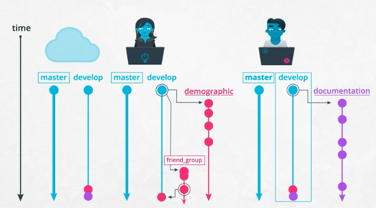

# Machine Learning DevOps Engineer: Personal Notes on the Udacity Nanodegree

These are my notes of the [Udacity Nanodegree Machine Learning DevOps Engineer](https://www.udacity.com/course/machine-learning-dev-ops-engineer-nanodegree--nd0821).

The nanodegree is composed of four modules:

1. Clean Code Principles
2. Building a Reproducible Model Workflow
3. Deploying a Scalable ML Pipeline in Production
4. ML Model Scoring and Monitoring

Each module has a folder with its respective notes. This folder and file refer to the **first** module: **Clean Code Principles**.

Note that:
- `TODO`
- `TODO`

Mikel Sagardia, 2022.  
No guarantees.

## Practical Installation Notes

We need to install:

- Python 3.X
- Anaconda
- Machine Learning libraries: Scikit-Learn, Matplotlib, Pandas, Seaborn, Numpy, etc.
- Git
- GitHub account

```bash
conda create -n ds python=3.7
conda install jupyter numpy pandas matplotlib scipy sympy cython numba pytables jupyterlab pip -y
conda install scikit-learn scikit-image -y
conda install -c pytorch pytorch -y
conda install statsmodels -y
conda install seaborn -y
conda install pandas-datareader -y
# ...
conda activate ds
```

## Overview of Contents

1. Lesson 1: Introduction

2. Lesson 2: Coding Best Practices
	- Clean and Modular Code
	- PEP 8 Summary (My Notes)
	- Conventions (DLR)
	- Writing Modular Code
	- Refactoring Code
	- Refactoring Code - Notebook: `./lab/wine_quality/refactor_whine_quality.ipynb`
	- Efficient Code
	- Efficient Code - Notebook: `./lab/common_books/optimizing_code_common_books.ipynb`
	- Efficient Code - Notebook: `./lab/holiay_gifts/optimizing_code_holiday_gifts.ipynb`
	- Documentation
	- Documentation: Inline Comments
	- Documentation: Docstrings
	- Documentation: `README.md`
	- Auto-PEP8 and Linting
    - Psycodestyle

3. Lesson 3: Working with Others Using Version Control
	- Basic Git
	- Notes on `pull` and `push` and Remote/Cloud Repos
	- Working on Teams
		- A successful Git branching model
		- Scenario 1: We Develop Features Locally on Branches and Merge Them to `develop`
		- More on Branches
		- Scenario 2: Another colleague merges to `develop`
		- Merge Conflicts
		- Pull Request (PR) Workflow
		- Fork-Branch-Pull-Request Workflow
	- Model and Dataset Versioning
	- Code Reviews

4. Lesson 4: Production Ready Code
    - Catching Errors
    - `assert` and `raise`
    - Testing
    - Pytest: Unit Testing Tool
        - Installation and Basic Usage
        - Pytest Fixtures 1
        - Pytest Fixtures 2
        - Pytest Fixture Parametrization
        - Pytest Parametrization
        - Pytest Shared Namespace with `conftest.py`
        - Pytest Shared Namespace with Cache
    - Test-Drivem Development (TDD)
    - Logging
    - Model Drift

5. Project: Predict Customer Churn with Clean Code

## 1. Lesson 1: Introduction

Coding machine learning models in local notebooks is a mess. We need to follow some clean code principles in order to be able to work in teams, make the code and models reproducible, maintainable, and deployable.

Clean code principles take time to be implemented; if we perform a simple ad-hoc analysis with a notebook that will not be used any more, we don't need to apply them. In the rest of the cases: di apply them! E.g., when we or others use the code in the future, when the code needs to be deployed, etc.

Clean code principles go back to the 1950's when Fortran was developed; although social coding and code version didn't exist yet, they had the basic principles in mind already.

Typical actions for clean code:

- Write modular code in scripts, not in messy notebooks
- Make code shareable (git) and easily maintainable
- Refactoring
- Optimization
- Tests
- Logging
- Documentation
- Meet PEP8 standards

## 2. Lesson 2: Coding Best Practices

### Clean and Modular Code

Clean code = readable, simple, concise.

Modular code = functions and modules/files used extensively; that facilitates re-usability of code pieces and avoid re-programming.

DRY Principle = Don't repeat yourself.

**Variable names** should be as descriptive as possible, so that no explanatory comments are necessary!

- Be descriptive and imply type:
	- `booleans`: use `is_` or `has_`
	- functions: try to use verbs
	- variables: try to use nouns
	- long names are not the same as descriptive... function names should not include implementation details!
- Be consistent and clearly differentiate: better `age_list` than `ages`.
- Avoid abbreviations and single letters, unless the audience know them. Exceptions: counters and math variables, e.g., `i, j, k, x, y, z, t`.
- Use standard library functions when possible: `math.sqrt()` instead of `**0.5`, `np.mean()`, etc.; they are faster and have descriptive names!

**Whitespaces and indentation**: have a look at [PEP8 Code Layout](https://peps.python.org/pep-0008/#code-lay-out)

- 4 spaces for each indent.
- Sections: whitespace separation.
- Use the 79 character limit (activate the ruler); use function hanging indents and backslashes (if necessary).
- Look at [PEP8 Code Layout](https://peps.python.org/pep-0008/#code-lay-out) and also below.

### PEP 8 Summary (My Notes)

- Key idea: code is more often read than written, thus, improve readability!
- Indentation: prefer 4 white spaces - mixed white spaces and TABs are not allowed in Python 3.
- Line width: prefer 79 characters max., 72 for docstrings.
- Line breaks:
    - Align if possible with `()`, `[]`, ... Break line after `(`, `[`.
    - Long lines can be broken wrapping expressions in parenthesis, sometimes `\` is necessary (ex: `with`).
    - It is more intuitive to break before operator (`+, -, and, or`, ...).
- Module functions and classes surrounded by 2 blank lines.
- Class methods surrounded by 1 blank line.
- Use blank lines within functions sparinly to indicate logical sections.
- Language: always english.
- Encoding:
    - UTF-8 (Python 3); if that encoding, avoid declaration.
    - String literals and comments/docstrings must be in ASCII; use escapes otherwise.
- Imports:
    - Each in a separate line.
    - Between module globals and constants.
    - Grouped and in order: general to specific/own.
    - Prefer absolute imports.
    - Avoid wildcard imports: `from <module> import *`
- Single-quoted or double-quoted strings are the same.
- White spaces: similar to regular punctuation
    - Avoid after parenthesis opening and before closing: `func( a ) (wrong)`.
    - Avoid before comma/colon/semicolon: `a , b (wrong)`.
    - Try to avoid for slicing operator unless it's visually required: `[lower + offset : upper + offset] (correct)`.
    - Do not use before parenthesis of function call/name: `func (a) (wrong)` - same applies to `[]` accessing.
    - Do not leave white spaces at the end of line.
    - Surround these logical operators (and related) with 1 white space: `=, +, +=, and, not, in, >, ==, ...`
    - Consider doing this for displaying operator priorities: `x*x + 2; (a+b) * (a-b)`
    - Don't surround `=` with space for keyword arguments or default parameters.
- Control-flow statements (`if, for, while`) break line after `:`.
- Trailing commas:
    - Necessary for single-element tuples: `FILES = ('my_file.txt',)`.
    - Lists to be extended over time - BUT in this case use line breaking:
        `FILES = [
                'my_file.txt',
                'other_file.txt',
                ]`.
- Naming conventions:
    - **See DLR naming conventions below**
    - Avoid single letter variables as `l`, `O`... which are difficult to distinguish from numbers.
    - Prefer CamelCase to mixedCase; use mixedCase if code is already implemented like that.
- For simple public variables you don't need setters/getters or the like in Python. BUT: attribute access (MyClass.a instead of MyClass.get_a()) assumes obtaining the attribute is cheap; so guarantee that.
- All undocumented interfaces should be considered internal.
- Names of public APIs: put them in the module file after imports: `__all__ = ['API1', 'API2']`.
- Comparisons to singletons like `None` must be done with `is` or `is not`, never with `==` or `!=`
- Comparisons to types or special structures should be done with `is` or `is not`, never with `==` or `!=`. BUT, for types, prefer the use of `isinstance`: `isinstance(obj, int)`
- When implementing ordering operations, implement all six operations: `__eq__, __ne__, __lt__, __le__, __gt__, __ge__`. Note: reflexivity rules are applied by Python: `y > x` can be swapped by `x < y`.
- Use `def` when a lambda is binded to an identifier, e.g., `f`:
    `(right) def f(x): return 2*x`
    `(wrong) f = lambda x: 2*x`
- Exceptions:
    - are inherited from `Exception` rather than `BaseException`
    - have suffix `Error`
    - don't leave `except` empty, use at least `Exception`:
        `except Exception:`
- Be consistent with return with a function:
    ```
    (wrong)
    def f(x):
        if x >= 0:
            return math.sqrt(x)
    (right)
    def f(x):
        if x >= 0:
            return math.sqrt(x)
        else:
            return None
    ```
- Don't compare boolean values to `True/False`

### Conventions (DLR)

- General Structure:
    - Author + description + docstring
    - imports: from more general to specific/own
    - in modules: `__version__ = '1.2.3'`; you could also add `__author__ = 'MS'`
    - constants: `MY_CONSTANT = 'blah'`
    - module-level variables (not indented)
    - functions (not indented)
    - classes (not indented)
    - `if __name__ = '__main__':`
- Language: ALWAYS ENGLISH.
- File length: < 600 lines; otherwise, break them down to several.
- Lines: one statement per line, 120 characters; otherwise, break them down to several with alignment. That is in conflict with the 79 character lines of PEP 8.
- Indentation: 4 white spaces.
- Blank lines
    - Single: between 'paragraphs': methods within class.
    - Double: between 'sections': between functions, classes.
- White space: similar to text punctuation. BUT: avoid around `=` INSIDE function calls.
- Comments: do not use when it's obvious; prefer extra line comments than inline comments.
- Docstrings: use them for modules, functions, classes & methods.
- Prefer dictionaries to `if-else` statements.
- Avoid brackets in control flow statements (`if, for, while`)
- Exceptions:
    - inherit from `Exception`, don't simply catch `Exception`
    - don't leave `except` empty, use at least `Exception`:
        `except Exception:`
- Files/streams: use `while open(.) as f:` 
- Classes
    - All member variables defined in `__init__()`.
    - `self` alsways first argument of each method.
    - Group methods functionally.
    - Docstrings.
- Naming conventions:
    - Packages/Modules: `common, sdk, logger_utils`
    - Classes: nouns, camel case, `_` for internal classes
    	- Examples: `ImageMap, _Raster, RasterDelegate`
        - Note: when importing, `*` does not select names stating with `_`
    - Test classes: use `TestCase` suffix: `ImageMapTestCase, RasterTestCase`
    - Exceptions: use `Error` suffix: `_InternalError, ApplicationError`
    - Memeber methods: verbs, lower case separated by `_`
        - Examples: `run(), run_fast(), get_variable(), set_variable()`
        - Non-public/accessible methods: `_run_slow()`
        - Non-public/accessible and non-inheritable methods: `__run_slower()`
        - Test methods: `test_run()`
    - Member variables: like methods, but use nouns instead; note `_` and `__` prefix applies also.
    - Functions: like methods
        - Internal functions: `_calculate_width()`
        - Name conflicts: `print_()`
    - Module variables, argument names: `new_width`, `property_`
    - Constants: delcared at the begining of class / module: `TOTAL, MY_OPERATOR`

### Writing Modular Code

Data scientists are known to write spaghetti code. Don't be that person!

- DRY = Don't Repeat Yourself; write reusable functions.
- Abstract the logic for more readability.
- Use list list comprehensions.
- For/While-loops can iterate over several lists and use several conditions; use this property!
- Minimize the number of entities: functions, classes, modules; break down code into the minimum but necessary amount of elements.
- Functions should do one thing only:
	- Otherwise, they're more difficult to generalize and re-use.
	- Example: in a function don't perform a processing and the print.
- Arbitrary variable names in general functions make the code more readable: `arr`, `n`
- Try to use max. 3 arguments, whenever possible; if we have many variables, maybe we need to define a class?

### Refactoring Code

When we are at the research stage, it's easy to write messy and repetitive code. We don't know which pieces could be modularized how.

Refactoring: when we finish, we come back to the code and re-structure it to improve its structure without changing the internal functionality. We clean and modularize. That way, we can develop for the long run: we can more easily understand it in the future and re-use it.

### Refactoring Code - Notebook: `./lab/wine_quality/refactor_whine_quality.ipynb`

Very easy example. Learnings:

- Always abstract processing to functions
- Use **list comprehensions** when iterating and modifying column items!

```python
import pandas as pd
df = pd.read_csv('winequality-red.csv', sep=';')

# Rename feature/column labels with list comprehensions
labels = list(df.columns)
df.columns = [label.replace(' ', '_') for label in labels]

# Create feature buckets
def stratify_by_feature_level(df, feature_name):
    df_copy = df.copy()
    median_feature = df_copy[feature_name].median()
    for i, value in enumerate(df_copy[feature_name]):
        if value >= median_feature:
            df_copy.loc[i, feature_name] = 'high'
        else:
            df_copy.loc[i, feature_name] = 'low'
    return df_copy.groupby(feature_name).quality.mean()

# Print quality mean depending on feature high/low
target = 'quality'
for feature in df.columns:
    if feature != target:
        print(stratify_by_feature_level(df, feature),'\n')
```

### Efficient Code

Efficiency is related to speed and memory. Of course, we need to optimize when the code is run frequently and in live events.

### Efficient Code - Notebook: `./lab/common_books/optimizing_code_common_books.ipynb`

Nice notebook in which two lists are comapred to find common elements in both; `numpy.intersect1d` and `set.intersection` are compared.

Learnings:

- Use vector operations instead of loops when possible
- Get used to google strategies, e.g.: "how to find common elements in two lists"
- Be aware of the data structures and algorithms available in our language; e.g.: sets in python
- When optimizing code, measure the time of different approaches! Use `time.time()`.
- [What makes sets faster than lists?](https://stackoverflow.com/questions/8929284/what-makes-sets-faster-than-lists/8929445#8929445)


```python
import numpy as np
import time

with open('books_published_last_two_years.txt') as f:
    recent_books = f.read().split('\n')
    
with open('all_coding_books.txt') as f:
    coding_books = f.read().split('\n')

# Strategy 1: np.intersect1d
start = time.time()
recent_coding_books = np.intersect1d(coding_books, recent_books)
print(len(recent_coding_books))
print('Duration: {} seconds'.format(time.time() - start)) # 0.96 sec

# Strategy 2: set.intersection
start = time.time()
recent_coding_books = set(coding_books).intersection(set(recent_books))
print(len(recent_coding_books))
print('Duration: {} seconds'.format(time.time() - start))
```

### Efficient Code - Notebook: `./lab/holiay_gifts/optimizing_code_holiday_gifts.ipynb`

From 1M cost values, the sum of the costs that are below 25 needs to be computed.

Learning: Whenever possible, use `numpy` and its vector operations, e.g., `v[v < 10]`.

```python
import numpy as np

with open('gift_costs.txt') as f:
    gift_costs = f.read().split('\n')
    
gift_costs = np.array(gift_costs).astype(int)  # convert string to int

# Medium speed
total_price = np.array([cost for cost in gift_costs if cost < 25]).sum()*1.08
# Much faster
total_price = gift_costs[gift_costs < 25].sum()*1.08

```

### Documentation

Types of documentation

- Inline comments: in code lines: `# ... `
- Docstrings: function and module level: `""" .... """`
- Project: `README.md` files

### Documentation: Inline Comments

Typicall uses

- Major steps of complex code, for each block; however, some argue that this would be an example of bad code that needs to be refactored.
- Explanation of arbitrary choices, variables that cause problems, etc.

### Documentation: Docstrings

All functions and modules should have them! One line docstrings are fine, but if more explanations are needed, add notes on arguments, processing and returns.

Notes:

- Use **tripe double quotes**: `"""`
- Docstrings become the `__doc__` attribute of objects
- Module docstrings should go in `__init__.py`


See also:

- [PEP 257 - Docstring conventions](https://peps.python.org/pep-0257/)
- [Numpy Docstring guide](https://numpydoc.readthedocs.io/en/latest/format.html)

Example: look at the spacing.

```python
""" Module for computing population density.

Author: Mikel
Date: May 2022
"""

def population_density(population, area):
	"""Calculate population' density of area.
	
	Args:
		population: (int) The population of the area.
		area: (int, float) Area in km^2 or any other unit.

	Returns:
		population_density: (float) population/area. Population density expressed according to the units of the arguments.
	"""
	return population / area

```

### Documentation: `README.md`

Anatomy of a `README.md` (not all parts are necessary):

- Title
	- Short description
- Installation / Getting Started
	- Dependencies
	- Installation commands
- Usage
	- Commands
	- Known bugs
- Contributing
	- Guidelines if people wantto contribute
- Code Status
	- are all tests passing?
	- shields: build/passing
	- if necessary
- FAQs (if necessary)
- License / Copyright
	- By default, I have the intelectual property, but it's not bad stating it explicitly if necessary
	- Choose appropriate license

Examples of READMEs:

- [Bootstrap](https://github.com/twbs/bootstrap)
- [Scikit Learn](https://github.com/scikit-learn/scikit-learn)
- [Stackoverflow blog](https://github.com/jjrunner/stackoverflow)

Observations:

- Files should appear as links: `[File](file.md)`
- README sections should appear as anchor links: `[My Heading](#my-heading)`
- If we have a section/part which is long and could be collapsed, do it! Use `<details>` and `<summary>`; see below.
- Provide all links possible in text
- Big projects have
	- Documentation links
	- Shields as Status
	- How to contribute
	- Community
	- Sponsors
	- Authors / Creators
	- Thanks
	- Backers

Example of **callapsable text**:

```Markdown
For some amazing info, you can checkout the [below](#amazing-info) section.

<details><summary>Click to expand</summary>

## Amazing Info
It would be great if a hyperlink could directly show this title.

</details>
```

### Auto-PEP8 and Linting

First, we transform our notebook to a python file, follwoing these steps:

- We modularize everything in functions.
- We take the most efficient approach.
- We add a `if __name__ == "__main__"` section where the our main function(s) are used. If the file/module is imported, the section is ignored; if the file is executed, the section is executed - so it works like for testing!

Example with the notebook `./lab/common_books/optimizing_code_common_books.ipynb`. First version:

`./lab/comon_books/recent_coding_books.py`

```python
import numpy as np
import time

def find_recent_coding_books(recent_books_path, coding_books_path):
	with open(recent_books_path) as f:
	    recent_books = f.read().split('\n')
	    
	with open(coding_books_path) as f:
	    coding_books = f.read().split('\n')


	recent_coding_books = set(coding_books).intersection(set(recent_books))
	return recent_coding_books

if __name__ == "__main__":

	recent_coding_books = find_recent_coding_books('books_published_last_two_years.txt', 'all_coding_books.txt')
```

There are several formatting and convention mistakes in that first version. To detect them, we need to install the following tools:

```bash
conda activate ds
pip install pylint
pip install autopep8
```

Then, we proceed as follows:

```bash
cd lab/comon_books/
# After we've done our best, run pylint
pylint recent_coding_books.py
# Make all major changes suggested
# Leave things like: whitespaces, line lengths, etc.
# Then, run autopep8 with
# --in-place: file changed
# --aggressive twice, to make all changes necessary
autopep8 --in-place --aggressive --aggressive recent_coding_books.py
# Run pylint again to check we get a 10/10 score!
pylint recent_coding_books.py
```

Final version:

```python
"""Module for find_recent_coding_books function.

Author: Mikel
Date: May 2022
"""


def find_recent_coding_books(recent_books_path, coding_books_path):
    """Finds common book ids that appear in the lists contained in the passed files.

    Args:
        recent_books_path: (str) path for file containing all recent book records
        coding_books_path: (str) path for file containing all coding book records
    Returns:
        recent_coding_books: (set) all commoon book records: recent and coding
    """
    with open(recent_books_path, encoding="utf-8") as recent_books_file:
        recent_books = recent_books_file.read().split('\n')

    with open(coding_books_path, encoding="utf-8") as coding_books_file:
        coding_books = coding_books_file.read().split('\n')

    recent_coding_books = set(coding_books).intersection(set(recent_books))
    return recent_coding_books


if __name__ == "__main__":

    RECENT_CODING_BOOKS = find_recent_coding_books(
        'books_published_last_two_years.txt', 'all_coding_books.txt')

```

Conclusion: Always follow this procedure:

- Transoform to modularized python file, as clean as possible and with a `if __name__ == "__main__"` block.
- Run `pylint`.
- Correct errors detected by `pylint`.
- Run `autopep8` and let it make the spacing and minor rest changes.
- Run `pylint` again to check we get a 10/10 score.
- We have the file!

### Pycodestyle

Look at these interesting links:

- [Jupyter Notebook Best Practices](https://towardsdatascience.com/jupyter-notebook-best-practices-f430a6ba8c69)
- [Jupyter Notebook Shortcuts](https://towardsdatascience.com/jypyter-notebook-shortcuts-bf0101a98330)
- [Pycodestyle](https://pypi.org/project/pycodestyle/)

We can use `pycodestyle` to guarantee PEP-8 standards in Jupyter notebooks.

```python
## Cell 1
!pip install pycodestyle pycodestyle_magic
!pip install flake8
%load_ext pycodestyle_magic

## Cell 2
%%pycodestyle

# Now, any code we write in the cell will be checked by pycodestyle
# and warnings displayed!

```


## 3. Lesson 3: Working with Others Using Version Control

### Basic Git

Nothing new.

- Create a Github repository
- Basic commands: `git clone`, `git add`, `git commit`, `git pull`, `git push`
- Reviewing commands: `git status`, `git log`
- Branching: `git checkout`, `git branch`, `git merge`

Have a look at my git cheatsheet:

`./git_howto.txt`

### Notes on `pull` and `push` and Remote/Cloud Repos

We `pull` / `push` from the remote/cloud repo. Usually, that remote repo is called `origin`, and often there is only one. If we have several remote repos and several branches, we need to specify them in the `pull` / `push` command!

```bash
# Check current remote/cloud repos
git remote -v

# Add a remote/cloud repo with its URL and name it "upstream"
git remote add upstream URL

# Push (upload) to default remote/cloud repo called "origin"
# from current local branch to remote branch called BRANCH_NAME
git push origin BRANCH_NAME

# Pull from remote/cloud repo called "upstream",
# from its branch BRANCH_NAME to current local branch
# We can also use the URL is we haven't linked the remote/cloud repo yet
git pull upstream BRANCH_NAME
git pull URL BRANCH_NAME

```

### Working on Teams

Usual workflow explained with an example: we are working on a recommendation engine; first we want to improve the recommenddations with demographics data; then, we are asked whether we can improve it with information about friends groups.

- There should be always two major branches up in the cloud or remote: `master` or `main` and `develop`.
- `develop` should contain the latest stable version from which we check out to work.
- For each new feature we are creating, we create a local branch, say `feature-demographic`
	- We commit our work related to that feature to our local branch
- If we are requested to work on a new feature, we check out from the `develop` in the cloud/remote and create a new local branch, say: `feature-friends`
	- We commit our work related to that feature to our local branch
- When we finish a feature:
	- If we don't have W permissions for the cloud/remote `develop`
		- We make a pull request
		- A code review is done
		- We modify our code according to the reviews
	- The `feature-` branch is merged to the `develop` branch
- After the team reviews the changes in `develop`, they merge them locally to `master`, and the local `master` is pushed to the cloud `master`, which should be production-ready.


#### A successful Git branching model

A very interesting article on how to work with branches on teams: [A successful Git branching model](https://nvie.com/posts/a-successful-git-branching-model/). My notes on it:

- `origin/master` should be always production-ready
- When `develop` is steady, it's merged to `origin/master`
- Besides `master` and `develop`, we have other branches with limited lifetime, ie., unlike `master` and `develop`, they'll be removed eventually:
	- Feature branches: `feature-*`
		- To work on new features
		- They are branched from `develop`
		- When development finished, they are merged to `develop`; then deleted!
	- Release branches: `release-*`
		- To support releases: few new things implemented, since these are done in the feature branches
		- They are branched from `develop`
		- When development finished, they are merged to `develop` and then to `master`
		- After merging to the `master`, a `tag` is created with the release version with the major minor notation, e.g., `1.2`
	- Hotfix branches: `hotfix-*`
		- Like release branches, but done to fix unplanned bugs; thus, the workflow is similar
		- They are branched from `develop`
		- When development finished, they are merged to `develop` and then to `master`
		- After merging to the `master`, a `tag` is created with the last release version + the hotfix patch number, e.g., `1.2.1`

#### Scenario 1: We Develop Features Locally on Branches and Merge Them to `develop`

Workflow in Git, using the exmaple explained before:

```bash

## 1) we start to work on a first feature

# switch to develop branch
git checkout develop
# pull latest changes
git pull

# create and switch to a new local branch
git checkout -b feature-demographic
# work on this local repo
git add ...
git commit -m "..." # always commit before changing branches!
# optionally, we can push to the cloud/remote repo if we want other to see it
git push # we'll get an error with the right command: copy & paste
git push ... # git push --set-upstream origin feature-demographic

## 2) now, we are requested to work on a second feature

# switch to develop branch again to create a new local branch!
git checkout develop
git pull # always pull changes from develop!

# create and switch to yet another new local branch
git checkout -b feature-friends
# work on this local repo
git add ...
git commit -m "..." # always commit before changing branches!
# optionally, we can push to the cloud/remote repo if we want other to see it
git push # we'll get an error with the right command: copy & paste
git push ... # git push --set-upstream origin friends

## 3) we finish the second feature

# switch to develop
git checkout develop
# merge our second feature to develop locally
# --no-ff = no fast forward, create a new commit and preserve history
git merge --no-ff feature-friends
# push local develop to cloud/remote; origin is by ddefault the name of the remote repo
git push origin develop # if in teams with branches, specify where to push!

# 4) we continue with our first feature

# switch to branch
git checkout feature-demographic

```

#### More on Branches

Anything new we do, do it on a branch!

```bash
# See all branches; hit Q to exit
git branch
# Create a branch and switch to it
git checkout -b branch_name
# Switch from current branch to branch branch_name
git checkout branch_name

# To remove a branch, go to master/main
# and use -d option
git checkout main
git branch -d branch_name
```

#### Scenario 2: Another colleague merges to `develop`

Nothing new here, except that the other developer needs to `pull` from `develop` our merge.



```bash
git checkout develop
git pull
git checkout -b feature-documentation
git add ...
git commit -m "..." # always commit before changing branches!
git checkout develop
git merge --no-ff feature-friends
git push origin develop # if in teams with branches, specify where to 
```

#### Merge Conflicts

Merge conflicts appear when we have modified the same part in the file. Thus, we should have a ticket system to see which features are being implemented and avoid changes in the same place!

However, when a merge conflict appears, we select the part we want to keep and erase the conflict manually.

```bash
# Go to local repo
cd ~/git_repositories/my_repo

# Get conflicts, in red;
# We need to go one by one, and for each file either:
# - git rm the file
# - modify the file and git add
git status
```

Conflicts have this appearance:

```
	If you have questions, please
	<<<<<<< HEAD
	open an issue
	=======
	ask your question in IRC.
	>>>>>>> branch-a
```

This is the part of the HEAD:

```
	<<<<<<< HEAD
	...
	=======
```

This is the part of the merging branch:

```
	The part
		=======
		...
		>>>>>>> branch-a
```

Which part part do we want? Select the desired one and remove the other together with the `>>>, <<<, ===` separators.

Then:

```bash
git add .
git commit -m "Resolved merge conflict."
```

#### Pull Request (PR) Workflow

Before merging our feature branch to `develop`, or the `develop` branch to `master`, we often want others to review it. For that, we need to `push` the feature branch to the cloud/remote repo and open a **pull request**.

Note that merges between branches can be done via the web GUI. Additionally, Pull Requests are a construct defined in GitHub, and thus, are done in the web GUI; however, for the complete workflow to be executed, we need to use `git`.

This is the Pull_request Workflow:

- We push our feature branch to the cloud/remote repo; if we do `git push` in our local `feature-branch`, it results in an error and the correct command we should use is displayed: `git push --set-upstream origin feature-branch`
- We open a **Pull Request**. Pull Requests are done always on GitHub.com; we have several options:
	1. Go to freshly uploaded repo branch `feature.*`: "Compare & pull request"
	2. Menu, "Pull Requests", "New Pull Request"
	3. There is a "Contribute" option in our GitHub repo page
- Choose: from ("compare") `feature-*` to `develop` / `main` ("base"); in case of forks, choose if the source/destination repos are ours (forked) or the original. We can additionally:
	- Add title
	- Add comments, if we want
	- ...
- The owners of the `develop` / `main` branch get the pull request
	- They can review each file and line, e.g., add comments
	- They can approve the PR or request changes
	- They can also merge the Pull Request if there are no conflicts; everything on the web
- After the merge is done, it's a good practice to delete the feature branch, both on the cloud/remote repo as well as locally. Note that deleted branches can be restored, too.
	- To remove on the cloud/remote repo: do it through the GUI; this option is offered after the merge.
	- To remove it locally: `git checkout master; git branch -d feature-banch`

See detailed steps in:

`./git_howto.txt` / `## Social Coding: Fork, Change on Branch, Pull Request`

#### Fork-Branch-Pull-Request Workflow

I found the following interesting article:

[The Git Fork-Branch-Pull Workflow](https://www.tomasbeuzen.com/post/git-fork-branch-pull/)

To properly understand and test the workflow, I tried it. It covers:

- Forking foreign repos
- The Branching & Pull-Request Workflow introduced so far above, but applied to the forked repo.


First steps:

- I created an organization (free): GitHub, +, New Organization: `machine-vision-academy`.  
- I created a repo in it: `mv_toolkit`: [https://github.com/machine-vision-academy/mv_toolkit](https://github.com/machine-vision-academy/mv_toolkit)
- I forked it to [https://github.com/mxagar/mv_toolkit](https://github.com/mxagar/mv_toolkit)

Note that the remote repo URLs are:

```
git@github.com:machine-vision-academy/mv_toolkit.git
git@github.com:mxagar/mv_toolkit.git
```

Both repos have `master` and `develop`. Recall that when we fork, there are two remote repos: OURS (aka **origin**) an THEIRS (aka **upstream**). If we want to pull a branch from THEIRs to OURs, we can do it in two steps: first we pull to our local repo, then we push it to OUR cloud/remote repo:

```bash
# Go to local repo
cd ~/git_repositories/my_repo

# Checkout the branch we'd like to merge to
git checkout BRANCH_NAME # git checkout -b BRANCH_NAME

# Pull from the upstream repo we forked
# Note: select the branch we'd like from that upstream repo: 
git pull https://github.com/ORIGINAL_OWNER/ORIGINAL_REPOSITORY.git BRANCH_NAME
git pull git@github.com:ORIGINAL_OWNER/ORIGINAL_REPOSITORY.git BRANCH_NAME

# Push to OUR remote repo branch we'd like
git push --set-upstream origin BRANCH_NAME
```

Note: however, we'll see a button in the GitHub.com web GUI, too: "Fetch upstream"; so this can be done by clicking on the GUI.


##### Step by Step Workflow

Summary of cloud/remote repos and branches:

```
git@github.com:machine-vision-academy/mv_toolkit.git (original, THEIRS)
	machine-vision-academy:mv_toolkit - master
	machine-vision-academy:mv_toolkit - develop
git@github.com:mxagar/mv_toolkit.git (forked, OURS)
	mxagar:mv_toolkit - master
	mxagar:mv_toolkit - develop	
```

I carried out these steps, following the [link](https://www.tomasbeuzen.com/post/git-fork-branch-pull/) form above:

```bash
# Go to local repo, which points to OUR cloud/remote repo
cd ~/git_repositories/mv_toolkit

# Check the cloud/remote repo
git remote -v # origin: git@github.com:mxagar/mv_toolkit.git (fetch/pull, push)

# Add remote called "upstream" pointing to the original repository (THEIRS)
# Now we'll have 2 remote/cloud repos: origin (OURS) and upstream (THEIRS)
git remote add upstream git@github.com:machine-vision-academy/mv_toolkit.git
git remote -v

# Create and checkout a new branch called "feature-test":
git checkout -b feature-test

# Make the desired changes to the local repository on this branch
vim README.md
# Edit, ESC :wq
git add .
git commit -m "Minor changes in README"

# Pull changes from the original remote branch we want to merge to
git checkout develop
git pull upstream develop

# Merge locally our feature-test (where we are) to develop
git checkout feature-test
git merge --no-ff develop

# Push changes to remote/cloud origin (OURS)
git push origin feature-test

# Open a Pull Request on upstream remote:
# (base) upstream:develop <- (head, compare) origin:feature-test
# Steps:
# - Go to GitHub, OUR remote repo (origin)
# - Navigate to "feature-test" branch
# - "Compare & pull request"
# - "Create Pull Request"
# Then, the OTHERS would accept the PR
# In this case, I'm the OTHERS, too, with the MVA organization.
# Typically, they:
# - Review
# - Wait for checks in the web GUI, then "Merge" and "Confirm"
# However, we can get change requests back.

# After Pull Request has been accepted and merge by the OTHERS
# Update our local repos with the remote/cloud ones
git checkout develop
git pull upstream develop

# Since I use a double master-develop structure in MVA
# I create a PR and merge in the upstream remote develop->master
# via the web GUI: upstream web > branch: master/develop > "Commpare & PR", ...
# Thus, I need to update the local master branch accordingly
git checkout master
git pull upstream master

# Finally, it's good practice to delete the feature branch
# if not done via GitHub web
git branch -d feature-test
git push origin --delete feature-test

```

### Model and Dataset Versioning

First and foremost: **Always add in the commit message the metrics of the train and cross-validation/test splits for the given model!** That way, we can always revert to the best version just by looking at `git log`

Addiitonally, a link to an interestting article is provided:

[Version Control ML Model](https://towardsdatascience.com/version-control-ml-model-4adb2db5f87c)

Datasets and machine learning models (or other artefacts) are large files that cannot be stored in git repostories. One solution for dealing with them is `dvc`, as explained in the article linked above:

[Data Version Control: `dvc`](https://dvc.org/)

After installing `dvc`, we can use similarly to `git` and in conjunction with it.

Basically, metadata files are created with each model or file version; then, these files are uploaded to large file storage and the metadata file pointing to the concrete file location is tracked with git.

More detailed steps or workflow:

- Create a `git` repo and add some ML code + dataset to it
- Connect to a remote `dvc` bucket, e.g. Amazon S3: `dvc remote add -d s3remote s3://my-test-bucket-dvc/myproject`
- Train the model: we get a `model.h5`
- Add the model to the `dvc` bucket: `dvc add model.h5`
	- The file is moved to `.dvc/`
	- A metadata file `model.h5.dvc` is created, which records where the model file is
- Upload the real model to the bucket: `dvc push model.h5.dvc`
- Add the metadata file to the git repo and tag it: 

	```bash
	git add .gitignore model.h5.dvc data.dvc metrics.json
	git commit -m "model first version, 1000 images"
	git tag -a "v1.0" -m "model v1.0, 1000 images"
	```

- Now, if we want to use it a concrete tagged version of the model:

	```bash
	git checkout tags/<tag_name> -b <branch_name>
	dvc pull model.h5.dvc
	```

### Code Reviews

Benefits of code reviews:

- Prevent errors
- Improve readability
- Check standards are met
- Share knowledge in team

Interesting links on guidelines:

- [Guidelines for code reviews](https://github.com/lyst/MakingLyst/tree/master/code-reviews)
- [Code Review Best Practices, by Kevin London](https://www.kevinlondon.com/2015/05/05/code-review-best-practices)

Questions we should ask ourselves: clean & modular, effficient, documentation, testing, logging?

1. Is the code **clean and modular**?
	- Can I understand the code easily?
	- Does it use meaningful names and whitespace?
	- Is there duplicated code?
	- Can I provide another layer of abstraction?
	- Is each function and module necessary?
	- Is each function or module too long?
2. Is the code **efficient**?
	- Are there loops or other steps I can vectorize?
	- Can I use better data structures to optimize any steps?
	- Can I shorten the number of calculations needed for any steps?
	- Can I use generators or multiprocessing to optimize any steps?
3. Is the **documentation** effective?
	- Are inline comments concise and meaningful?
	- Is there complex code that's missing documentation?
	- Do functions use effective docstrings?
	- Is the necessary project documentation provided?
4. Is the code **well tested**?
	- Does the code high test coverage?
	- Do tests check for interesting cases?
	- Are the tests readable?
	- Can the tests be made more efficient?
5. Is the **logging** effective?
	- Are log messages clear, concise, and professional?
	- Do they include all relevant and useful information?
	- Do they use the appropriate logging level?

Tips:

- Use `pylint` or [`cpplint`](https://github.com/cpplint/cpplint)
- Explain issues and make suggestions with rationale, don't command
- Try inclusive style, prefer "we" to "I" or "you"
- If necessary, make code suggestions to explain what you mean

## 4. Lesson 4: Production Ready Code

Topics:

- Handling errors
- Writing tests and logs
- Model drift
- Automated vs. non-automated retraining

### Catching Errors

General good practices:

- Use `try-except` whenever we know the code could fail.
- Catch the type of errors we know would happen!

```python
import pandas as pd

def read_data(path):
	try:
		df = pd.read_csv(path)
		print(df.head())
		return df
	except (FileNotFoundError, NameError):
		# See error type given by python
		# by causing the error;
		# Use tuples is several error types grouped
		print("File not found!")
	except IsADirectoryError as err:
		print("File is a directory!")
        raise err
	except:
		# Avoid exept without any error type
		# In this case all the rest of errors would land here
		print("Something went wrong with the file...")

df = read_data(".../my_file.csv")
```

Some error types from the [python documentation](https://docs.python.org/3/tutorial/errors.html):

```
NameError,
ValueError,
ZeroDivisionError,
SyntaxError,
TypeError,
RuntimeError,
OSError,
BaseException (all inherit from it),
ConnectionError,
AssertionError,
...
```

We can also `return` an error string instead of `printing` it:

```python
def divide_vals(numerator, denominator):
    try:
        fraction_val = numerator/denominator
        return fraction_val
    except ZeroDivisionError:
        return "denominator cannot be zero"
```

### `assert` and `raise`

These tokens are not covered, but I briefly explain them, since they are used in testing libraries under the hood. Note that both can stop the program execution if the exception they launch is not catched. Stopping the program execution is not desirable when testing, we want to perform all the tests.

```python
# When the assertion condition is violated, AssertionError is raised
# with a custom message, if we want
# and the program stops if we don't catch the AssertionError
numer = -42
assert number > 0 and number < 50, f"number in (0,50) expected, got: {number}"
# Traceback (most recent call last):
#     ...
# AssertionError: number greater than 0 expected, got: -42

# We can also check types!
value = "hello"
assert isinstance(value, int)

# We can raise any type of Exception when we detect a condition which is not met
# We can 'raise Exception('blah')', too
radius = -1
if radius < 0:
    raise ValueError("positive radius expected")
```

`assert` and `raise` are not limited to testing only; we can use them in the regular program to check that everything works properly:

```python
def sum_vals(value_a, value_b):
    '''
    Args:
        value_a: (int)
        value_b: (int)
    Return:
        value_a + value_b (int)
    '''
    try:
        assert isinstance(value_a, int) and isinstance(value_b, int)
        return value_a+value_b
    except AssertionError:
        # We would replace print by logging.error(); see below
        print(f"ERROR: input arguments need to be integers: {a}, {b}")
        return None
```


### Testing

Problems that can occur in data science ar not always detectable; therefore, we need to apply **test-driven development** (TDD): we write the tests even before writing the code.

**Unit tests** are tests that cover one piece of a code, usually a single function, independently from teh rest of the program.

Very interesting presentation: [Getting Started Testing, by Ned Batchelder](https://speakerdeck.com/pycon2014/getting-started-testing-by-ned-batchelder)

Tests should be:

- Repeatable
- Informative: Report information of what went ok/wrong? (eg., expected results vs. current)
- Automatized
- Should not stop when a test fails

### Pytest: Unit Testing Tool

We should write and integrate tests into our deployment, for instance with [pytest](https://docs.pytest.org/en/7.1.x/) or [unittest](https://docs.python.org/3/library/unittest.html). We use pytest because it is more powerful:

- much simpler to use: just use the keyword `assert`
- it finds test files and functions automatically: they need to start witg `test_`
- backwards compatible with the standard `unittest`: we can easily migrate projects
- it has **fixtures**, explained below

#### Installation and Basic Usage

```bash
conda activate ds
pip install -U pytest
```

Unless we define in the python file pytest decorators (e.g., fixtures and parametrization, explained below), we don't need to import anything: we just need to:

- **name testing files and functions with preceding** `test_*`; that's the dafault, we can change that in the [configuration](https://docs.pytest.org/en/latest/example/pythoncollection.html); if we repeat the name for functions, pytest doesn't complain
- use in the test functions `assert`, `isinstance(value, type)` or the like to check values
- run `pytest` in the terminal: all tests are automatically found and executed! Optionally, use the `-vv` flag for verbose outputs
- NOTE: if we don't name the file `test_*`, we need to run `pytest filename.py`

It is a good practice to for testing functions to a `Given-When-Then` structure inside:
- `Given` sets variable values, if necessary
- `When` executes the functionality, which can return a value
- `Then` checks whether the returned value is correct

Example: `./01_Clean_Code/lab/tests_example`
- file `my_module.py`
- file `test_my_module.py`

```python
###### my_module.py
def square(value):
    return value ** 2

###### test_my_module.py
from my_module import square

def test_square_gives_correct_value():
    # When
    subject = square(2)

    # Then
    assert subject == 4

def test_square_return_value_type_is_int():
    # When
    subject = square(2)

    # Then
    assert isinstance(subject, int)

```

Now, we run on the Terminal

```bash
cd .../01_Clean_Code/lab/tests_example
pytest
# 2 successful tests: ..
# each successful test is a dot
# if one fails, it doesn't stop, it continues: F.
# if we want more info, activate verbose flag: -vv
```

#### Pytest Fixtures 1

Fixtures are functions defined as decorators which return objects used in tests. The idea is that test functions take as arguments these fixture functions, which return variables used in the test functions. By convention, fixtures are defined in a `conftest.py` file, but we can define them in the `test_` file.

Some notes:

- Fixture functions are reusable as many times as we want
- We can define scopes where they are valid: classes, modules, packages`, functions, or session.
    - Session scope refers to the case in which the fixture is called once every session. This is practical to load a dataset at the beginning.
    - Function scope refers to the case in which the fixture is called in every new function which uses the fixture function.
- We can define setup and teardown statements in the fixtures
- More on [pytest fixtures](https://docs.pytest.org/en/7.1.x/how-to/fixtures.html)
- The `conftest.py` file is visible for the whole directory; in it, we can define parameters, fixtures, or variable; however, we can also work without it.
- The fixtures can return functions, for instance the functions we'd like to test!

Example: `./01_Clean_Code/lab/tests_example`; all the above files, plus:

- file `conftest.py`
- file `test_my_module_with_fixtures.py`

```python
###### my_module.py
def square(value):
    return value ** 2

###### conftest.py

# With fixtures, we need to import pytest
# By convention, all fuxtures defined in conftest.py
# are made available to all detected test files and functions!
import pytest

@pytest.fixture
def input_value():
	return 4

###### test_my_module_with_fixtures.py
from my_module import square

# input_value is defined as a fixture in conftest.py
# but we could've had defined it in this file, too - just cut & paste code piece
def test_square_gives_correct_value(input_value):
    # When
    subject = square(input_value)

    # Then
    assert subject == 16

```

Now, we run on the Terminal:

```bash
cd .../01_Clean_Code/lab/tests_example
pytest
# 3 successful tests: 
# test_my_module.py ..   
# test_my_module_with_fixtures.py .
```

#### Pytest Fixtures 2

Now, the case in which the fixtures are defined in the `test_` file itself: `test_my_function_with_fixtures.py`.

However, note that using `conftest.py` has the advantage that the fixtures and the parameters are defined for all `test_` files.

```python
# File: test_my_function_with_fixtures.py
# Pytest filename starts with "test_...."
# Whereever we define fixtures, pytest must be imported!
import pytest

##################################
"""
Function to test (usually, this is on another file!)
"""
import pandas as pd
def import_data(pth):
    df = pd.read_csv(pth)
    return df

##################################
"""
Fixture - The test function test_import_data() will 
use the return of path() as an argument
"""
@pytest.fixture(scope="module")
def path():
    #return "./data/bank_data.csv"
    return "../wine_quality/winequality-red.csv"

##################################
"""
Test method
"""
def test_import_data(path):
    try:
        df = import_data(path)

    except FileNotFoundError as err:
        logging.error("File not found")
        raise err

    # Check the df shape
    try:
        assert df.shape[0] > 0
        assert df.shape[1] > 0

    except AssertionError as err:
        logging.error(
            "Testing import_data: The file doesn't appear to have rows and columns")
        raise err
    return df
##################################
```

```bash
cd .../01_Clean_Code/lab/tests_example
pytest
# 4 successful tests: 
# test_my_module.py ..   
# test_my_module_with_fixtures.py .
# test_my_function_with_fixtures.py .
```

#### Pytest Fixture Parametrization

We can pass `params` to each fixture; then we catch them with `request.param` inside and the fixture is executed as many times as the number of params. Notice that `params` is plural, while `request.param` is singular.

```python
@pytest.fixture(scope="module", params=["./data/bank_data.csv",
	"./data/hospital_data.csv"])
def path():
  value = request.param
  return value
```

#### Pytest Parametrization

Parametrization can be achieved with other decorartors, too. Instead of using fixtures, we can parametrize the test function, i.e., we define different values to be used by it; that parameter is passed as argument. As an effect, instead of running the test once, we run it so many times are number of parameter values. That is helpful to test edge cases, such as values like `0, NA, null`, etc.

Example: `./01_Clean_Code/lab/tests_example`; all the above files, plus: `test_my_module_parametrized.py`

```python
###### my_module.py
def square(value):
    return value ** 2

###### test_my_module_parametrized.py

from my_module import square

# We need to import pytest
# because we're using one of its decorators
import pytest

# We define the variable input to be a parameter of the test
# passed to the testing function.
# The test function is executed so many times as the number of values
# defined in the parameter list
@pytest.mark.parametrize(
    'inputs',
    [2, 3, 4]
)

def test_square_return_value_type_is_int(inputs):
    # When
    subject = square(inputs)

    # Then
    assert isinstance(subject, int)

```

Now, we run on the Terminal:

```bash
cd .../01_Clean_Code/lab/tests_example
pytest
# 7 successful tests: 
# test_my_function_with_fixtures.py .                                           
# test_my_module.py ..
# test_my_module_parametrized.py ...
# test_my_module_with_fitures.py .
```

Note: that each parameter value is a test! Thus, `test_my_module_parametrized.py` is run 3x.

#### Pytest Shared Namespace with `conftest.py`

We can define an object in `conftest.py` which can be accessed by all test functions.

This is useful when an output from a test function is used in another test function.

Example:

```python

### -- conftest.py
import pytest

# Initialize as None
def df_plugin():
	return None

# Creating a Dataframe object 'pytest.df' in Namespace
def pytest_configure():
	pytest.df = df_plugin() # we can access & modify pytest.df in test functions!

### -- test_function.py

# Test function 1
# See the `pytest.df = df` statement to store the variable in Namespace
def test_import_data():
	try:
	    df = import_data("./data/bank_data.csv")
	except FileNotFoundError as err:
	    logging.error("File not found")
	    raise err
	'''
	Some assertion statements per your requirement.
	'''
	pytest.df = df
	return df

# Test function 2
# See the `df = pytest.df` statement accessing the Dataframe object from Namespace
def test_function_two():
    df = pytest.df
    '''
    Some assertion statements per your requirement.
    '''

```

#### Pytest Shared Namespace with Cache

It is also possible to share objects between functions without using `conftest.py`.

To that end, we need to use the cache, which can be accessed via:

```
request.config.cache.set()
request.config.cache.get()
```

Example (same as before, but without `conftest.py` definitions):

```python
### -- test_function.py

# Test function 1
# See the `pytest.df = df` statement to store the variable in Namespace
def test_import_data():
	try:
	    df = import_data("./data/bank_data.csv")
	except FileNotFoundError as err:
	    logging.error("File not found")
	    raise err
	'''
	Some assertion statements per your requirement.
	'''
	#pytest.df = df
	request.config.cache.set('cache_df', df)
	return df

# Test function 2
# See the `df = pytest.df` statement accessing the Dataframe object from Namespace
def test_function_two():
    #df = pytest.df
    df = request.config.cache.get('cache_df', None)
    '''
    Some assertion statements per your requirement.
    '''
```

### Test-Drivem Development (TDD)

Test-Driven Development (TDD) consists in writing tests before even programming: we write tests for test or edge cases, which will fail, but as we write our code, they all should end up working.

Example: write a function that checks whether an email is valid; instead of writing the function, first, we write the tests:

```python
def email_validator(email):
	pass

def test_email_validator():
	assert email_validator("mikel@gmail.com") == True
	assert email_validator("mikel@.com") == False
	# ...
```

We basically define all the edge cases we come up with and implement out function based on them.
When all tests pass, we know we are done.
At the end, we produce two things: (1) the function and (2) its test. The nice thing is that if we change (e.g., refactor) the function, the test is still a valid method to checked whether the new version works!

```python
def email_validator(email):
	valid = True
	if email.count("@") == 0:
		valid = False
	if email.count(".") == 0:
		valid = False
	# ...
	return valid
```

### More Notes on Testing

The next module explains how to use pytest to perform data validation. Basically, no new techniques are introduced, but testing is applied to data checks.

### Logging

Significant events in our code need to be logged; that way, when the code crashes, we can trace back what happened.

Logging messages need to

- Be professional and clear.
- Be concise and well written (punctuation, capitalization, etc.)
- Choose the appropriate level for logging (NOTSET < DEBUG < INFO < WARNING < ERROR < CRITICAL)
- Provide any useful information (ids, etc.)

In python, there is a built-in logger: [logging](https://docs.python.org/3/library/logging.html)

Basically, we do the following:

- We configure the logger
- In every place we would have printed a message, we log it

At the end, the logged messages are dumped to a file.

Note: be generous when logging, i.e., log also successful steps with used values, so that everything is tracked!

```python
import logging
import pandas as pd

# Configuration
logging.basicConfig(
    filename='./results.log', # filename, where it's dumped
    level=logging.INFO, # minimum level I log
    filemode='w',
    # https://docs.python.org/3/library/logging.html
    # logger - time - level - our message
    format='%(name)s - %(asctime)s - %(levelname)s - %(message)s')

# Code, with logging.<level>() instead of print()
def read_data(file_path):
	try:
		df = pd.read_csv(file_path)
		logging.info("SUCCESS: File loaded. There are %i entries in the dataset.", df.shape[0])
		return df
	except FileNotFoundError as err:
		logging.error("ERROR: File not found: %s", file_path)
        raise err

read_data("some_path")
```

When we execute the code and it finishes, the file `./results.log` will be created with all the messages.

Note that the logging messages must be in the C-style or lazy-logging style; the other styles work, but they might lead to problems:

```python
# CORRECT
logging.info("Integer %i, Float %f, String %s", 5, 6.0, "hello")
# If we are unsure of which type was introduced, add two loggings, or arguments as %s
logging.info("Inserted values: ")
logging.info(a, b)
logging.info("Inserted values: %s, %s", a, b)
# NOT CORRECT
logging.info(f"Integer {my_int}, Float {my_float}, String {my_string}") 
logging.info("Integer {}, Float {}, String {}".format(5, 6.0, "hello"))
```

List of most common types in lazy-formattting:

```
%s - String
%d - Integer
%f - Float
%.3f - Float with 3 decimal points
```

### Model Drift

Model drift is quite characteristic of machine learning.

Models are built on offline data; as new data is introduced in live situations, the properties of these data might be shifted from the model or the original traning dataset.

In these case, we might need to:

- Train the model again.
- Find new features.
- Tune the hyperparameters.

Typical ways to measure and detect model drift:

- Change in distributions of business metrics: revenue, clicks, impressions, etc.
- Change in distributions of model metrics (accuracy, recall, precision, etc.)
- Changes in distirbutions of input features.

We can use mainly two types of ratraining:

1. Automated: when frequent and small updates are needed; e.g., fraud detection.
2. Non-automated: more common for models that predict company metrics & Co.

Automated re-training is usually applied usually for simple models; the model is simply retrained no new arquitecture is defined.

The rest of there-tranings is usually done manually, i.e., non-automated.

## 5. Project: Predict Customer Churn with Clean Code

See `./Project_1_Customer_Churn`.

Additionally, I have extended and improved the project to be a boilerplate for transforming research notebooks into production level code; the result can be found in this repository:

[customer_churn_production](https://github.com/mxagar/customer_churn_production)

Interesting links provided by the reviewer:

- [Logging Wisdom: How to Log](https://medium.com/unomaly/logging-wisdom-how-to-log-5a19145e35ec)
- [How to write a good README for your GitHub project?](https://bulldogjob.com/readme/how-to-write-a-good-readme-for-your-github-project)
- [The Best of the Best Practices (BOBP) Guide for Python](https://gist.github.com/sloria/7001839)
- [Logging Best Practices: The 13 You Should Know](https://www.dataset.com/blog/the-10-commandments-of-logging/)
- [How to Publish an Open-Source Python Package to PyPI](https://realpython.com/pypi-publish-python-package/)


