# Machine Learning DevOps Engineer: Personal Notes on the Udacity Nanodegree

These are my notes of the [Udacity Nanodegree Machine Learning DevOps Engineer](https://www.udacity.com/course/machine-learning-dev-ops-engineer-nanodegree--nd0821).

The nanodegree is composed of four modules:

1. Clean Code Principles
2. Building a Reproducible Model Workflow
3. Deploying a Scalable ML Pipeline in Production
4. ML Model Scoring and Monitoring

Each module has a folder with its respective notes. This folder and file refer to the **second** module: **Building a Reproducible Model Workflow**.

This module uses exercises from the following forked repository:

[udacity-cd0581-building-a-reproducible-model-workflow-exercises](https://github.com/mxagar/udacity-cd0581-building-a-reproducible-model-workflow-exercises)

Mikel Sagardia, 2022.  
No guarantees.

## Practical Installation Notes

We need to install:

- Python 3.X
- Anaconda
- Machine Learning libraries: Scikit-Learn, Matplotlib, Pandas, Seaborn, Numpy, etc.
- Git
- GitHub account

```bash
conda create -n ds python=3.7
conda install jupyter numpy pandas matplotlib scipy sympy cython numba pytables jupyterlab pip -y
conda install scikit-learn scikit-image -y
conda install -c pytorch pytorch -y
conda install statsmodels -y
conda install seaborn -y
conda install pandas-datareader -y
# ...
conda activate ds
```

## Overview of Contents

1. [Lesson 1: Introduction to Reproducible Model Workflows](#1.-Introduction-to-Reproducible-Model-Workflows)
    - 1.1 Machine Learning Operations (MLOps)
        - What Are MLOps and Reproducible Workflows?
    - 1.2 Business Stakeholders: Which Roles Are Important in MLOps?
    - 1.3 When Should We Use MLOps?
    - 1.4 MLOps Tools Used
        - Installation of Weights & Biases and MLflow
    - 1.5 Module Project: Rental Price Prediction in New York
2. [Lesson 2: Machine Learning Pipelines](#2.-Machine-Learning-Pipelines)
    - [2.1 The Three Levels of MLOps](#2.1-The-Three-Levels-of-MLOps)
    - [2.2 Argparse](#2.2-Argparse)
    - [2.3 Versioning Data and Artifacts in Weights and Biases](#2.3-Versioning-Data-and-Artifact-in-Weights-and-Biases)
    - [2.4 Weights & Biases: Example Notebook](#2.4-Weights-&-Biases:-Example-Notebook)
    - [2.5 Weights & Biases: Exercise 1, Versioning Data & Artifacts and Using Them](#2.5-Weights-&-Biases:-Exercise-1,-Versioning-Data-&-Artifacts-and-Using-Them)
    - [2.6 ML Pipeline Components in MLFlow](#2.6-ML-Pipeline-Components-in-MLFlow)
        - Conda: `conda.yaml`
        - Project Definition: `MLproject`
        - Running the Project
    - [2.7 Introduction to YAML](#2.7-Introduction-to-YAML)
    - [2.8 MLflow: Exercise 2, Defining and Running an MLflow pipeline](#2.8-MLflow:-Exercise-2,-Defining-and-Running-an-MLflow-pipeline)
    - [2.9 Linking Together the Components](#2.9-Linking-Together-the-Components)
        - Pipeline Configuration: Hydra
        - Tracking Pipelines with Weights & Biases
    - [2.10 MLflow and Hydra: Exercise 3, Parametrized Pipeline](#2.10-MLflow-and-Hydra:-Exercise-3,-Parametrized-Pipeline)
    - [2.11 MLflow Project Development Recommendations](#2.11-MLflow-Project-Development-Recommendations)
    - [2.12 Conda vs. Docker](#2.12-Conda-vs.-Docker)
    - [2.13 Running in the Cloud](#2.13-Running-in-the-Cloud)
3. [Lesson 3: Data Exploration and Preparation](#3.-Data-Exploration-and-Preparation)
    - [3.1 Exploratory Data Analysis (EDA)](#3.1-Exploratory-Data-Analysis-(EDA))
    - [3.2 Pandas Profiling](#3.2-Pandas-Profiling)
    - [3.3 Set Up EDA Notebook with WandB and MLflow: Exercise 4](#3.3-Set-Up-EDA-Notebook-with-WandB-and-MLflow:-Exercise-4)
        - **Important Issues**
    - [3.4 Clean and Pre-Process the Data](#3.4-Clean-and-Pre-Process-the-Data)
    - [3.5 Pre-Processing Script with W&B and MLflow: Exercise 5](#3.5-Pre-Processing-Script-with-W&B-and-MLflow:-Exercise-5)
    - [3.6 Data Segregation](#3.6-Data-Segregation)
    - [3.7 Data Segregation Script with W&B and MLflow: Exercise 6](#3.7-Data-Segregation-Script-with-W&B-and-MLflow:-Exercise-6)
    - [3.8 Feature Stores](#3.8-Feature-Stores)
4. Lesson 4: Data Validation
5. Lesson 5: Training, Validation and Experiment Tracking
6. Lesson 6: Final Pipeline, Release and Deploy
7. Project: Build an ML Pipeline for Short-term Rental Prices in NYC

## 1. Introduction to Reproducible Model Workflows

Deployed machine learning pipelines must be efficient and reliable.

To achieve that, we need to perform a successful deployment; the first thing to that end is to answer several questions:

- Data aspects: Data pipeline
    - How will be the data for training and for production collected
    - How will data be managed in the operational setting?
    - How will be the data secured?
    - Do we need to transfer the data?
    - Do we need some quality levels for the data?
    - Will the data need some preparation? If some preparation needed, how will it be addressed in the operational setting?
    - Is the data structured?
    - Data rights: Do we have access? If not, do we need some dummy data?
    - Are we considering data biasing when performing any selections?
- Model operational aspects:
    - The model must be reliable at any time.
    - Does the customer require ML model transparency?
    - How do we plan to re-train a model that is already in production?
        - Cloud deployments are easier to re-train than edge deployments.
    - Definition of Done for a Data Scientist: model working in production producing Return on Investment (ROI) for the company.
    - Data engineers and ML engineers must work hand-by-hand.
    - Customer expectations, experience, etc. is fundamental.

Goals of the module:

1. Create a clean, organized, reproducible, end-to-end machine learning pipeline from scratch.
2. Transform, validate and verify your data (avoid “garbage in, garbage out”).
3. Run experiments, track data, code, and results.
4. Select the best performing model and promote it to production.
5. Create an artifact ready for deployment, and release your final pipeline.

Review python [decorators](https://book.pythontips.com/en/latest/decorators.html?highlight=decorators).

### 1.1 Machine Learning Operations (MLOps)

These two settings are completely different:

- Academic/competition seetings: research environment is enough.
- Real-world applications: production environment is the goal.

If we are aiming for a production environment, we're going to need to deploy our model. In that case, when modelling, we need to keep in mind the following:

- Production: A model is 100% useless until it's production.
- Usability: 70% accuracy in production is infinitely better than 90% accuracy that can't be used, e.g., because the processing is too slow.
- Dependability: we need to monitor to avoid performance drift.
- Reproducibility: the process must be transparent (understandable by all stakeholders and team members) and repeatable.

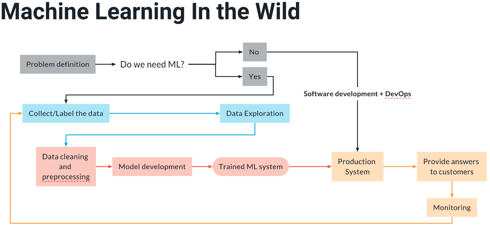

MLOps is a quite recent disciplines, although it has its roots in the 1990's. It could be argued that it was founded with the seminal paper by Sculley et a.: *Hidden Technical Debt in Machine Learning Systems*.

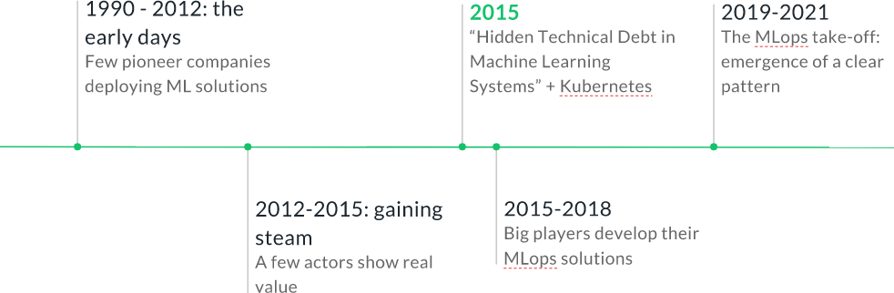


#### What Are MLOps and Reproducible Workflows?

**Machine Learning Operations (MLOps)** are a set of best practices and tools for an efficient end-to-end development and operation of performant, scalable, reliable, automated and reproducible ML solutions in a real production setting.

With MLOps many things are automated and we don't need to deal so much with the infrastructure anymore, so we have more time for the two most important things in data science:

- Data processing: cleaning, feature engineering, etc.
- Modelling; without MLOps, the time allocated for modelling would have been much smaller.

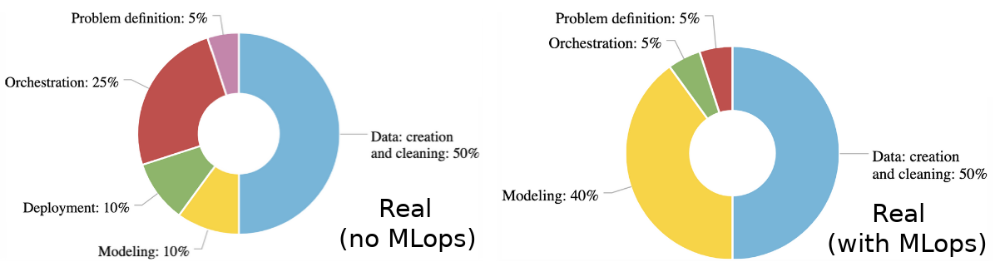

In a real-world machine learning deployment, we don't only deploy the model pipeline, but take care of many other steps:

- Data labeling
- Data storage
- ML pipeline packaging
- Tracking of experiments, code & artifacts with each model pipeline
- Repositories of models
- Inference system, which pulls the appropriate model pipeline
- Monitoring, which triggers re-training if necessary and updates the data labelling process

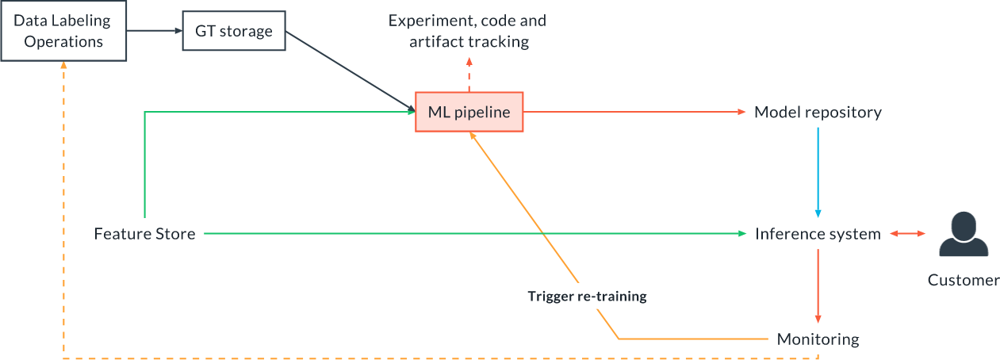

**Reproducible Workflow** is an orchestrated, tracked and versioned workflow that can be reproduced and inspected.

[Gartnet Report: Top Strategic Technology Trends for 2021](https://www.gartner.com/en/newsroom/press-releases/2020-10-19-gartner-identifies-the-top-strategic-technology-trends-for-2021#:~:text=Gartner%20research%20shows%20only%2053,a%20production%2Dgrade%20AI%20pipeline.): *" only 53% of projects make it from artificial intelligence (AI) prototypes to production"*

### 1.2 Business Stakeholders: Which Roles Are Important in MLOps?

There are different roles involved in MLOps and all need to have a clear common language as well as good communication in order a project to be successful. In small companies, a person might have several hats. However, which are these roles:

1. **Data Scientists and ML Engineers**: the main people responsible for the development of the model and the performance measurement.
2. **Data Engineers**: responsible for the data ingestion pipelines and the quality of the data, as well as provisioning the right data at inference time (in production).
3. **Software or Platform Engineers**: they are responsible for the production environment: front-en and back-end. They are necessary partners to think about deployment, and what are the constraints in terms of processing power, latency, throughput, infrastructure and so on. They basically build the production environment.
4. **DevOps Engineer**: they are responsible for handling the infrastructure: training servers, the different MLops tools, and any other infrastructure needed to train and deploy a model. They basically maintain the infrastructure.
5. **Product Managers**: they **define the right problem to solve, exploiting their knowledge about customers' needs**. They keep the project on time and on budget. For them, MLops is a tool allowing for faster and more reliable deployment.
6. **Customers**: MLops and reproducible workflows are hidden from them, but they are going to notice improved reliability and a faster pace of improvements and enhancements in the product.

### 1.3 When Should We Use MLOps?

MLOps is always helpful, but not always necessary; the more complex the project is, the larger is the need and medium-term benefit of MLOps.

Rule of thumb:

- Small personal side-projects and competitions don't need MLOps.
- Initial MVPs often don't require MLOps.
- As soon as we deploy a model, we need MLOps.

### 1.4 MLOps Tools Used

Udacity has strived for simplicity, proven efficiency and availability on desktop platforms:

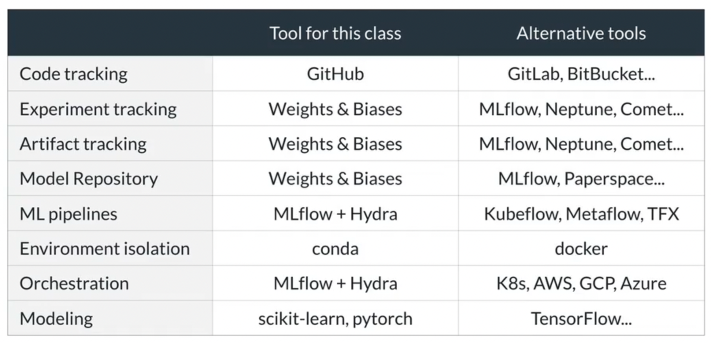

Tools used:

- Github
- Weights & Biases
- MLflow + Hydra
- Anaconda (as oposed to Docker?)
- scikit-learn & pytorch

#### Installation of Weights & Biases and MLflow

Create an account: I used my Github account: [https://wandb.ai/mxagar](https://wandb.ai/mxagar).

Create/activate a conda environment and install the following packages:

```bash
# Create an environment
# conda create --name udacity-mlops python=3.8 mlflow jupyter pandas matplotlib requests -c conda-forge
# ... or activate an existing one:
conda activate ds
# Install missing packages
conda install mlflow requests -c conda-forge
# Make sure pip is pointing to the pip in the conda environment
which pip
# Install Weights and Biases through pip
pip install wandb
# Log in to wandb
wandb login
# Log in on browser if not done
# Go to provided URL: https://wandb.ai/authorize
# Copy and paste API key on Terminal, as requested
# Done!
```

Test `wandb` and `mlflow`:

```bash
wandb --help
mlflow --help
```

### 1.5 Module Project: Rental Price Prediction in New York

> A property management company is renting rooms and properties in New York for short periods on various rental platforms. They need to estimate the typical price for a given property based on the price of similar properties. The company receives new data in bulk every week, so the model needs to be retrained with the same cadence, necessitating a reusable pipeline.

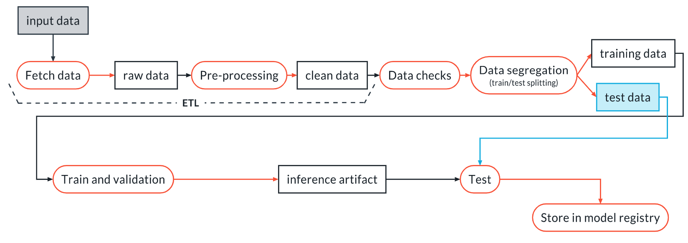

## 2. Machine Learning Pipelines

A machine learning pipeline is a sequence of independent, modular and reusable components. It can be represented as a Direct Acyclic Graph (DAG) in which the output artifact of a component is the input for the next one or another component.

Artifacts are ouput files of objects that need to be

- tracked (who did what when),
- versioned,
- stored.

Example 1: **ETL pipeline** = Extract, Transform, Load: it ingests the data from varois sources, aggregates and cleans it and stores it in a database.

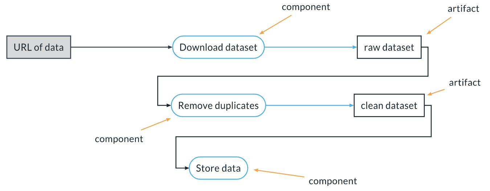

Example 2: **Training Pipeline** = It takes the raw dataset and produces an inference artifact, which is more than the model, rather the pipeline. The ETL pipeline is part of it. The artifact is stored in a registry.


In this section, tools for creating machine learning pipelines are introduced, with examples.

The tools are:

- Weights and Biases, `wandb`: it tracks pipeline runs as wells as artifacts generated in the different steps. We can upload and download artifact versions.
- MLflow, `mlflow`: each step in the pipeline is a mini-project with a well defined conda/docker environment which executes a script or code file in any language; example steps are: get the data, process the data, train, etc. With MLflow we can define sequences of steps with their parameters; additionally, in combination with `wandb` we can generate and track artifacts which glue the different steps of the pipeline.
- Hydra: hydra offers an extra layer on top of MLFlow with which we can parametrize the pipeline with a configuration file. Hydra can do much more, but it's covered in the section.

The examples are in the repository [udacity-cd0581-building-a-reproducible-model-workflow-exercises](https://github.com/mxagar/udacity-cd0581-building-a-reproducible-model-workflow-exercises). However, I copied them to `./lab/`. In particular the exercise/example 3 is very interesting: `WandB_MLflow_Hydra_exercise_3_parametrized_pipeline`. It covers a 2-step pipeline which fetches data, uploads, downloads and processes artifacts, etc. It is like a blueprint for any large ML pipeline.

### 2.1 The Three Levels of MLOps

**Level 0**: no production, proofs of concept, competitions; often just monolithic scripts/notebooks and no pipelines.

**Level 1**: Pipelines, not models.

- The target is not just a model, but an entire pipeline; thus, we can regenerate the model with the pipeline (easy to retrain).
- The pipeline has reusable components.
- The code, artifacts, experiments are tracked.
- The model is monitored in production to avoid the model drift.
- We can learn in production.
- Everything is standardized, thus, it's easier to hand over th epipeline between teams or to try new things just by changing small parts of the modularized components.

**Level 2**: Continuous Integration, Continuous Development.

- The development and deployment of pipeline components is automatized.
    - Changes in components are tested; if they pass, they're merged automatically and deployed into production.
- Continuous training.
- It requires larger teams and infrastructure, but it is very fast and efficient.
- It is often used in A/B testing, because rapid interations are possible only when we have high automation.
- Customers see continuous improvements: pipelines are iterated very quickly.
- This level appears in large companies with mature ML infrastructures; they are very serious players.

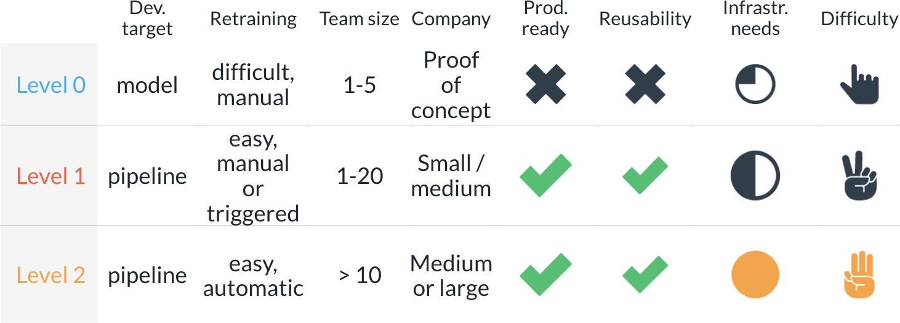

### 2.2 Argparse

Logging refresher:

```python
# Instantiate the logger at global scope of the script
import logging
logging.basicConfig(level=logging.INFO, format="%(asctime)-15s %(message)s")
logger = logging.getLogger()

# We can log messages instead of printing in any scope
# Mark the message as "debug" importance
logger.debug("This is a debug message")
# Mark the message as "info" importance
logger.info("This is an info message")
# Mark the message as "warning" importance
logger.warning("This is a warning")
# Mark the message as "error" importance
logger.error("This is an error")
```

Argparse is a Python module which can be used to parse script arguments.
In order to use it, we instantiate an `ArgumentParser` with a description and then simply `add_arguments` to it. Later, those arguments can be introduced to the script execution comman and they are parsed for use and stored in a [namedtuple](https://docs.python.org/3/library/collections.html#collections.namedtuple).

The following example shows how this works and provides a tpical script structure in which we factorize the functionality to a function called from the `main` scope.

```python

import argparse

# The real code / functions
def do_something(args):
    pass

if __name__ == "__main__":

    # Instantiate parser
    parser = argparse.ArgumentParser(description="This is a brief description of this script")

    # Required argument
    parser.add_argument("--number_1",
        type=float, help="First number", required=True)
    
    # Optional argument: default value needed
    parser.add_argument("--number_2",
        type=int, help="Second number", required=False, default=3)

    # Optional argument: default value needed
    parser.add_argument("--artifact_name",
        type=str, help="Name of the artifact", required=False, default="artifact:latest")

    # Parse arguments
    # args is a namedtuple
    # https://docs.python.org/3/library/collections.html#collections.namedtuple
    args = parser.parse_args()

    # Now, we can access the arguments:
    print(f"number_1: {args.number_1}")
    print(f"number_2: {args.number_2}")
    print(f"number_2: {args.artifact_name}")

    do_something(args)

# We can perfom these calls/script execution commands
# Best practice: use "" for strings
#   python my_script.py --number_1 1.2 --number_2 3 -- artifact_name "my_artifact:debug"
#   python my_script.py --number_1 1.2
#   python my_script.py --help

```

### 2.3 Versioning Data and Artifacts in Weights and Biases

In Weights and Biases, we have

- runs,
- experiments,
- artifacts,
- and job types.

A **run** is a basic unit of tracking, i.e., one/multiple script or notebook executions. We can attach to it:

- Parameters
- Metrics
- Artifacts
- Images, plots

One run generates a row in the table of results; all rows can then be analyzed and visualized.

An **experiment** is a grouping of runs. We collect runs that have the same configuration or are part of the same pipeline execution (e.g., the complete pipeline execution can be an experiment). This grouping is optional and can be undone. We can compare experiments. Experiments are defined with `group` in a run.

A **project** is an heterogenous collection of runs, experiments and artifacts related to a goal. We look at one project at a time, and they can be public or private.

An **artifact** is any file/directory produced during a run; they are all versioned and uploaded if anything changes in their content.

We can also specify the `job_type`, which is a mere tag for filtering.

This is how we define a **run**:

```python
import wandb

# Defintion of a run
run = wandb.init(
        #name="my_run_name" usually left so that W&B chooses one
        project="my_project", # project
        group="experiment_1", # experiment
        job_type="data_cleaning" # job type
)
```

### 2.4 Weights & Biases: Example Notebook

The notebook `02_Reproducible_Pipelines/lab/WandB_examples/01_WandB_Upload_Artifact.ipynb` showcases very basic but useful examples of how projects, runs and artifacts are created locally and registered/uploaded to the W&B registry.

In order to use it, you need to have a Weight & Biases account; then run `wandb login` and log in via the web.

The commands shown here have an effect in the projects on our W&B account, accessible via the web. Thus, always check interatcively the W&B web interface to see the changes.

Whenever we execute `wandb.init()`, a `wandb` folder is created with W&B stuff; I add that folder to `.gitignore`.

Note that in my W&B account I created a group `datamix-ai`, which appars in the package output; however, I'm logged as `mxagar`. As far as I know, that has no effect.

**Overview of Contents**:

1. Create a file to be an artifact and instantiate a run
2. Instantiate an artifact, attach the file to it and attach the artifact to the run
3. Change the file and re-attach to artifact & run
4. Using runs with context managers

```python
### -- 1. Create a file to be an artifact and instantiate a run

# We must be logged in: $ wandb login
import wandb

# Create a file
with open("my_artifact.txt", "w+") as fp:
    fp.write("This is an example of an artifact.")

# Check that the file is in the local directory
!ls

# Instantiate a run
run = wandb.init(project="demo_artifact",
                 group="experiment_1")
# Now, we go to the W&B page and look for the project: [https://wandb.ai/mxagar/projects](https://wandb.ai/mxagar/projects).
# We will fin the project, from which hang the `experiment` and the `run` with the automatic name `eternal-planet-1`.
# In Jupyter, we also get a link to the run when we execute a run with `wandb.init()`.

# To check wand object and function options
#wandb.init?
#wandb.Artifact?

### -- 2. Instantiate an artifact, attach the file to it and attach the artifact to the run

# Instantiate an artifact
artifact = wandb.Artifact(
    name="my_artifact.txt", # does not need to be the name of the file
    type="data", # this is to group artifacts together
    description="This is an example of an artifact",
    metadata={ # metadata is an optional dictionary; we can use it for searching later on
        "key_1":"value_1"
    }
)

# We attach a file to the artifact; we can attach several files!
artifact.add_file("my_artifact.txt")

# We attach the artifact to the run
run.log_artifact(artifact)

# The fact that we attached the artuufact to the run doesn't mean that it has been uploaded to the W&B registry. W&B uploads stuff whenever we close a run (e.g., when exiting the notebook) or every a certain amount of time (auto-upload).

# We can manually finish the run to force W&B upload the artifacts
# We cannot use the run object anymore after finish()
run.finish()


### -- 3. Change the file and re-attach to artifact & run

# When we change and re-attach the file, we will have a new version in the W&B web interface. However, a new version is registered only if the file has changed!

# Change the file
with open("my_artifact.txt", "w+") as fp:
    fp.write("This is an example of an artifact changed.")

# Instantiate a run
run = wandb.init(project="demo_artifact",
                 group="experiment_1")

# Instantiate an artifact
artifact = wandb.Artifact(
    name="my_artifact.txt", # does not need to be the name of the file
    type="data", # this is to group artifacts together
    description="This is an example of an artifact",
    metadata={ # metadata is an optional dictionary; we can use it for searching later on
        "key_1":"value_1"
    }
)

# We attach a file to the artifact; we can attach several files!
artifact.add_file("my_artifact.txt")
run.log_artifact(artifact)

# We can manually finish the run to force W&B upload the artifacts
run.finish()


### -- 4. Using runs with context managers

# If we use contexts, it's easier to use several runs. Several runs make sense, for instance, when we're doing hyperparameter tuning. We don't need to do run.finish(), since that's handle by the context manager.

with wandb.init(project="demo_artifact", group="experiment_1") as run:

    with open("my_artifact.txt", "w+") as fp:
        fp.write("This is an example of an artifact.")

    artifact = wandb.Artifact(
        name="my_artifact.txt", # does not need to be the name of the file
        type="data", # this is to group artifacts together
        description="This is an example of an artifact",
        metadata={ # metadata is an optional dictionary; we can use it for searching later on
            "key_1":"value_1"
        }
    )
    
    artifact.add_file("my_artifact.txt")

with wandb.init(project="demo_artifact", group="experiment_1") as run:

    with open("my_artifact.txt", "w+") as fp:
        fp.write("This is an example of an artifact changed again.")

    artifact = wandb.Artifact(
        name="my_artifact.txt", # does not need to be the name of the file
        type="data", # this is to group artifacts together
        description="This is an example of an artifact",
        metadata={ # metadata is an optional dictionary; we can use it for searching later on
            "key_1":"value_1"
        }
    )
    
    artifact.add_file("my_artifact.txt")

```

### 2.5 Weights & Biases: Exercise 1, Versioning Data & Artifacts and Using Them

Repository:

[udacity-cd0581-building-a-reproducible-model-workflow-exercises](https://github.com/mxagar/udacity-cd0581-building-a-reproducible-model-workflow-exercises)

Folder:

`/lesson-1-machine-learning-pipelines/exercises/exercise_1`

I also copied the files to

`./lab/WandB_exercise_1_upload_use_artifact/`

The exercise uses 3 files, 2 of which need to be completed:

- `zen.txt`: text file used as artifact.
- `upload_artifact.py`: create run, attach the `zen.txt` as artifact and upload it.
- `use_artifact.py`: **use/download** different versions of the artifact uploaded.

All files use `logging` and `argparse`. They need to be executed with the command specified in the file docstring.

Basically, artifacts are registered, changed and re-registered. After that, different versions are used. Note that every time we handle different versions of artifacts, W&B creates two folders:

- `wandb/`
- `artifacts/`

File `upload_artifact.py`:

```python
'''This file creates and registers a Weights & Biases run using arguments passed from the CLI.

To run it:

python upload_artifact.py --input_file zen.txt \
           --artifact_name zen_of_python \
           --artifact_type text_file \
           --artifact_description "20 aphorisms about writing good python code"
           
Then, check it on the W&B web interface: https://wandb.ai/home Projects: exercise_1

If we change zen.txt and re-run the script, a new artifact version will appear in W&B.
But if we re-run the script without changing the file no new version will appear.

When we have different versions, we'll get a local folder artifacts/ which contains them. Whenever we'd like to use a version, the run object gets the correct path (see script use_artifact.py).
'''
import argparse
import logging
import pathlib
import wandb


logging.basicConfig(level=logging.INFO, format="%(asctime)-15s %(message)s")
logger = logging.getLogger()


def go(args):

    logger.info("Creating run exercise_1")

    # Create a W&B run in the project ``exercise_1``. Set the option ``job_type="upload_file"``:
    run = wandb.init(project="exercise_1",
                     job_type="upload_file")

    # Create an instance of the class ``wandb.Artifact``. Use the ``artifact_name`` parameter to fill
    # the keyword ``name`` when constructing the wandb.Artifact class.
    # Use the parameters ``artifact_type`` and ``artifact_desc`` to fill respectively the keyword
    # ``type`` and ``description``
    # HINT: you can use args.artifact_name to reference the parameter artifact_name
    artifact = wandb.Artifact(
        name=args.artifact_name,
        type=args.artifact_type, 
        description=args.artifact_description,
    )

    # Attach the file provided as the parameter ``input_file`` to the artifact instance using
    # ``artifact.add_file``, and log the artifact to the run using ``run.log_artifact``.
    artifact.add_file(args.input_file)
    run.log_artifact(artifact)

if __name__ == "__main__":
    parser = argparse.ArgumentParser(
        description="Upload an artifact to W&B", fromfile_prefix_chars="@"
    )

    parser.add_argument(
        "--input_file", type=pathlib.Path, help="Path to the input file", required=True
    )

    parser.add_argument(
        "--artifact_name", type=str, help="Name for the artifact", required=True
    )

    parser.add_argument(
        "--artifact_type", type=str, help="Type for the artifact", required=True
    )

    parser.add_argument(
        "--artifact_description",
        type=str,
        help="Description for the artifact",
        required=True,
    )

    args = parser.parse_args()

    go(args)

    

```

File `use_artifact.py`:

```python
'''This script uses an artifact registered in Weights & Biases using arguments passed from the CLI.

To run it:

python use_artifact.py --artifact_name exercise_1/zen_of_python:v1

We can change between artifact versions with v0, v1, etc.

The different artifact versions are on the cloud and also locally, in the folder artifacts/
'''
import argparse
import logging
import pathlib
import wandb


logging.basicConfig(level=logging.INFO, format="%(asctime)-15s %(message)s")
logger = logging.getLogger()


def go(args):

    logger.info("Creating run in project exercise_1")
    run = wandb.init(project="exercise_1", job_type="use_file")

    logger.info("Getting artifact")

    # Get the artifact and store its local path in the variable "artifact_path"
    # From the W&B web interface (Usage):
    # artifact = run.use_artifact('datamix-ai/exercise_1/zen_of_python:v1', type='text_file')
    # Apparently, we don't necessarily need the team name datamix-ai
    artifact = run.use_artifact(args.artifact_name)
    # The file path is retreived, pointing to the correct version in folder artifacts/
    artifact_filepath = artifact.file()
    print(f"artifact_filepath = {artifact_filepath}")
    
    # We open the file
    # But 
    logger.info("Artifact content:")
    with open(artifact_filepath, "r") as fp:
        content = fp.read()

    print(content)

if __name__ == "__main__":
    
    parser = argparse.ArgumentParser(
        description="Use an artifact from W&B", fromfile_prefix_chars="@"
    )

    parser.add_argument(
        "--artifact_name", type=str, help="Name and version of W&B artifact", required=True
    )

    args = parser.parse_args()

    go(args)


```

### 2.6 ML Pipeline Components in MLFlow

We're going to use an MLflow component called **MLflow Project**. An **MLflow Project** is a package of data science code that is reusable and reproducible. It includes an API and CLI tools for running and chaining projects into workflows.

An MLflow project has 3 components:

1. The **code** we want to use. This is independent from the rest; it can be in any language! When putting together pipelines, we can even mix components written in different languages.
2. The **environment definition**: runtime dependencies; we can use either conda or docker. Udacity focuses on conda.
3. The **project definition**: contents of the project and how to interact.


#### Conda: `conda.yaml`

Conda is language agnostic, it handles also C++ packages. Also it's open source - we should not mix it with Anaconda.

We define the conda environment in YAML file:

```yaml
name: download_data
channels:
  - conda-forge
  - defaults
dependencies:
  - requests=2.24.0
  - pip=20.3.3
  - mlflow=1.14.1
  - hydra-core=1.0.6
  - pip:
    - wandb==0.10.21
```

In the `conda.yaml`:

- We define the environment: `download_data`
- Channels are distribution channels for packages; `conda-forge` contains many packages. By listing the channels this way, conda looks for the package in the specified order.
- Dependencies: all code dependencies must be specified; if some dependencies are not in conda, we add a section with `pip`. We should specify the exact version used in the development environment. Note that the `pip` section uses `==` instead of `=`. If we don't specify the version, conda will always get the latest version, and our code might fail.
- **IMPORTANT**: it seems I need to add `protobuf` as dependency sometimes (I haven't figured out the cause and when). See other `conda.yaml` that add `protobuf`.

More information on conda by the instructor Giacomo Vianello [Conda: Essential Concepts and Tips](https://towardsdatascience.com/conda-essential-concepts-and-tricks-e478ed53b5b). Concepts covered:

- Why conda
- Entry-level examples
- What is conda
- Conda and pip
- Conda Vs Anaconda Vs Miniconda
- How to install conda
- Getting Miniconda
- Installing packages, and environments
- The base environment
- Other environments
- The best way to use Jupyter and conda
- Removing environments
- Sharing an environment
- Channels
- The conda-forge channel
- Conda and pip
- Conda is slow
- Free up some disk space
- Conda and docker
- In-depth: RPATH and conda
- Conclusions

#### Project Definition: `MLproject`

```
name: download_data
conda_env: conda.yml

entry_points:
  main:
    parameters:
      file_url:
        description: URL of the file to download
        type: uri
      artifact_name:
        description: Name for the W&B artifact that will be created
        type: str

    command: >-
      python download_data.py --file_url {file_url} \
                              --artifact_name {artifact_name}
  other_script:
    parameters:
        parameter_one:
          description: First parameter
          type: str
    command: julia other_script.jl {parameter_one}
```

In the `MLproject` file:

- Note that even though the `MLproject` file is a YAML file, it has no ending.
- Note also that the filename needs to be `MLproject`.
- We define the name of the project (can be any name) and the `conda_env` file defined above.
- The section `entry_points` is very important: it defines all the commands that are available for our project. 
    - We must have a `main` section: default script to run.
    - The other sections are optional, they are other possible scripts.
    - Every entry point has `command` and its `parameters`.
    - A `parameter` has
        - `description`: any string
        - `type`: str, float, uri, path
        - `default`: if the parameter is optional, default value

#### Running the Project

When running the `MLproject` file via CLI, we pass the parameters with the option `-P` and the parameter name. **Important**: the project file name needs to be `MLproject` and we pass the folder name to `mlflow`.

```bash
# Run default script from a local folder
mlflow run ./my_project -P file_url=https://myurl.com \
    -P artifact_name=my_data.csv

# Run different entry point from a local folder
mlflow run ./my_project -e other_script -P parameter_one=27

# Run default script directly from Github (HEAD is used)
mlflow run git@github.com/my_username/my_repo.git \
    -P file_url=https://myurl.com \
    -P artifact_name=my_data.csv

# Run a specific release or tag from the repository (best practice, otherwise HEAD is used)
mlflow run git@github.com/my_username/my_repo.git \
    -v 2.5.3 \
    -P file_url=https://myurl.com \
    -P artifact_name=my_data.csv
```

However, note that it is also possible to use `mlflow` via its API. That makes sense if we want to define a pipeline consisting of several chained components. See Section 2.8 for that topic.

### 2.7 Introduction to YAML

In YAML we can define lists and dictionaries; we can also combine and nest them. List items are preceded by `-` and key-value pairs are signaled with `:`. Example with a nested dictionary and a nested list with it:

```yaml
a: a value
b:
  c: 1.2
  d: 1
  e: a string
c:
  - 1
  - 2
  - another string
  - - 1
    - 2
    - a
```

Especial symbols:

- `#`: comments
- `>-`: line breaks allowed (but if command, we need to add `\`, too)

If we want to parse YAML files: `pip install pyyaml`, then:

```python
import yaml
with open("conda.yml") as fp:
    d = yaml.safe_load(fp)
print(d) # dictionary is printed
```

### 2.8 MLflow: Exercise 2, Defining and Running an MLflow pipeline

Repository:

[udacity-cd0581-building-a-reproducible-model-workflow-exercises](https://github.com/mxagar/udacity-cd0581-building-a-reproducible-model-workflow-exercises)

Folder:

`/lesson-1-machine-learning-pipelines/exercises/exercise_2`

I also copied the files to

`./lab/WandB_MLflow_exercise_2_download_upload_artifact/`

The exercise comes with the python script `download_data.py`, which downloads a file and logs it into W&B.

The script can be run as

```bash
python download_data.py \
       --file_url https://raw.githubusercontent.com/scikit-learn/scikit-learn/4dfdfb4e1bb3719628753a4ece995a1b2fa5312a/sklearn/datasets/data/iris.csv \
       --artifact_name iris \
       --artifact_type raw_data \
       --artifact_description "The sklearn IRIS dataset"
```

We need to transform it into an MLflow pipeline: `conda.yaml` + `MLproject`.

#### Solution

`conda.yaml`:

```yaml
name: download_data
channels:
  - conda-forge
  - defaults
dependencies:
  - requests=2.24.0
  - pip=20.3.3
  - mlflow=1.14.1
  - hydra-core=1.0.6
  - pip:
    - wandb==0.10.21
```

`MLproject`:

```yaml
name: download_data
conda_env: conda.yaml

entry_points:
  main:
    parameters:
      file_url:
        description: URL of the file to download
        type: uri
      artifact_name:
        description: Name for the W&B artifact that will be created
        type: str
      artifact_type:
        description: Type of the W&B artifact that will be created
        type: str
        default: raw_data
      artifact_description:
        description: Description of the W&B artifact that will be created
        type: str

    command: >-
      python download_data.py \
       --file_url {file_url} \
       --artifact_name {artifact_name} \
       --artifact_type {artifact_type} \
       --artifact_description {artifact_description}
```

Execution:

```bash
# Run default script from a local folder.
# We need to pass all non-default arguments required by the command script.
# We specify the folder where the procject file MLproject is.
# The conda environment is created and the command/script are executed. That creates a run in W&B.
mlflow run . \
    -P file_url=https://raw.githubusercontent.com/scikit-learn/scikit-learn/4dfdfb4e1bb3719628753a4ece995a1b2fa5312a/sklearn/datasets/data/iris.csv \
    -P artifact_name=iris \
    -P artifact_description="This data sets consists of 3 different types of irises’ (Setosa, Versicolour, and Virginica) petal and sepal length"
```

Check: project and artifact appear in Weights & Biases.

### 2.9 Linking Together the Components

The ML pipeline is a graph of components or modules that produce artifacts; the output artifact of a component is the input of another. Thus, **artifacts are the glue** of the pipeline. Additionally, note that there is no limit in the number of inputs & outputs of a component.

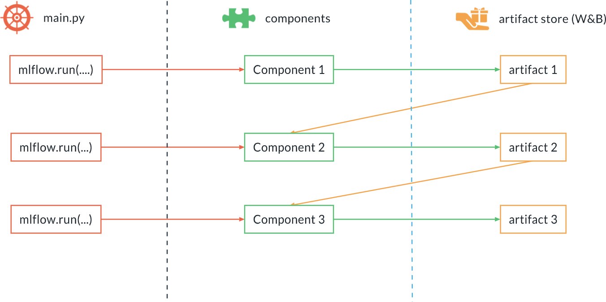

We can use `mlflow` via its API; we call a main python script `mlflow.run(...)` several times: each `mlflow.run(...)` is equivalent to using the CLI `mlflow run ...`. That way, we can use several components or modules chained with their artifacts.

Thus:

- `mlflow` is used to call different components with their parameters in a sequence.
- W&B is used to register the artifacts.

The `mlflow.run()` command works as follows:

```python
import mlflow

# Equivalent to 
# mlflow run ./my_project -e main -P file_url="https://..." -P artifact_name="my_data.csv"
mlflow.run(
  # URI can be a local path or the URL to a git repository
  # here we are going to use a local path.
  # The MLproject file must be there.
  uri="my_project",
  # Entry point to call
  entry_point="main",
  # Parameters for that entry point
  parameters={
    "file_url": "https://...",
    "artifact_name": "my_data.csv"
  }
)
```

That python snippet is equivalent to:

```bash
mlflow run ./my_project -e main \
    -P file_url="https://..." \
    -P artifact_name="my_data.csv"
```

Therefore, a typical ML pipeline has several components and has the following structure:

```
ml_pipeline/
    download_data/
        conda.yaml
        MLproject
        run.py
    remove_duplicates/
        conda.yaml
        MLproject
        run.py
    conda.yaml
    main.py
    MLproject
```

The top directory contains all the components in folder, and additionally:

- `main.py`, which executes all the `mlflow.run()`
- `MLproject`, to define how to call `main.py`
- `conda.yaml`, the environment configuration for `main.py`; the component dependencies DO NOT go here!

In fact, each component directory is a MLflow project that can be run on its own.

Example `main.py`:

```python
import mlflow

mlflow.run(
  uri="download_data",
  entry_point="main",
  parameters={
    "file_url": "https://...",
    "output_artifact": "raw_data.csv",
    "output_artifact_type": "raw_data",
    "output_artifact_description": "Raw data"
  }
)

mlflow.run(
  uri="remove_duplicates",
  entry_point="main",
  parameters={
    "input_artifact": "raw_data.csv:latest",
    "output_artifact": "clean_data.csv",
    "output_artifact_type": "dedup_data",
    "output_artifact_description": "De-duplicated data"
  }
)
```

Notes on `main.py`:

- The output of a run is the input for the next run.
- Note that the input artifact of the second component has a `:latest` tag! This is because we use W&B and we always need to provide the version. If we want a specific version and not the latest, we need to specify it, e.g., `:v2`.

#### Pipeline Configuration: Hydra

A complex ML project can have many parameters; they belong to specific components, yet they are all related. In order to track and handle them all together, another configuration layer is usually defined, for instance with [Hydra](https://hydra.cc/docs/intro/). Note that Hydra is not ML specific, it works for any complex project.

We should always avoid hard-coding the parameters in the `main.py` script, because that makes difficult to re-use the code. Instead, we can have them in a `hydra` configuration YAML which is used by the rest of the project. That configuration file defines the parameters and their default values. We have these advantages:

- All parameters are documented and can be versioned.
- We can override the parameters if required.
- We can genrate multiple runs from the same command; example: hyper-parameter optimization.

The typical hydra YAML has sections that map each one to each of the components (in addition to the main script), but that's a convention -- we can organize it as we please.

Example configuration YAML for hydra; the projects aims to train a random forest and has two components: (1) fetching the data and the (2) train random forest. Each section can have subsections.

Hydra configuration `config.yaml`:

```yaml
main:
  project_name: my_project
  experiment_name: dev
data:
  train_data: "exercise_6/data_train.csv:latest"
random_forest_pipeline:
  random_forest:
    n_estimators: 100
    criterion: gini
    max_depth: null
```

In the `main.py` file which calls `mlflow.run()` we just need to `import hydra` and add a decorator; with that, we have access to the configuration paramaters:

File `main.py`:

```python
import os
import mlflow
import hydra

@hydra.main(config_name="config") # config.yaml is read (not we DON't add .yaml)
def go(config): # config object has teh contents of config.yaml
    # Now here config is a dictionary with our configuration
    # For example, to access the parameter project_name in the data
    # section we can just do
    project_name = config["main"]["project_name"]

    # WandB run grouping
    os.environ["WANDB_PROJECT"] = config["main"]["project_name"] # WandB project name
    os.environ["WANDB_RUN_GROUP"] = config["main"]["experiment_name"] # WandB experiment name

    mlflow.run(
        uri="test_data",
        parameters={
            "input_artifact": config["data"]["train_data"],
            "output_data": "raw_data.csv"
            # ...
        }
    )
    mlflow.run(
        uri="train_random_forest",
        parameters={
            "input_artifact": "raw_data.csv:latest",
            "n_estimators": config["random_forest_pipeline"]["random_forest"]["n_estimators"]
            # ...
        }
    )


if __name__=="__main__":
    go() # we DON'T pass config
```

Notes:

- Since we're using `hydra`, we don't need `argparse`.
- `go()` is called without the `config` object.
- The `config` object is created when using the `hydra` decorator, which loads the `config.yaml`, even though we pass the filename without extension.

To use `hydra`, we need to change the `MLproject` file so that we can override the parameters written in the configuration file. That is done allowing only one option, `hydra_options`, which is echoed directly to the `main.py` script. If we don't explicitly override parameters, the default ones from the `hydra` `config.yaml` are going to be used.

Top level `MLproject` file:

```yaml
name: main
conda_env: conda.yml

entry_points:
  main:
    parameters:
      hydra_options:
        description: Hydra parameters to override
        type: str
        default: ''
    command: >-
      python main.py $(echo {hydra_options})
```

ML pipeline execution call with everything together:

```bash
# Run local pipeline
mlflow run .

# Run pipeline in path
mlflow run /path/to/project

# Run with an overidden parameter from config.yaml
# The sections and their subsections are separated with .
mlflow run . -P hydra_options="main.experiment_name=my_experiment"
mlflow run . -P hydra_options="random_forest.random_forest_pipeline.n_estimators=50"

# Run with several overidden parameters
# Parameters are separated with white space
mlflow run . \
    -P hydra_options="main.experiment_name=my_experiment main.project_name=test"
```

#### Tracking Pipelines with Weights & Biases

Each run in W&B is tracked; additionally, recall that we can group them together in experiments and projects. It is in fact a best practice. That is done by defining the environment variables `WANDB_PROJECT` and `WAND_RUN_GROUP`.

```python
import hydra
import mlflow
import os

@hydra.main(config_name="config")
def go(config):
    # WandB run grouping
    os.environ["WANDB_PROJECT"] = config["main"]["project_name"] # WandB project name
    os.environ["WANDB_RUN_GROUP"] = config["main"]["experiment_name"] # WandB experiment name

    mlflow.run(
        # ...
    )
    # ...

if __name__ == "__main__":
    go()
```

However, note that:

- This is set for the main script only.
- Any component can iveride the project/experiment name in `wandb.init()`.

### 2.10 MLflow and Hydra: Exercise 3, Parametrized Pipeline

Repository:

[udacity-cd0581-building-a-reproducible-model-workflow-exercises](https://github.com/mxagar/udacity-cd0581-building-a-reproducible-model-workflow-exercises)

Folder:

`/lesson-1-machine-learning-pipelines/exercises/exercise_3`

I also copied the files to

`./lab/WandB_MLflow_Hydra_exercise_3_parametrized_pipeline/`

**This is a very interesting exercise, since a complete pipeline with 2 characteristic steps is realized. It's a nice blueprint for larger projects.** Things done:

- Fetch data from an URL
- Add/upload CSV artifact 
- Download CSV artifact
- Process data: t-SNE
- Upload processed data + image (t-SNE)

Everything is reflected in the W&B web interface.

The exercise comes with the following file structure, which contains an ML pipeline with two components:

```
.
├── MLproject # mlflow main
├── conda.yml # mlflow main
├── config.yaml # hydra
├── main.py # mlflow main
├── download_data # mlflow step/component
│    ├── MLproject
│    ├── conda.yml
     └── download_data.py # download the data
└── process_data # mlflow step/component
    ├── MLproject
    ├── conda.yml
    └── run.py # t-SNE visualization + dataframe with t-SNE features
```

We need to stitch these two components together by finishing what's missing in each file. Then, we execute the pipeline and check everything is registered in the W&B web interface.

#### Solution

Main `MLproject`:

```yaml
name: download_data
conda_env: conda.yml

entry_points:
  main:
    parameters:
      hydra_options:
        description: Hydra parameters to override
        type: str
        default: ''
    command: >-
      python main.py $(echo {hydra_options})
```

Main `conda.yaml`:

```yaml
name: download_data
channels:
  - conda-forge
  - defaults
dependencies:
  #- python=3.8
  - requests=2.24.0
  - pip=20.3.3
  - mlflow=1.14.1
  - hydra-core=1.0.6
  - pip:
    - wandb==0.10.21
```

Main `config.yaml` (hydra):

```yaml
main:
  project_name: experiment_3
  experiment_name: dev
data:
  file_url: https://raw.githubusercontent.com/scikit-learn/scikit-learn/4dfdfb4e1bb3719628753a4ece995a1b2fa5312a/sklearn/datasets/data/iris.csv
```

File `main.py`:

```python
import mlflow
import os
import wandb
import hydra
from omegaconf import DictConfig

# This automatically reads in the configuration
@hydra.main(config_name='config')
def go(config: DictConfig):

    # Setup the wandb experiment. All runs will be grouped under this name
    os.environ["WANDB_PROJECT"] = config["main"]["project_name"]
    os.environ["WANDB_RUN_GROUP"] = config["main"]["experiment_name"]

    # You can get the path at the root of the MLflow project with this:
    root_path = hydra.utils.get_original_cwd()

    _ = mlflow.run(
        os.path.join(root_path, "download_data"),
        "main",
        parameters={
            "file_url": config["data"]["file_url"],
            "artifact_name": "iris.csv",
            "artifact_type": "raw_data",
            "artifact_description": "Input data"
        }
    )

    _ = mlflow.run(
        os.path.join(root_path, "process_data"),
        "main",
        parameters={
            "input_artifact": "iris.csv:latest",
            "artifact_name": "clean_data.csv",
            "artifact_type": "processed_data",
            "artifact_description": "Cleaned data"
        }
    )

if __name__ == "__main__":
    go()
```

File `download_data/MLproject`:

```yaml
name: download_data
conda_env: conda.yml

entry_points:
  main:
    parameters:
      file_url:
        description: URL of the file to download
        type: uri
      artifact_name:
        description: Name for the W&B artifact that will be created
        type: str
      artifact_type:
        description: Type of the artifact to create
        type: str
        default: raw_data
      artifact_description:
        description: Description for the artifact
        type: str

    command: >-
      python download_data.py --file_url {file_url} \
                              --artifact_name {artifact_name} \
                              --artifact_type {artifact_type} \
                              --artifact_description {artifact_description}

```

File `download_data/conda.yaml`:

```yaml
name: download_data
channels:
  - conda-forge
  - defaults
dependencies:
  - requests=2.24.0
  - pip=20.3.3
  - mlflow=1.14.1
  - hydra-core=1.0.6
  - pip:
    - wandb==0.10.21
```

File `download_data/download_data.py`

```python
#!/usr/bin/env python
import argparse
import logging
import pathlib
import wandb
import requests
import tempfile


logging.basicConfig(level=logging.INFO, format="%(asctime)-15s %(message)s")
logger = logging.getLogger()

def go(args):

    # Derive the base name of the file from the URL
    basename = pathlib.Path(args.file_url).name.split("?")[0].split("#")[0] # iris.csv

    # Download file, streaming so we can download files larger than
    # the available memory. We use a named temporary file that gets
    # destroyed at the end of the context, so we don't leave anything
    # behind and the file gets removed even in case of errors
    logger.info(f"Downloading {args.file_url} ...")
    with tempfile.NamedTemporaryFile(mode='wb+') as fp:
        
        logger.info("Creating run")
        #with wandb.init(project="exercise_3", job_type="download_data") as run:
        with wandb.init(job_type="download_data") as run:
            
            # Download the file streaming and write to open temp file
            with requests.get(args.file_url, stream=True) as r:
                for chunk in r.iter_content(chunk_size=8192):
                    fp.write(chunk)

            # Make sure the file has been written to disk before uploading
            # to W&B
            fp.flush()

            logger.info("Creating artifact")
            artifact = wandb.Artifact(
                name=args.artifact_name,
                type=args.artifact_type,
                description=args.artifact_description,
                metadata={'original_url': args.file_url}
            )
            artifact.add_file(fp.name, name=basename)

            logger.info("Logging artifact")
            run.log_artifact(artifact)

            # This makes sure that the artifact is uploaded before the
            # tempfile is destroyed
            #artifact.wait()


if __name__ == "__main__":
    parser = argparse.ArgumentParser(
        description="Download a file and upload it as an artifact to W&B", fromfile_prefix_chars="@"
    )

    parser.add_argument(
        "--file_url", type=str, help="URL to the input file", required=True
    )

    parser.add_argument(
        "--artifact_name", type=str, help="Name for the artifact", required=True
    )

    parser.add_argument(
        "--artifact_type", type=str, help="Type for the artifact", required=True
    )

    parser.add_argument(
        "--artifact_description",
        type=str,
        help="Description for the artifact",
        required=True,
    )

    args = parser.parse_args()
    
    go(args)
```

File `process_data/MLproject`:

```yaml
name: download_data
conda_env: conda.yml

entry_points:
  main:
    parameters:
      input_artifact:
        description: Fully-qualified artifact name for the input artifact
        type: uri
      artifact_name:
        description: Name for the W&B artifact that will be created
        type: str
      artifact_type:
        description: Type of the artifact to create
        type: str
        default: raw_data
      artifact_description:
        description: Description for the artifact
        type: str

    command: >-
      python run.py --input_artifact {input_artifact} \
                    --artifact_name {artifact_name} \
                    --artifact_type {artifact_type} \
                    --artifact_description {artifact_description}
```

File `process_data/conda.yml`:

```yaml
name: download_data
channels:
  - conda-forge
  - defaults
dependencies:
  - requests=2.24.0
  - pip=20.3.3
  - seaborn=0.11.1
  - pandas=1.2.3
  - scikit-learn=0.24.1
  - matplotlib=3.2.2
  - pillow=8.1.2
  - pip:
    - wandb==0.10.21
    - protobuf==3.20
```

File `process_data/run.py`:

```python
#!/usr/bin/env python
import argparse
import logging
import seaborn as sns
import pandas as pd
import wandb

from sklearn.manifold import TSNE

logging.basicConfig(level=logging.INFO, format="%(asctime)-15s %(message)s")
logger = logging.getLogger()

def go(args):

    run = wandb.init(project="experiment_3", job_type="process_data")
    #run = wandb.init(job_type="process_data")

    logger.info("Downloading artifact")
    artifact = run.use_artifact(args.input_artifact)
    artifact_path = artifact.file()

    iris = pd.read_csv(
        artifact_path,
        skiprows=1,
        names=("sepal_length", "sepal_width", "petal_length", "petal_width", "target"),
    )

    target_names = "setosa,versicolor,virginica".split(",")
    iris["target"] = [target_names[k] for k in iris["target"]]

    logger.info("Performing t-SNE")
    tsne = TSNE(n_components=2, init="pca", random_state=0)
    transf = tsne.fit_transform(iris.iloc[:, :4])

    iris["tsne_1"] = transf[:, 0]
    iris["tsne_2"] = transf[:, 1]

    g = sns.displot(iris, x="tsne_1", y="tsne_2", hue="target", kind="kde")

    logger.info("Uploading image to W&B")
    run.log({"t-SNE": wandb.Image(g.fig)})

    logger.info("Creating artifact")

    iris.to_csv("clean_data.csv")

    artifact = wandb.Artifact(
        name=args.artifact_name,
        type=args.artifact_type,
        description=args.artifact_description,
    )
    artifact.add_file("clean_data.csv")

    logger.info("Logging artifact")
    run.log_artifact(artifact)


if __name__ == "__main__":
    parser = argparse.ArgumentParser(
        description="Download a file and upload it as an artifact to W&B",
        fromfile_prefix_chars="@",
    )

    parser.add_argument(
        "--input_artifact",
        type=str,
        help="Fully-qualified name for the input artifact",
        required=True,
    )

    parser.add_argument(
        "--artifact_name", type=str, help="Name for the artifact", required=True
    )

    parser.add_argument(
        "--artifact_type", type=str, help="Type for the artifact", required=True
    )

    parser.add_argument(
        "--artifact_description",
        type=str,
        help="Description for the artifact",
        required=True,
    )

    args = parser.parse_args()

    go(args)
```

Project execution:

```bash
# Local run with default parameters
mlflow run .
# Local run with overriden parameter
mlflow run . -P hydra_options="main.experiment_name=prod"
```

### 2.11 MLflow Project Development Recommendations

These are tipcs and tricks I collected while following the course.

#### Notes, Tips & Tricks

- Make sure that teh indentation in zthe YAML files is correct.
- Make sure that the requirements of the conda env are correctly typed: =, ==, etc.
- Sometimes I needed to add protobuf as pip requirement for the environment.
- The first time a run with an environment is executed, the conda environment is created; the next times, the environment is already there, so it's faster. See how to delete the `mlflow` `conda` environments below.

#### Troubleshooting Pipelines

If the MLflow project has several steps and it doesn't work, we can try each step separately. However, note that the project name for `wandb` needs to be set in the python script, because it is usually passed via the environment. Also note that if we execute the python script manually, we're outside from the desired environment with the required dependencies.

```bash
mlflow run . \
-P input_artifact=iris.csv:latest \
-P artifact_name=clean_data.csv \
-P artifact_type=processed_data \
-P artifact_description="Cleaned data"
```

```bash
python run.py --input_artifact iris.csv:latest \
       --artifact_name clean_data.csv \
       --artifact_type processed_data \
       --artifact_description "Cleaned data"
```

#### Remove all conda mlflow conda environments

The first time a run with an environment is executed, the conda environment is created; the next times, the environment is already there, so it's faster. If we want to remove all `mlflow` `conda` environment, we can use this script.

```bash
 #!/bin/bash
 
 echo "Removing all conda environments with prefix 'mlflow-'"
 
 conda env list | cut -d " " -f1 | while read -r env ; do
     echo "Processing $env"
     if [[ $env == mlflow-* ]]; then
         conda env remove -n $env
     fi  
 done
```

### 2.12 Conda vs. Docker

I will spare the [Docker overview](https://docs.docker.com/get-started/overview/) details, since I've worked already with docker.

Mlflow offers the possibility of working with Docker instead of conda. For more details, look at: [Specifying an Environment: Docker](https://www.mlflow.org/docs/latest/projects.html#specifying-an-environment)

Conda, in contrast to Docker, is/has:

- Easier to use, no need of DevOps knowledge.
- No need of a separate regstry for the images.
- Self-contained, but not completely isolated: still OS libraries are used.
- No integration with Kubernetes; that's only possible with Docker

### 2.13 Running in the Cloud

MLflow is written by [Databricks](https://databricks.com/); hence, it has full support for deployment at Databricks.

In summary, these are the options we have for running our pipelines in the cloud:

- If we have Databricks enterprise, we can just add the option `-b` to the `mlflow run` command. More details: [Run MLflow Projects on Databricks](https://docs.databricks.com/applications/mlflow/projects.html#run-mlflow-projects-on-databricks).
- We can upload the code to a repo, generate an AWS compute instance, clone the repo there and run it on the cloud. This is the manual way.
- We can use hydra lanchers. These can distirbute the work in different cores, computers, clusters, etc. Hydra is very powerful, but not covered here.
- Use Kubernetes with Kubeflow.

## 3. Data Exploration and Preparation

### 3.1 Exploratory Data Analysis (EDA)

Before developing any Machine Learning Pipeline, we need to perform our Exploratory Data Analysis (EDA). EDA helps us understand the dataset:

- Learn data types, ranges, distributions, etc.
- Plots: histograms, etc.
- Identify missing values, outliers
- Test assumptions
- Uncover data biases

EDA is quite an art, since it's specific for each dataset.

Even though EDA is interactive and is usually done with Jupyter notebooks, we can track it with Weights & Biases and MLflow.

To that end:

- Write an MLflow component that installs Jupyter + libs, and execute the EDA as a notebook from within this component.
- Track inputs and outputs of the notebook (artifacts) with Weights & Biases; for that we create a run and set `save_code=True`. This keeps the code in synch with the copy W&B. W&B tracks even the order in which the cells were run. BUT: please, write notebooks that can be run sequentially from top to bottom!

```pyhon
run = wandb.init(
  project="my_exercise",
  save_code=True
)
```

### 3.2 Pandas Profiling

[Pandas profiling](https://github.com/ydataai/pandas-profiling) is a tool which can help during EDA. A **profile** is an interactive visualization of the characteristics of a dataframe. It goes beyond `df.describe()`.

```bash
conda install -c conda-forge pandas-profiling
```

The [pandas-profiling](https://github.com/ydataai/pandas-profiling) repository has very nice quick-start commands.

Here, an example with the Iris dataset is provided in a code snippet to be run on a Jupyter notebook.

`./lab/pandas_profiling/Pandas_Profiling.ipynb`:

```python
import pandas_profiling
import pandas as pd
from sklearn import datasets

# Load Iris dataset
iris = datasets.load_iris()
X = pd.DataFrame(iris['data'], columns=iris['feature_names'])
y = pd.DataFrame(iris['target'], columns=['species'])
y['species'].replace({0:iris['target_names'][0],
                      1:iris['target_names'][1],
                      2:iris['target_names'][2]},
                      inplace=True)
df = pd.concat([X,y],axis=0)

# Pandas profiling report
profile = pandas_profiling.ProfileReport(df, title="Pandas Profiling Report", explorative=True)
profile.to_widgets()
# Report with:
# - Warnings
# - Correlations
# - Variable information: histogram, descriptives, etc.
# - ...
```

### 3.3 Set Up EDA Notebook with WandB and MLflow: Exercise 4

This exercise shows how to perform Jupyter notebook tracking with W&B and MLflow. The key idea is that the notebook runs as well as the code can be tracked by W&B. MLflow is used just to automate the environment generation and launching of Jupyter Notebook.

Repository:

[udacity-cd0581-building-a-reproducible-model-workflow-exercises](https://github.com/mxagar/udacity-cd0581-building-a-reproducible-model-workflow-exercises)

Folder:

`/lesson-2-data-exploration-and-preparation/exercises/exercise_4`

I also copied the files to

`./lab/WandB_MLflow_Jupyter_EDA_exercise_4_tracked_notebook/`

The dataset used is a modified version of the [Spotify Songs](https://www.kaggle.com/datasets/mrmorj/dataset-of-songs-in-spotify).

First, upload the dataset from the repo:

```bash
cd exercise_4/ # where genres_mod.parquet is located
wandb artifact put \
      --name exercise_4/genres_mod.parquet \
      --type raw_data \
      --description "A modified version of the songs dataset" genres_mod.parquet
```

Then, we carry out these steps (exercise instructions):

- Upload the dataset to W&B with the command above.
- Write the `MLproject` file: `main` step, no `parameters`, `command`: `jupyter notebook`.
- Check & update the `conda.yaml` file.
- Excute: `mlflow run .`
- Wait for the environment to be created and the Jupyter to be opened.
- Create a notebook called EDA.
- Write code into the notebook:
    - Imports
    - `run = wandb.init(project="exercise_4", save_code=True)`
    - `ProfileReport`
    - Simple EDA.
    - `run.finish()`
- Shut down the notebook server manually clicking on the button.

#### Solution

`conda.yaml`:

```yaml
name: simple_eda
channels:
  - conda-forge
  - defaults
dependencies:
  - python=3.8
  - jupyter=1.0.0
  - jupyterlab=3.1.7
  - seaborn=0.11.1
  - pandas=1.2.3
  - pip=20.3.3
  #- pandas-profiling=2.11.0
  - pandas-profiling=3.2.0
  - pyarrow=2.0
  #- flask=2.1.0
  - ipywidgets=7.6.5
  - pip:
    - wandb==0.10.21
    - protobuf==3.20
```

`MLproject`:

```yaml
name: EDA
conda_env: conda.yml

entry_points:
  main:
    command: >-
      jupyter notebook
```

`EDA.ipynb`:

```python
import wandb

import pandas_profiling
import pandas as pd
import seaborn as sns

# Create a run for our project; name automatically generated
run = wandb.init(
  project="exercise_4",
  save_code=True
)

# Open the artifact: the name is not the filename,
# but the name we used when registering it
# To download the file we need to call .file()
artifact = run.use_artifact("exercise_4/genres_mod.parquet:latest")
df = pd.read_parquet(artifact.file())
df.head()

# Note: Jupyter Lab has sometimes issues; use Jupyter Notebook if you come up with them
profile = pandas_profiling.ProfileReport(df, title="Pandas Profiling Report", explorative=True)
profile.to_widgets()

## Minimal EDA

# Drop duplicates
df = df.drop_duplicates().reset_index(drop=True)

# New feature
# This feature will have to go to the feature store.
# If you do not have a feature store,
# then you should not compute it here as part of the preprocessing step.
# Instead, you should compute it within the inference pipeline.
df['title'].fillna(value='', inplace=True)
df['song_name'].fillna(value='', inplace=True)
df['text_feature'] = df['title'] + ' ' + df['song_name']

# Do Some plotting

# Finish run to upload the results.
# Close the notebook and stop the jupyter server
# by clicking on Quit in the main Jupyter page (upper right or File Quit, etc.)
# NOTE: DO NOT use Crtl+C to shutdown Jupyter.
# That would also kill the mlflow job.
run.finish()

# Go to W&B web interface: select run.
# You will see an option {} in the left panel.
# Click on it to see the uploaded Jupyter notebook.
```

#### Important Issues

- Pandas profiler sometimes doesn't work with Jupyter lab; JS library needs to be re-compiled locally. Or use Jupyter notebook.
- I had several issues with dependencies I needed to install manually: protobuf, ipywidgets, newer version of pandas-profiling, jupyter, etc. All are reflected in the `conda.yaml`.
- Artifacts and their naming:
    - when we create an artifact with `wandb.Artifact()` we need an `artifact_name`, which doesn't need to be the `file_name`  
    - when we `run.use_artifact()`, we need `project_name/artifact_name:version`
    - when we ` artifact.add_file()` we need the real `file_name`
    - when we `put` or `get` an artifact via CLI, we use the `project_name/artifact_name:version` identifier (if `put`, no version is added)

### 3.4 Clean and Pre-Process the Data

We perform EDA and conclude the pre-processing steps we require; typical steps are:

- Imputation of missing values, if these will not be missing in production.
- Duplicate removal.
- Feature reduction: throw away features that are not available in production.

However, the pre-processing is related to the training data; if the production data requires it, it should go to the **inference pipeline**. In other words, this pre-processing is usually quite small, since we are just shaping the data to the form the model will see it in production. If the data needs larger modifications which will be also done to the data in production, then, we need to implement the transformations in the inference pipeline, obviously

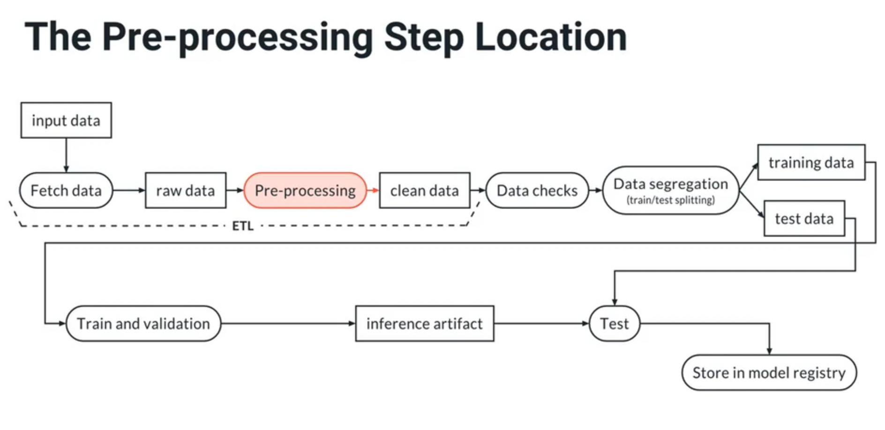

Examples of operations that should not be part of the pre-processing step:

- Categorical encoding: if something needs to be carried out in inference and training, then it should go to the inference pipeline!
- MIssing value imputation when this should also happen in production, too.
- Dimensionality reduction (e.g., PCA), when this should happen in production, too.

Key idea: keep in mind the type of data that the model should see in production: its collection, transformations, etc. The model must  be trained with a dataset which is representative of that!

### 3.5 Pre-Processing Script with W&B and MLflow: Exercise 5

In this exercise, the artifact from the previous exercise 4 is downloaded, pre-processed, and a new artifact is registered (pre-processed data). Really no skills are learnt.

Repository:

[udacity-cd0581-building-a-reproducible-model-workflow-exercises](https://github.com/mxagar/udacity-cd0581-building-a-reproducible-model-workflow-exercises)

Folder:

`/lesson-2-data-exploration-and-preparation/exercises/exercise_5`

I also copied the files to

`./lab/WandB_MLflow_Preprocessing_Script_exercise_5/`

For the exercise, the following files needed to be done:

- Complete `run.py` with instructions.
- Create and fill in `conda.yaml`.
- Create and fill in `MLproject`.

#### Solution

`conda.yaml`:

```yaml
name: clean_data
channels:
  - conda-forge
  - defaults
dependencies:
  - python=3.8
  - jupyter=1.0.0
  - jupyterlab=3.1.7
  - seaborn=0.11.1
  - pandas=1.2.3
  - pip=20.3.3
  - pyarrow=2.0
  - ipywidgets=7.6.5
  - pip:
    - wandb==0.10.21
    - protobuf==3.20
```

`MLproject`:

```yaml
name: clean_data
conda_env: conda.yaml

entry_points:
  main:
    parameters:
      input_artifact:
        description: Fully-qualified artifact name for the input artifact
        type: str
        default: exercise_4/genres_mod.parquet:latest
      artifact_name:
        description: Name for the W&B artifact that will be created
        type: str
        default: preprocessed_data.csv
      artifact_type:
        description: Type of the artifact to create
        type: str
        default: clean_data
      artifact_description:
        description: Description for the artifact
        type: str
        default: Cleaned dataset

    command: >-
      python run.py --input_artifact {input_artifact} \
                    --artifact_name {artifact_name} \
                    --artifact_type {artifact_type} \
                    --artifact_description {artifact_description}
```

`run.py`:

```python
#!/usr/bin/env python
import argparse
import logging
import pandas as pd
import wandb

logging.basicConfig(level=logging.INFO, format="%(asctime)-15s %(message)s")
logger = logging.getLogger()

def go(args):

    run = wandb.init(project="exercise_5", job_type="process_data")

    # Open the artifact: the name is not the filename,
    # but the name we used when registering it
    # To download the file we need to call .file()
    logger.info("Downloading artifact")
    artifact = run.use_artifact(args.input_artifact)
    df = pd.read_parquet(artifact.file())
    
    logger.info("Performing pre-processing: duplicates + new data")
    # Drop duplicates
    df = df.drop_duplicates().reset_index(drop=True)
    # New feature
    # This feature will have to go to the feature store.
    # If you do not have a feature store,
    # then you should not compute it here as part of the preprocessing step.
    # Instead, you should compute it within the inference pipeline.
    df['title'].fillna(value='', inplace=True)
    df['song_name'].fillna(value='', inplace=True)
    df['text_feature'] = df['title'] + ' ' + df['song_name']

    # Persist cleaned dataset
    df.to_csv(args.artifact_name, sep=',', header=True, index=False)

    logger.info("Creating artifact")
    artifact = wandb.Artifact(
        name=args.artifact_name,
        type=args.artifact_type,
        description=args.artifact_description,
    )
    artifact.add_file(args.artifact_name)

    logger.info("Logging artifact")
    run.log_artifact(artifact)

    # Run finish is not necessary here
    # because it finishes automatically
    # when the script ends.
    # In a Jupyter session it is necessary, though.

if __name__ == "__main__":
    parser = argparse.ArgumentParser(
        description="Preprocess a dataset",
        fromfile_prefix_chars="@",
    )

    parser.add_argument(
        "--input_artifact",
        type=str,
        help="Fully-qualified name for the input artifact",
        required=True,
    )

    parser.add_argument(
        "--artifact_name", type=str, help="Name for the artifact", required=True
    )

    parser.add_argument(
        "--artifact_type", type=str, help="Type for the artifact", required=True
    )

    parser.add_argument(
        "--artifact_description",
        type=str,
        help="Description for the artifact",
        required=True,
    )

    args = parser.parse_args()

    go(args)

```

#### Running the Example

Since the MLflow project has default arguments, we can just run

```bash
mlflow run .
```

If we didn't have default arguments, we'd need to run

```bash
mlflow run . -P input_artifact="exercise_4/genres_mod.parquet:latest" \
             -P artifact_name="preprocessed_data.csv" \
             -P artifact_type=clean_data \
             -P artifact_description="Cleaned dataset"
```

### 3.6 Data Segregation

Data segregation comes after the **data validation** step, covered later.

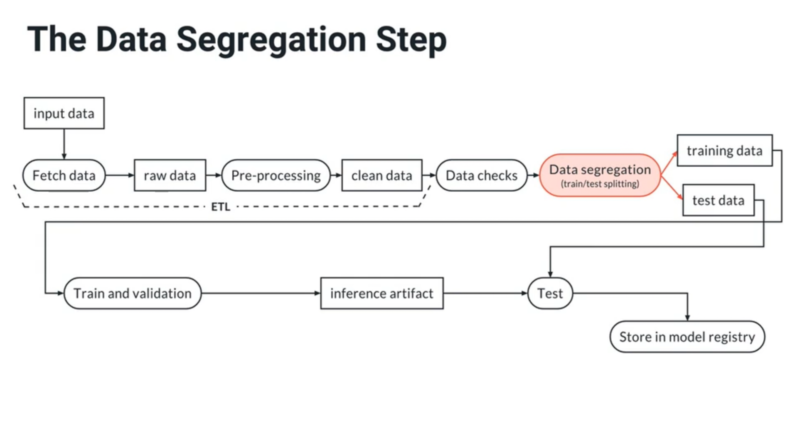

Data segregation consists in splitting the dataset into the **train, validation and test sub-sets**.

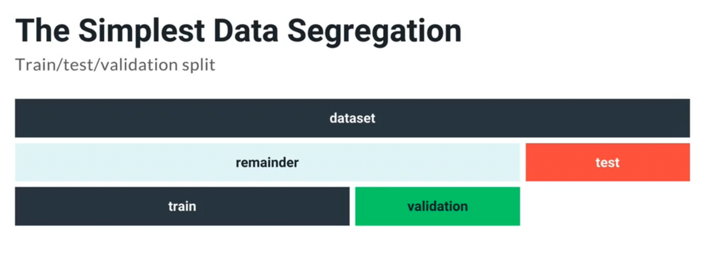

We should take into account the following points:

- First split train/test, and then obtain the validation subset from within the train split.
- We can also perform k-fold validation, for which we don't need to fix the validation sub-set, since it is chosen later.
- The test split is used only to evaluate the model performance when we finish; never use the test split for anything else.
- The validation split is used for model validation, prevent overfitting and hyperparameter tuning; the validation split should be always different to the stest split!

We can also go beyond the simple train/validation/test split: this can happen by sub-dividing the validation and test splits in strata groups: male vs. female, low income vs. high income, etc. This is possible if we have enough data. It is called complex sub-sampling.

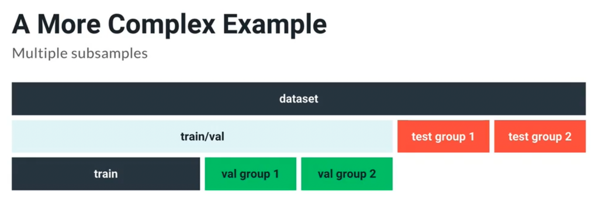

### 3.7 Data Segregation Script with W&B and MLflow: Exercise 6

In this exercise, the artifact from the previous exercise 5 is downloaded: the pre-processed dataset; then, that dataset is segregated into train and test splits. Really no skills are learnt.

Repository:

[udacity-cd0581-building-a-reproducible-model-workflow-exercises](https://github.com/mxagar/udacity-cd0581-building-a-reproducible-model-workflow-exercises)

Folder:

`/lesson-2-data-exploration-and-preparation/exercises/exercise_6`

I also copied the files to

`./lab/WandB_MLflow_Segregation_Script_exercise_6/`

For the exercise, the following files needed to be done:

- Complete `run.py` with instructions.
- Check the `conda.yaml` file.
- Check the `MLproject` file.

Run:

```bash
mlflow run . -P input_artifact="exercise_5/preprocessed_data.csv:latest" \
             -P artifact_root="data" \
             -P test_size=0.3 \
             -P stratify="genre"
```

#### Solution

`conda.yaml`:

```yaml
name: download_data
channels:
  - conda-forge
  - defaults
dependencies:
  - pandas=1.2.3
  - pip=20.3.3
  - scikit-learn=0.24.1
  - pip:
    - wandb==0.10.21
    - protobuf==3.20
```

`MLproject`:

```yaml
name: split_data
conda_env: conda.yml

entry_points:
  main:
    parameters:
      input_artifact:
        description: Fully qualified name for the artifact
        type: str
      artifact_root:
        description: Name for the W&B artifact that will be created
        type: str
      artifact_type:
        description: Type of the artifact to create
        type: str
        default: raw_data
      test_size:
        description: Description for the artifact
        type: float
      random_state:
        description: Integer to use to seed the random number generator
        type: str
        default: 42
      stratify:
        description: If provided, it is considered a column name to be used for stratified splitting
        type: str
        default: "null"

    command: >-
      python run.py --input_artifact {input_artifact} \
                    --artifact_root {artifact_root} \
                    --artifact_type {artifact_type} \
                    --test_size {test_size} \
                    --random_state {random_state} \
                    --stratify {stratify}
```

`run.py`:

```python
#!/usr/bin/env python
import argparse
import logging
import os
import tempfile

import pandas as pd
import wandb
from sklearn.model_selection import train_test_split


logging.basicConfig(level=logging.INFO, format="%(asctime)-15s %(message)s")
logger = logging.getLogger()


def go(args):

    run = wandb.init(project="exercise_6", job_type="split_data")

    logger.info("Downloading and reading artifact")
    artifact = run.use_artifact(args.input_artifact)
    artifact_path = artifact.file()

    df = pd.read_csv(artifact_path, low_memory=False)

    # Split model_dev/test
    logger.info("Splitting data into train and test")
    splits = {}

    splits["train"], splits["test"] = train_test_split(
                                                       df, # entire dataset: X, y
                                                       test_size=args.test_size,
                                                       random_state=args.random_state,
                                                       stratify=df[args.stratify] if arg.stratify != 'null' else None
                                                       )

    # Now we save the artifacts. We use a temporary directory so we do not leave
    # any trace behind
    with tempfile.TemporaryDirectory() as tmp_dir:

        for split, df in splits.items():

            # Make the artifact name from the provided root plus the name of the split
            artifact_name = f"{args.artifact_root}_{split}.csv"

            # Get the path on disk within the temp directory
            temp_path = os.path.join(tmp_dir, artifact_name)

            logger.info(f"Uploading the {split} dataset to {artifact_name}")

            # Save then upload to W&B
            df.to_csv(temp_path)

            artifact = wandb.Artifact(
                name=artifact_name,
                type=args.artifact_type,
                description=f"{split} split of dataset {args.input_artifact}",
            )
            artifact.add_file(temp_path)

            logger.info("Logging artifact")
            run.log_artifact(artifact)

            # This waits for the artifact to be uploaded to W&B. If you
            # do not add this, the temp directory might be removed before
            # W&B had a chance to upload the datasets, and the upload
            # might fail
            artifact.wait()


if __name__ == "__main__":
    parser = argparse.ArgumentParser(
        description="Split a dataset into train and test",
        fromfile_prefix_chars="@",
    )

    parser.add_argument(
        "--input_artifact",
        type=str,
        help="Fully-qualified name for the input artifact",
        required=True,
    )

    parser.add_argument(
        "--artifact_root",
        type=str,
        help="Root for the names of the produced artifacts. The script will produce 2 artifacts: "
             "{root}_train.csv and {root}_test.csv",
        required=True,
    )

    parser.add_argument(
        "--artifact_type", type=str, help="Type for the produced artifacts", required=True
    )

    parser.add_argument(
        "--test_size",
        help="Fraction of dataset or number of items to include in the test split",
        type=float,
        required=True
    )

    parser.add_argument(
        "--random_state",
        help="An integer number to use to init the random number generator. It ensures repeatibility in the"
             "splitting",
        type=int,
        required=False,
        default=42
    )

    parser.add_argument(
        "--stratify",
        help="If set, it is the name of a column to use for stratified splitting",
        type=str,
        required=False,
        default='null'  # unfortunately mlflow does not support well optional parameters
    )

    args = parser.parse_args()

    go(args)
```

#### Run the Exercise

```bash
mlflow run . -P input_artifact="exercise_5/preprocessed_data.csv:latest" \
             -P artifact_root="data" \
             -P test_size=0.3 \
             -P stratify="genre"
```

### 3.8 Feature Stores

Feature engineering requires applying domain knowledge and it can make a huge difference in terms of model performance.

For instance, if we have the `height` and `weight`, the `BMI = height/weight^2` is an engineered feature which best predicts whether the subject is overweight.

Feature engineering cannot be in the pre-processing step, because if it were, we would not have those engineered features in the inference pipeline. Thus, one solution is to allocate it to the inference pipeline. However, this does not scale optimally: it's slow and changes stop the inference.

Another solution consists in having **feature stores**: this a new concept which allows for development-production symmetric by using engineered features. The feature computation is centralized and automated:

- Feature registry: Several data scientists can define formulas/rules to compute different features, available to everyone.
- Features are computed automatically according to the feature computation definitions. If there is any update which affects the features, these are automatically modified.
- Serving can be done for real-time applications (hot or fast serving - inference) or for high throughput applications (cold or batch serving - training).

As far as I understand, it is like a parallel component which serves features given a dataset. The users commit the feature computation code and the store automatically can serve features in cold/hot for different steps in the pipeline, i.e., training of inference.

However, note that the feature store deals more with the generation of new features. Encoding or scaling are not part of the feature store, but of the inference pipeline!

## 4. Data Validation

If we want to automatically avoid bad data entering our system, data validation is fundamental.

Data validation can be achieved with [pytest](https://docs.pytest.org/en/7.1.x/).

Data validation is equivalent to unit testing in software, but it is applied on incoming data. Basically, our data assumptions are checked to avoid inputting garbage, which would lead to outputting garbage (Garbage In Garbage Out, GIGO).

Examples of why data inconsistencies might appear:

- Rating value changes from 5-stars system to 10-points system with floating point values. Thus, the range and the type are different, as well as the interpretation.
- A value of a product can change from USD to 1,000 USD; thus, the range is different.
- The world changes and previous assumptions don't hold; e.g., before the pandemic households close to workplaces were expensive and their neighborhood means were high, but after the pandemic, with remote work, that is not always true.

Data checks or data validation is placed immediately before or after the data segregation (train/test split).

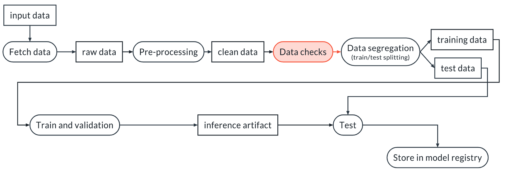


### 4.1 A Primer on Pytest

This section explains how to use pytest in the context of data validations. Several concepts introduced in the first module (Clean Code: Lesson 4, Production Ready Code) are re-visited. Have a look at the notes of the second module.

- Test files are typically stored in the `test/` folder, by convention; i.e., we can use another folder name.
- Test files must start with `test_*`.
- The test functions must start with `test_*`.
- In a `test_` function, we can use `assert` and `isinstance()` to perform data validation.

Typically, fixtures are used with pytest: decorators that can provide with input data.

```python
import pytest
import wandb

run = wandb.init()

# Since we specify scope="session"
# this fixture is run once for the complete session.
# As an effect, the variable `data` triggers the function data() only once
# and it yields the loaded dataframe.
# Using `data` as an argument is equivalent to:
# data_ = data()
# test_data_length(data_)
# Note that with scope="function"
# every test_ function using data would load the complete dataset every time
@pytest.fixture(scope="session")
def data():

    local_path = run.use_artifact("my_project/artifact").file()
    df = pd.read_csv(local_path, low_memory=False)

    return df


def test_data_length(data):
    """
    We test that we have enough data to continue
    """
    assert len(data) > 1000
```

To run the code below, assuming the file is `test/test_dataset.py`:

```bash
# If the test_ files are not in ., we specify the path where they are
# -vv: verbose
pytest test/ -vv
```

### 4.2 Deterministic Tests: Example / Exercise 7

Deterministic tests check properties of the data without uncertainty; examples:

- Number of features/columns.
- Number of entries/rows.
- Ranges of numerical features.
- Possible categories in a categorical variable, or number of categories.

#### Exercise 7

In this exercise, the artifact from the previous exercise 5 is downloaded: the pre-processed dataset; then, that dataset is checked with pytest.

Repository:

[udacity-cd0581-building-a-reproducible-model-workflow-exercises](https://github.com/mxagar/udacity-cd0581-building-a-reproducible-model-workflow-exercises)

Folder:

`lesson-3-data-validation/exercises/exercise_7/`

I also copied the files to

`./lab/DataValidation_exercise_7_pytest_dataframe/`

We have the following files:

- `MLproject`
- `conda.yaml`: in theory given, in practice I needed to add some dependencies (see issues section below).
- `test_data.py`: file to be completed; two testing functions need to be defined: test categories are correct and some numerical column values are in their expected ranges.

Run:

```bash
cd path-to-mlflow-file
mlflow run . 
```

#### Solution

`MLproject`:

```yaml
name: download_data
conda_env: conda.yml

entry_points:
  main:
    # NOTE: the -s flag is necessary, otherwise pytest will capture all the output and it
    # will not be uploaded to W&B. Hence, the log in W&B will be empty.
    command: >-
      pytest -s -vv .

```

`conda.yaml`:

```yaml
name: download_data
channels:
  - conda-forge
  - defaults
dependencies:
  - python=3.8
  - pandas=1.2.3
  - pip=20.3.3
  - pytest=6.2.2
  - pip:
      - wandb==0.10.21
      - protobuf==3.20
```

`test_data.py`:

```python
import pytest
import wandb
import pandas as pd

# This is global so all tests are collected under the same
# run
run = wandb.init(project="exercise_7", job_type="data_tests")


@pytest.fixture(scope="session")
def data():

    local_path = run.use_artifact("exercise_5/preprocessed_data.csv:latest").file()
    df = pd.read_csv(local_path, low_memory=False)

    return df


def test_column_presence_and_type(data):
    
    # It is a nice practice to create dictionaries of values to check.
    # `pandas.api.types` provides many type checking functions we can use!
    required_columns = {
        "time_signature": pd.api.types.is_integer_dtype,
        "key": pd.api.types.is_integer_dtype,
        "danceability": pd.api.types.is_float_dtype,
        "energy": pd.api.types.is_float_dtype,
        "loudness": pd.api.types.is_float_dtype,
        "speechiness": pd.api.types.is_float_dtype,
        "acousticness": pd.api.types.is_float_dtype,
        "instrumentalness": pd.api.types.is_float_dtype,
        "liveness": pd.api.types.is_float_dtype,
        "valence": pd.api.types.is_float_dtype,
        "tempo": pd.api.types.is_float_dtype,
        "duration_ms": pd.api.types.is_integer_dtype,  # This is integer, not float as one might expect
        "text_feature": pd.api.types.is_string_dtype,
        "genre": pd.api.types.is_string_dtype
    }

    # Check column presence
    assert set(data.columns.values).issuperset(set(required_columns.keys()))

    for col_name, format_verification_funct in required_columns.items():

        assert format_verification_funct(data[col_name]), f"Column {col_name} failed test {format_verification_funct}"


def test_class_names(data):

    # Check that only the known classes are present
    known_classes = [
        "Dark Trap",
        "Underground Rap",
        "Trap Metal",
        "Emo",
        "Rap",
        "RnB",
        "Pop",
        "Hiphop",
        "techhouse",
        "techno",
        "trance",
        "psytrance",
        "trap",
        "dnb",
        "hardstyle",
    ]

    assert data["genre"].isin(known_classes).all()


def test_column_ranges(data):

    ranges = {
        "time_signature": (1, 5),
        "key": (0, 11),
        "danceability": (0, 1),
        "energy": (0, 1),
        "loudness": (-35, 5),
        "speechiness": (0, 1),
        "acousticness": (0, 1),
        "instrumentalness": (0, 1),
        "liveness": (0, 1),
        "valence": (0, 1),
        "tempo": (50, 250),
        "duration_ms": (20000, 1000000),
    }

    for col_name, (minimum, maximum) in ranges.items():
        # Do not forget .dropna() and .all()
        assert data[col_name].dropna().between(minimum, maximum).all(), (
            f"Column {col_name} failed the test. Should be between {minimum} and {maximum}, "
            f"instead min={data[col_name].min()} and max={data[col_name].max()}"
        )

```

#### Important Notes / Comments / Issues

- `pandas.api.types` provides many type checking functions we can use!
- It is a nice practice to create dictionaries of values to check.
- I had to add these dependencies to `conda.yaml`: `python=3.8`, `protobuf==3.20`.
- Get used to auxiliary function of sets: `isin()`, `issuperset()`, etc.
- Get used to aggregate functions like `all()` instead of using loops!

### 4.3 Non-Deterministic or Statistical Tests: Example / Exercise 8

If we want to measure the correctness of a random variable, we perform non-deterministic or statistical tests; for instance, hypothesis tests.

Typically, the current dataset is checked against the dataset used during the exploratory data analysis (EDA). Examples:

- Mean and std. of columns. We can extend that with T-tests.
- Distribution of values in a column.
- Are there outliers?
- Correlations between columns and columns with target. They will be different, but should not vary so much.

In the frequentist hypothesis testing framework, we have:

- A null hypothesis `H0`: assumption of the data; e.g., both two distributions have same means
- An alternative hypothesis `H1`: violation of the assumption; e.g., distributions have different means

If we use T-tests to compare means, we compute the T statistic and checks its p-value in the T distribution. Of course, we need to define the `alpha` significance level beforehand, depending on how many false positives/negatives we'd like to achieve.

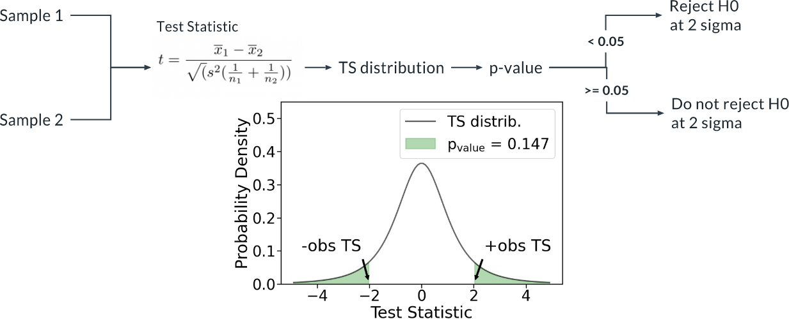

#### Exercise 8

#### Solution