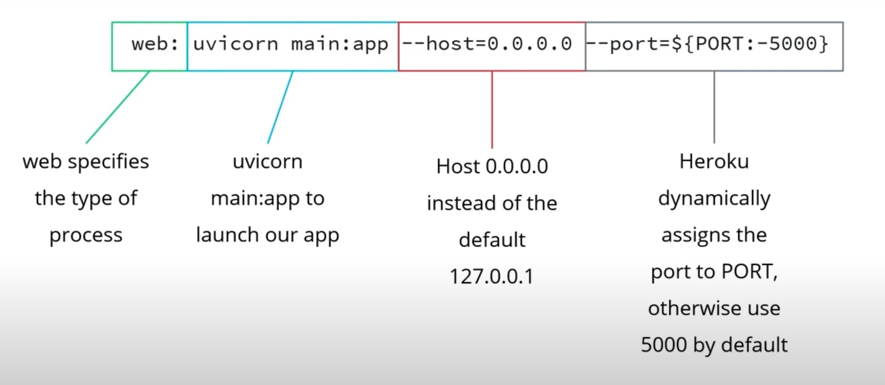

# Machine Learning DevOps Engineer: Personal Notes on the Udacity Nanodegree

These are my notes of the [Udacity Nanodegree Machine Learning DevOps Engineer](https://www.udacity.com/course/machine-learning-dev-ops-engineer-nanodegree--nd0821).

The nanodegree is composed of four modules:

1. Clean Code Principles
2. Building a Reproducible Model Workflow
3. Deploying a Scalable ML Pipeline in Production
4. ML Model Scoring and Monitoring

Each module has a folder with its respective notes. This folder and file refer to the **third** module: **Deploying a Scalable ML Pipeline in Production**.

I have extended this module with material from other courses:

- [Udacity Data Science Nanodegree](https://www.udacity.com/course/data-scientist-nanodegree--nd025); repository: [data_science_udacity](https://github.com/mxagar/data_science_udacity).
- [Deployment of Machine Learning Models](https://www.udemy.com/course/deployment-of-machine-learning-models) by Soledad Galli & Christopher Samiullah; repository: [deploying-machine-learning-models](https://github.com/mxagar/deploying-machine-learning-models).
- [Complete Tensorflow 2 and Keras Deep Learning Bootcamp](https://www.udemy.com/course/complete-tensorflow-2-and-keras-deep-learning-bootcamp/) J.M. Portilla; repository: [data_science_python_tools](https://github.com/mxagar/data_science_python_tools/tree/main/19_NeuralNetworks_Keras)

The extension material uses the module project as example and covers these topics:

- Dockerization (Section 7)
- Deployment to Heroku using containers (Section 7)
- Deployment to AWS ECS (Section 8)

Although I provide the links to the repositories with other notes, everything is self-contained here, too.

Mikel Sagardia, 2022.  
No guarantees.

## Overview of Contents

- [Machine Learning DevOps Engineer: Personal Notes on the Udacity Nanodegree](#machine-learning-devops-engineer-personal-notes-on-the-udacity-nanodegree)
  - [Overview of Contents](#overview-of-contents)
  - [1. Introduction to Deployment](#1-introduction-to-deployment)
    - [Deployment considerations](#deployment-considerations)
    - [Ways to deploy model](#ways-to-deploy-model)
    - [Final module project](#final-module-project)
    - [Stakeholders in Model Deployment](#stakeholders-in-model-deployment)
    - [When and How Should a Model Be Deployed?](#when-and-how-should-a-model-be-deployed)
  - [2. Performance Testing and Preparing a Model for Production](#2-performance-testing-and-preparing-a-model-for-production)
    - [2.1 K-Fold Coss-Validation](#21-k-fold-coss-validation)
    - [2.2 Data Slicing](#22-data-slicing)
    - [2.3 Data Slicing Use Cases and Overall Workflow](#23-data-slicing-use-cases-and-overall-workflow)
    - [2.4 Unit Testing for Data Slicing](#24-unit-testing-for-data-slicing)
      - [Exercise: Data Slicing with the Iris Dataset](#exercise-data-slicing-with-the-iris-dataset)
    - [2.5 Model Bias](#25-model-bias)
    - [2.6 Investigating Model Bias: The Aequitas Package](#26-investigating-model-bias-the-aequitas-package)
      - [Exercise/Demo: Aequitas Workflow with COMPAS Dataset](#exercisedemo-aequitas-workflow-with-compas-dataset)
      - [Exercise: Aequitas Workflow with Car Evaluation Dataset](#exercise-aequitas-workflow-with-car-evaluation-dataset)
    - [2.7 Model Cards](#27-model-cards)
    - [2.8 Performance Testing, Final Exercise: Manual Data Slicing](#28-performance-testing-final-exercise-manual-data-slicing)
  - [3. Data and Model Versioning](#3-data-and-model-versioning)
    - [3.1 Introduction Data Version Control (DVC): Installation \& Resemblance to Git](#31-introduction-data-version-control-dvc-installation--resemblance-to-git)
      - [Installation on Mac](#installation-on-mac)
      - [Resemblance to Git](#resemblance-to-git)
    - [3.2 Tracking with DVC: Local Remote](#32-tracking-with-dvc-local-remote)
    - [3.3 Remote Storage](#33-remote-storage)
      - [Example: GDrive Remote Storage](#example-gdrive-remote-storage)
    - [3.4 Pipelines with DVC](#34-pipelines-with-dvc)
      - [Exercise: Defining a Pipeline](#exercise-defining-a-pipeline)
        - [Solution](#solution)
    - [3.5 Experiment Tracking with DVC](#35-experiment-tracking-with-dvc)
    - [3.6 DVC Integration with Heroku and the FastAPI App](#36-dvc-integration-with-heroku-and-the-fastapi-app)
  - [4. CI/CD: Continuous Integration and Continuous Deployment](#4-cicd-continuous-integration-and-continuous-deployment)
    - [4.1 Software Engineering Principles: Automation, Testing, Versioning](#41-software-engineering-principles-automation-testing-versioning)
      - [Automation](#automation)
      - [Testing - in the Context of Machine Learning](#testing---in-the-context-of-machine-learning)
      - [Versioning](#versioning)
    - [4.2 Continuous Integration and Continuous Delivery: Definition](#42-continuous-integration-and-continuous-delivery-definition)
    - [4.3 Continuous Integration with Github Actions](#43-continuous-integration-with-github-actions)
    - [4.4 Continuous Deployment with Heroku](#44-continuous-deployment-with-heroku)
      - [Introduction to Heroku](#introduction-to-heroku)
      - [Continuous Deployment to Heroku: Demo](#continuous-deployment-to-heroku-demo)
    - [4.5 Deployment to Render Cloud Platform](#45-deployment-to-render-cloud-platform)
  - [5. API Deployment with FastAPI](#5-api-deployment-with-fastapi)
    - [5.1 Review of Python Type Hints](#51-review-of-python-type-hints)
    - [5.2 Fundamentals of FastAPI](#52-fundamentals-of-fastapi)
      - [Basic Example](#basic-example)
      - [Core Features of FastAPI](#core-features-of-fastapi)
      - [Example/Demo Using the App Above](#exampledemo-using-the-app-above)
      - [Example/Demo: Variable Paths and Testing](#exampledemo-variable-paths-and-testing)
      - [Events: startup and shutdown](#events-startup-and-shutdown)
      - [Parsing Field Names](#parsing-field-names)
    - [5.3 Local API Testing](#53-local-api-testing)
      - [Exercise: Testing Example](#exercise-testing-example)
    - [5.4 Heroku Revisited: Procfiles and CLI](#54-heroku-revisited-procfiles-and-cli)
      - [Heroku CLI](#heroku-cli)
    - [5.5 Live API Testing with Requests Package](#55-live-api-testing-with-requests-package)
      - [Exercise/Demo: Data Ingestion and Error Handling with FastAPI](#exercisedemo-data-ingestion-and-error-handling-with-fastapi)
    - [5.6 Extra: Udemy Course Notes](#56-extra-udemy-course-notes)
  - [6. Project: Deploying a Model with FastAPI to Heroku](#6-project-deploying-a-model-with-fastapi-to-heroku)
  - [7. Excursus: Dockerization](#7-excursus-dockerization)
    - [7.1 Docker Images and Containers](#71-docker-images-and-containers)
      - [Environments](#environments)
    - [7.2 Dockerfile: Image Definition](#72-dockerfile-image-definition)
    - [7.3 Building the Image and Running the Container Locally](#73-building-the-image-and-running-the-container-locally)
      - [Docker Compose](#docker-compose)
    - [7.3 Heroku Docker Deployment](#73-heroku-docker-deployment)
      - [Heroku Docker Deployment for Windows / Linux](#heroku-docker-deployment-for-windows--linux)
      - [Heroku Docker Deployment for Mac M1](#heroku-docker-deployment-for-mac-m1)
      - [Automate](#automate)
      - [Updating the App and Re-Deploying](#updating-the-app-and-re-deploying)
      - [Important Links](#important-links)
  - [8. Excursus: Deployment to AWS ECS](#8-excursus-deployment-to-aws-ecs)
    - [8.1 Launch Types and Costs](#81-launch-types-and-costs)
    - [8.2 Introduction to ECS](#82-introduction-to-ecs)
      - [Orchestration](#orchestration)
      - [Interesting Links](#interesting-links)
    - [8.3 AWS Account Setup](#83-aws-account-setup)
      - [Additional Notes](#additional-notes)
    - [8.4 AWS CLI: Install and Configure AWS Account](#84-aws-cli-install-and-configure-aws-account)
      - [Important Links](#important-links-1)
    - [8.5 Uploading a Docker Image to the Elastic Container Registry (ECR)](#85-uploading-a-docker-image-to-the-elastic-container-registry-ecr)
      - [Automate](#automate-1)
      - [Links](#links)
    - [8.6 Running an ECS Cluster with the Fargate Launch Method](#86-running-an-ecs-cluster-with-the-fargate-launch-method)
      - [Updating the Cluster Container and Re-Deploying](#updating-the-cluster-container-and-re-deploying)
      - [Cleaning Up](#cleaning-up)
      - [Continuous Deployment](#continuous-deployment)
      - [Links](#links-1)
  - [9. Excursus: Deployment to Render](#9-excursus-deployment-to-render)

## 1. Introduction to Deployment

The module is taught by [Justin Clifford Smith, PhD](https://www.justincliffordsmith.com/). Principal data scientist at [Optum](https://www.optum.com/).

Deployment consists in putting the model to work in production. But not all deployments are the same: sometimes we want to keep learning during the usage of the model!

The demos and exercises of this module are located in:

- [`./lab`](./lab)
- [mlops-udacity-deployment-demos](https://github.com/mxagar/mlops-udacity-deployment-demos)

### Deployment considerations

- Model performance and reliability: follow them.
- Model transparency and explainability.
- Legal & privacy aspects: used data is compliant?
- Model resilience and security: does the model run in a secure environment? is it a secure pipeline end-to-end?
- Model management in production: how frequently do we need to re-train and update?
- Management of good data flows.
- Automation: which steps, if not all, can be automated? If there are humans in the loop, is the model scalable?
- Scalability: scaling up or down the model usage dynamically can be essential; thus, always design for scalability.

### Ways to deploy model

- Run on ad-hoc batches.
- Run on a schedule.
- Run with an API.

### Final module project

It's a portfolio project that uses different technologies:

- DVC: Data/model/code version control.
- Github actions (CI).
- Unit tests.
- Continuous deployment (CD) using Heroku.
- An APi with FastAPI.
- Also, we're going to write a model card.

### Stakeholders in Model Deployment

- Users: UI/UX, value?
- Business Leaders: value?
- DevOps Engineers: they want a successful and smooth deployment.
- Colleagues.
- Your future self. Good decisions and efforts pay out.

### When and How Should a Model Be Deployed?

- Steps before deploying a model
  - Test performance
  - Check for bias
  - Write a model card
- Depending on the use case:
  - We might perform inferences on ad-hoc batches
  - We might need to develop an API for performing online inferences
- Always develop thinking on deployment for production
  - Unit tests
  - Continuous integration

## 2. Performance Testing and Preparing a Model for Production

Goals of the lesson:

- Analyze slices of data when training ans testing models:
  - Data slicing
  - K-fold cross validation
  - Testing
- Probe a model for bias using common frameworks such as Aequitas.
- Write model cards that explain teh purpose, provenance, and pitfalls of a model.

### 2.1 K-Fold Coss-Validation

In the beginning, we split our dataset in:

- training
- testing

The testing dataset will be evaluated only once at the end. The training split is further split in:

- train
- validation

The easiest way of computing the validation split is just taking a fraction of the dataset; typically, the **single validation set**

- is a fraction of 10-30%; but if the dataset is very large, it can be as low as 1%
- it is evaluated several times, during the training
- it should contain all classes; we can use *stratify* tools for that
- it should cover the entire dataset

However, a better way consists in using **K-Fold Cross-Validation (CV)**: we split the data in `k` subsets; we train in `k-1` subsets and validate in the last subset. Then, we repeat the process `k` times, and each time the validation subset is different. Then, the performance is averaged across all `k` subsets. Thus, it is more robust, because

- we use the entire dataset,
- an error average is computed.

However, this is expensive, because we need to train the model `k` times -- it is used for non Neural Network techniques. For Neural Networks, a unique validation split is used.

### 2.2 Data Slicing

Data slicing consists in stratifying or grouping the data according to

- class values: the output label itself
- or feature values: age groups, etc.

That is, we fix the value of a feature/label. Then, for each group with a fixed value the performance metric is computed.

Whereas cross-validation takes random samples or rows (horizontal slices) and computes the overall performance, data slicing takes groups in columns (vertical slices) and computes group performance.

An overall metric value with cross validation can be good, but the same metric in a data slice can be bad -- and it is undetected if we don't perform data slicing!


### 2.3 Data Slicing Use Cases and Overall Workflow

Possible slicing groups:

- Features:
  - if categorical, each level/class can be a slice
  - if numerical, we can cut in ranges/regions (e.g., above/below mean) and each is a slice
- Label classes
- Length of audio/text
- Sources of data

We should select the slices which are *relevant* to the model.

The workflow is the following:

- We train our model on the entire dataset.
- We have now the target label + predicted outcome.
- We compute the overall metric as always, e.g., F1: `y_true` vs. `y_pred`.
- We take our slices and check how good the metric of each slice is compared to the overall!

We can perform slicing:

- Pre-deployment: during training
- Post-deployment: the same slices we used during training should be used in the monitoring!

Interesting links:

- [Slice-based Learning](https://www.snorkel.org/blog/slicing)
- [Slice-based Learning: A Programming Model for Residual Learning in Critical Data Slices](https://papers.nips.cc/paper/2019/file/351869bde8b9d6ad1e3090bd173f600d-Paper.pdf)

### 2.4 Unit Testing for Data Slicing

Data slicing is used together with unit tests: we write unit tests that check the performance of data slices.

Unit tests can be run pre- and post-deployment.

Write unit tests following the SOLID principles:

- Single responsibility: every class/function should do only one thing.
- Open-closed: software should be open to extension but closed to modification.
- Liskov substitution: functions that use pointers to base classes should be able to use derived classes.
- Interface segregation: clients should not be forced to depend upon interfaces that they don't use.
- Dependency inversion: depend upon abstractions, not concretions.

Example of unit test for data slicing:

```python

### --- foo.py

def foo():
    return "Hello world!"

### --- test_foo.py

from .foo import foo

def test_foo():
    foo_result = foo()

    expected_foo_result = "Hello world!"
    assert foo_result == expected_foo_result

### --- test_slice.py

import pandas as pd
import pytest


@pytest.fixture
def data():
    """ Simple function to generate some fake Pandas data."""
    df = pd.DataFrame(
        {
            "id": [1, 2, 3],
            "numeric_feat": [3.14, 2.72, 1.62],
            "categorical_feat": ["dog", "dog", "cat"],
        }
    )
    return df


def test_data_shape(data):
    """ If your data is assumed to have no null values then this is a valid test. """
    assert data.shape == data.dropna().shape, "Dropping null changes shape."


def test_slice_averages(data):
    """ Test to see if our mean per categorical slice is in the range 1.5 to 2.5."""
    for cat_feat in data["categorical_feat"].unique():
        avg_value = data[data["categorical_feat"] == cat_feat]["numeric_feat"].mean()
        assert (
            2.5 > avg_value > 1.5
        ), f"For {cat_feat}, average of {avg_value} not between 2.5 and 3.5."

### --- Run

pytest -v test_slice.py

```

#### Exercise: Data Slicing with the Iris Dataset

Used dataset: [Iris](https://archive.ics.uci.edu/ml/datasets/Iris).

> Load the data using Pandas and then write a function that outputs the descriptive stats for each numeric feature while the categorical variable is held fixed. Run this function for each of the four numeric variables in the Iris data set.

The code is in [`DataSlicing_UnitTest.ipynb`](./lab/DataSlicing_UnitTest.ipynb):

```python
def slice_iris(df, feature):
    """ Function for calculating descriptive stats on slices of the Iris dataset."""
    for cls in df["class"].unique():
        # Alternative:
        # df.groupby('class').mean()
        # df.groupby('class').std()
        df_temp = df[df["class"] == cls]
        mean = df_temp[feature].mean()
        stddev = df_temp[feature].std()
        print(f"Class: {cls}")
        print(f"{feature} mean: {mean:.4f}")
        print(f"{feature} stddev: {stddev:.4f}")
    print()

slice_iris(df, "sepal_length")
slice_iris(df, "sepal_width")
slice_iris(df, "petal_length")
slice_iris(df, "petal_width")
```

### 2.5 Model Bias

- Bias = performance in favor or against one group in an unfair manner.
- Do not confuse with the bias of the bias-variance tradeoff.
- Model bias is often related to data bias, but not always (?).
- Types of **data bias**:
  - Human error
    - Sampling error: the sample doesn't capture the real population.
    - Exclusion bias: a group is excluded from the data acquisition; that can be on purpose/unwanted.
    - Recall bias: the unreliability of trying people to remember past events; data that consists of past event descriptions is usually unreliable.
  - Society error:
    - Implicit bias / stereotypes.
    - Unjust policy.

Bias is everywhere! Examples of data bias:

- In a dataset with animals, the bias in favor of cats might be significant.
- In a dataset with humans, a bias against black people can be significant.
- Collection: images from web might have a higher quality than the ones fed by regular users.
- Annotation: labeler bias, due to many factors, e.g., challenging time with little time.
- Preprocessing: truncating long text so that it fits into memory/model input size; maybe longer texts are long because they have certain characteristic features!

### 2.6 Investigating Model Bias: The Aequitas Package

[Aequitas](http://aequitas.dssg.io/) is a tool that quantifies bias; it has 3 main interfaces:

- Web app.
- CLI.
- Python package: shown here.

In Aequitas we specify the score, label, and at least one categorical field (or numerical in ranges/cuts) and then three reports are created comparing against a reference group (often the majority):

- Group Metrics Results
- Bias Metrics Results
- Fairness Measures Results

Install it:

```bash
pip install aequitas
```

#### Exercise/Demo: Aequitas Workflow with COMPAS Dataset

Links to the demo/exercise:

- Demo repository: [mlops-udacity-deployment-demos](https://github.com/mxagar/mlops-udacity-deployment-demos).
- Exercise/demo notebook: [`aequitas_demo.ipynb`](https://github.com/mxagar/mlops-udacity-deployment-demos/blob/main/aequitas_demo.ipynb).
- A more detailed official demo of Aequitas with the COMPAS dataset: [compas_demo.ipynb](https://github.com/dssg/aequitas/blob/master/docs/source/examples/compas_demo.ipynb)

The [COMPAS dataset](https://github.com/dssg/aequitas/tree/master/examples) is used in the example; it contains a **recidivism** score, i.e., the tendency of a convict to re-offend. We have the 7214 observations with these 6 columns:

- `entity_id`
- `race`
- `sex`
- `age_cat`
- `score`: score by the model, required by Aequitas. **This are our model predictions stored as `score`.**
- `label_value`: true label, required by Aequitas. **This is our target renamed as `label_value`.**

Notes:

- I understand that Aequitas works primarily with binary classification problems?
- I needed to remove numerical variables and work only with categoricals.
- This is an ad-hoc dataset; to see how this would work on another example, check [census_notebook.ipynb](https://github.com/mxagar/census_model_deployment_fastapi/blob/master/census_notebook.ipynb).

The package seems a little bit dense and complex to understand straightforwardly, because it provides many statistics. Go to the notebook to understand how to make a basic use of Aequitas; the general workflow is:

- We preprocess the dataset (not shown in the COMPAS demo):
    - Convert 'object' columns str.
    - Create `score` and `label_value` columns.
    - See [census_notebook.ipynb](https://github.com/mxagar/census_model_deployment_fastapi/blob/master/census_notebook.ipynb) for an example.
- We create a `Group()` object, from which we extract a crosstab; the crosstab contains the data slicing statistics: for each categorical feature and each level/group in them we have a slice/group for which the statistics are computed.
- We create a `Bias()` object and compute disparities of the slices wrt. a reference group. We specify the reference group in `ref_groups_dict`; if we don't specify any reference group, the majority group/slice is taken. We get the same statistics as before + disparity statistics, differences wrt. reference group
- We compute the `Fairness()`: We get the same statistics as before + Fairnes true/false parity values.
- We can obtain summary values and plots, too.

#### Exercise: Aequitas Workflow with Car Evaluation Dataset

The exercise is similar to the previous one, with a bit more EDA. Have a look at it:

Exercise/demo notebook: [`car_aequitas_solution.ipynb`](https://github.com/mxagar/mlops-udacity-deployment-demos/blob/main/aequitas_car_exercise/).

### 2.7 Model Cards

Model cards are documentation pages with all the key aspects to be able to use it in all possible ways: extend, re-train, etc. There is no industry standard, but we should include:

- Model details: type, training/hyperparameter details, links to longer docu
- Intended use and users.
- Metrics: overall performance and key slice performance.
- Relevant figures: learning curves, etc.
- Data: information on the training and the validation splits; how they were acquired & processed, etc.
- Bias: inherent in data or model.
- Caveats, if there are any.


Links:

- [Model Cards for Model Reporting](https://arxiv.org/pdf/1810.03993.pdf)
- [Google on Model Cards](https://modelcards.withgoogle.com/about)

Example Model Card:

> **Model Details**
> 
> Justin C Smith created the model. It is logistic regression using the default hyperparameters in scikit-learn 0.24.2.
> 
> **Intended Use**
>
> This model should be used to predict the acceptability of a car based off a handful of attributes. The users are prospective car buyers.
> 
> **Metrics**
> 
> The model was evaluated using F1 score. The value is 0.8960.
> 
> **Data**
> 
> The data was obtained from the UCI Machine Learning Repository (https://archive.ics.uci.edu/ml/datasets/Car+Evaluation). The target class was modified from four categories down to two: "unacc" and "acc", where "good" and "vgood" were mapped to "acc".
> 
> The original data set has 1728 rows, and a 75-25 split was used to break this into a train and test set. No stratification was done. To use the data for training a One Hot Encoder was used on the features and a label binarizer was used on the labels.
> 
> **Bias**
> 
> According to Aequitas bias is present at the unsupervised and supervised level. This implies an unfairness in the underlying data and also unfairness in the model. From Aequitas summary plot we see bias is present in only some of the features and is not consistent across metrics.

### 2.8 Performance Testing, Final Exercise: Manual Data Slicing

Exercise repository: [Performance_testing_FinalExercise](https://github.com/mxagar/mlops-udacity-deployment-demos/tree/main/Performance_testing_FinalExercise).

In this exercise the [Raisin dataset](https://archive.ics.uci.edu/ml/datasets/Raisin+Dataset) is used. In it, 900 observations of 7 raising features (all numerical) are collected; each observation has a target class which specifies one of two types of raisins: 'Kecimen' or 'Besni'.

Data slicing is applied manually to the dataset as follows:

- Data is split: `train`, `validation`.
- Logistic regression model is fit and F1 is computed: overall score.
- 3 features are chosen and their mean is computed; then, 2 buckets or ranges are defined for each of the 3 features: above and below the mean. Thus, we get 3x2 = 6 slices.
- For each slice, the F1 metric is computed again and compared to the overall F1.
- Finally, a model card is written.

```python
import pandas as pd
from sklearn.linear_model import LogisticRegression
from sklearn.model_selection import train_test_split
from sklearn.preprocessing import LabelBinarizer
from sklearn.metrics import classification_report, f1_score

data = pd.read_csv("./exercise_data/Raisin_Dataset.csv")

data.head()
data.head() # (900, 8)
data.Class.unique() # array(['Kecimen', 'Besni'], dtype=object)

# Take features + target
y = data.pop("Class")

# Split the data into train and validation, stratifying on the target feature.
X_train, X_val, y_train, y_val = train_test_split(data, y, stratify=y, random_state=23)

# Get a high level overview of the data.
# This will be useful for slicing: we take the mean values from here!
X_train.describe()

# Define and fit model
lr = LogisticRegression(max_iter=1000, random_state=23)
lb = LabelBinarizer()

# Binarize the target feature.
y_train = lb.fit_transform(y_train)
y_val = lb.transform(y_val)

# Train Logistic Regression.
lr.fit(X_train, y_train.ravel())

# Use sklearn's classification report to get an overall view of our classifier.
print(classification_report(y_val, lr.predict(X_val)))
# Average F1: 0.88

## Data Slicing + Performance

print("F1 score on MajorAxisLength slices:")
row_slice = X_val["MajorAxisLength"] >= 427.7
print(f1_score(y_val[row_slice], lr.predict(X_val[row_slice])))
row_slice = X_val["MajorAxisLength"] < 427.7
print(f1_score(y_val[row_slice], lr.predict(X_val[row_slice])))
# F1 score on MajorAxisLength slices:
# 0.0
# 0.9230769230769231

print("\nF1 score on MinorAxisLength slices:")
row_slice = X_val["MinorAxisLength"] >= 254.4
print(f1_score(y_val[row_slice], lr.predict(X_val[row_slice])))
row_slice = X_val["MinorAxisLength"] < 254.4
print(f1_score(y_val[row_slice], lr.predict(X_val[row_slice])))
# F1 score on MinorAxisLength slices:
# 0.65
# 0.9319371727748692

print("\nF1 score on ConvexArea slices:")
row_slice = X_val["ConvexArea"] >= 90407.3
print(f1_score(y_val[row_slice], lr.predict(X_val[row_slice])))
row_slice = X_val["ConvexArea"] < 90407.3
print(f1_score(y_val[row_slice], lr.predict(X_val[row_slice])))
# F1 score on ConvexArea slices:
# 0.30769230769230765
# 0.9174311926605505
```

Model card reported in the solution:

> #### Model Card
> ##### Model Details
> Logistic Regresion model using default scikit-learn hyperparameters. Trained with sklearn version 0.24.1.
> ##### Intended Use
> For classifying two types of raisins from Turkey.
> ##### Metrics
> F1 classification with a macro average of 0.85, 0.84 for the minority class, and 0.85 for the majority class.
> When analyzing across data slices, model performance is higher for raisins below the average size and much lower for raisins above the average.
> ##### Data
> Raisin dataset acquired from the UCI Machine Learning Repository: https://archive.ics.uci.edu/ml/datasets/Raisin+Dataset
> Originally from: Cinar I., Koklu M. and Tasdemir S., Classification of Raisin Grains Using Machine Vision and Artificial Intelligence Methods. Gazi Journal of Engineering Sciences, vol. 6, no. 3, pp. 200-209, December, 2020.
> ##### Bias
> The majority of raisins are below the average size. This could be a potential source of bias but more subject matter expertise may be necessary. Note to students: this is a useful call out, and in a real-world scenario should prompt you to engage in collaboration with subject matter experts so you can flesh this out.

## 3. Data and Model Versioning

DVC = Data Version Control. We use it to control the version of:

- data
- models
- etc.

either (1) locally or (2) remotely. Additionally, we can use it to 

- create pipelines 
- and track experiments.

Data provenance or data lineage aspects, i.e., complete record of data whereabouts:

- Origin: where data comes from.
- Movement: systems and location it was.
- Manipulation: how data has been transformed.

Data provenance is important because:

- We forget all the history and quality data if not recorded.
- Accountability: adjust to regulations.
- Future-proofing of data is only possibly if we have a complete record of all origins and movements.
- Clear understanding of data and models is possible only if we have a complete lineage.

Some links:

- [List of Provenance Tools](https://projects.iq.harvard.edu/provenance-at-harvard/tools)
- [Provenance Use Cases](https://confluence.csiro.au/public/PROMS/provenance-use-cases)

### 3.1 Introduction Data Version Control (DVC): Installation & Resemblance to Git

DVC relies on Git to do the version control and it doesn't store the data/models itself, but that is done by external or remote services like S3, HDFS, GDrive, etc.

DVC provides tools to track changes in large/binary files.

Links:

- Documentation: [https://dvc.org/doc/start](https://dvc.org/doc/start).
- Installation: [https://dvc.org/doc/install](https://dvc.org/doc/install).

#### Installation on Mac

There are several ways of installing DVC; we need an environment with Python 3.8+ to run the latest version, which is necessary for some remote storage functionalities.

```bash
conda activate mlops-nd # Python 3.8

# with brew (outdated)
brew install dvc

# or with pip
# BUT: we need to have an environment with python 3.8+
# to have the latest version of dvc
pip install -U "dvc[all]" # all: all remote storage interfaces are installed

# also a conda installation is possible,
# but it didn't work for me
```

#### Resemblance to Git

DVC os designed to have a very similar use as git:

```bash
# Initialize project, ./dvc/ folder is created
dvc init

# Add files/folders to tracking
dvc add

# Upload download data from the remote store, specified in dvc.yaml
dvc push
dvc pull

# This one is different than git commit
dvc commit
```

[DVC Reference](https://dvc.org/doc/command-reference): Typical workflow:

- `dvc init`
- `dvc add`
- Create a `dvc.yaml` file: it contains the processing pipeline + artifact outputs
- `dvc repro`: execute or restore any version of the pipeline
- `dvc push`, `dvc pull`: access remote storage

### 3.2 Tracking with DVC: Local Remote

```bash
# 0. Make sure we're on a git repo;
# if not, initialize first git, then dvc
git init
dvc init
# dvc init generates:
# .dvc/ folder
# .dvcignore: equivalent to .gitignore

# 1. Create a local remote folder
mkdir ~/data/remote
dvc remote add -d localremote ~/data/remote
# list available remotes
dvc remote list
# In addition to local remote folders, we can use
# real remote storage: S3, GDrive, etc.
# Check how config file changed
less .dvc/config

# 2. Track files
dvc add sample.csv
# We get a prompt saying that
# we should add .gitignore
# and sample.csv.dvc to git
# NOTE: sample.csv is added to .gitignore for us!
git add sample.csv.dvc .gitignore

# 2. Commit changes to git
git commit -m "initial commit of dataset using dvc"
# If our git repo is connected to a remote origin
# we can always do git push/pull

# 3. Send data to local remote
dvc push

# 4. Retrieve data from local remote
dvc pull

# 5. Change a dataset and track changes
vim sample.csv # now, change something
dvc add sample.csv
git add sample.csv.dvc
git commit -m "changes..."
dvc push

# 6. Manage remotes
# Change/add properties to a remote
dvc remote modify
# Rename a remote
dvc remote rename
# Change a defalut remote
dvc remote default # we get the name of the current default remote
dvc remote default <name> # new default remote
```

The `sample.csv.dvc` has content of the following form:

```
outs:
- md5: 82c893581e57f7e84418cc44e9c0a3d0
  size: 3856
  path: sample.csv
```

### 3.3 Remote Storage

The true potential of DVC is unlocked when we use remote storage; then, we can simply `git clone` any repository anywhere and push/pull remote datasets/models from GDrive, S3, or similar. Therefore, we can develop on one machine a deploy on another one without any issues, because the datasets and models are remotely stored.

Example:

```bash
dvc remote add s3remote s3://a/remote/bucket
```

Note: We can have multiple remote stores!

Links:

- [Data and Model Access](https://dvc.org/doc/start/data-management/data-and-model-access)
- [Supported Storage Types](https://dvc.org/doc/command-reference/remote/add#supported-storage-types)

#### Example: GDrive Remote Storage

```python
# To work with remote GDrive folders, we need the unique identifier,
# ie., the last long token in the URL after the last slash '/'
# Unique identifier: <UNIQUEID>
# Additionally, dvc-gdrive must be installed (see above)
dvc remote add driveremote gdrive://<UNIQUEID>
dvc remote modify driveremote gdrive_acknowledge_abuse true
# Check how config file changes
less .dvc/config

# Push to the gdrive remote
# Since the local remote is the default,
# we need to specify the new drive remote
dvc push --remote driveremote
# We open the prompted URL and log in to Google
# or are redirected to a log in window.
# If a verification code is given on the web
# we paste it back on the terminal
# Now, in GDrive, we should see version files

# If we do dvc push,
# it pushes to the default remote,
# which is usually the local remote! 
dvc push

# We can change the default remote
# to be a cloud storage
dvc remote list # we get the list of all remotes: localremote, driveremote
dvc remote default # we get the name of the current default remote
dvc remote default driveremote # new default remote
```

### 3.4 Pipelines with DVC

DVC also handles Direct Acyclic Graph (DAG) pipelines, like MLflow. In such pipelines, the output of a stage is the input of a next stage.

To that end, we need to create:

- `dvc.yaml`: where the stages or components of the pipeline are defined. This file is generated when we execute a stage with `dvc run`, as shown below.
- `params.yaml`: where the parameters are defined. We need to manually define this file manually; then, we can use the parameters defined in it as follows:

```python
import yaml
from yaml import CLoader as Loader

with open("./params.yaml", "rb") as f:
    params = yaml.load(f, Loader=Loader)

my_param = params["my_param"]
```

To create a pipeline stage, we need to execute `dvc run` as follows:

```bash
dvc run -n  clean_data \ # stage name, as defined in dvc.yaml
            -p param \ # parameter param defined in params.yaml
            -d clean.py -d data/data.csv \ # dependencies: files required to run stage
            -o data/clean_data.csv \ # output artifact directory + name
            python clean.py data/data.csv # command to execute the stage

# This command will create the dvc.yaml file
# with the stage clean_data
```

The only files we need to version control are `dvc.yaml` and `params.yaml`. With them, we have the pipeline, and we can track and reproduce it.

```bash
git add dvc.yaml params.yaml
git commit -m "adding dvc pipeline files"
```

Important links:

- [Creating pipelines](https://dvc.org/doc/start/data-management/data-pipelines)
- [Running pipelines](https://dvc.org/doc/command-reference/run)

#### Exercise: Defining a Pipeline

In the folder [`./lab/dvc_test`](./lab/dvc_test), the following files are added:

- `fake_data.csv`: fake dataset.
- `prepare.py`: it prepares the fake dataset by scaling the features.
- `train.py`: it trains a logistic regression model with the prepared fake dataset.

The exercise consists in 

1. creating the two stages of the pipeline using DVC
2. and reading the hyperparameters used in `train.py` from `params.yaml`.

In the following, the file contents are provided.

`fake_data.csv`

```
feature,label
3,0
4,0
5,0
7,1
8,1
1,0
9,1
10,1
2,0
2,0
3,0
4,1
1,0
0,1
8,1
10,0
7,1
6,1
5,0
```

Python files:

```python
### prepare.py
import numpy as np
import pandas as pd
from sklearn.preprocessing import MinMaxScaler

df = pd.read_csv("./fake_data.csv")

X = df["feature"].values
y = df["label"].values

scaler = MinMaxScaler()
X = scaler.fit_transform(X.reshape(-1, 1))
print(X)

np.savetxt("X.csv", X)
np.savetxt("y.csv", y)

### train.py
import numpy as np
import pandas as pd
from sklearn.linear_model import LogisticRegression
from sklearn.model_selection import train_test_split
from sklearn.metrics import f1_score

X = np.loadtxt("X.csv")
y = np.loadtxt("y.csv")

X_train, X_test, y_train, y_test = train_test_split(
    X, y, test_size=0.25, random_state=23
)

lr = LogisticRegression(C=1.0)
lr.fit(X_train.reshape(-1, 1), y_train)

preds = lr.predict(X_test.reshape(-1, 1))
f1 = f1_score(y_test, preds)
print(f"F1 score: {f1:.4f}")

```

##### Solution

First, after creating the files, we need to properly 

```bash
# Create the files
# and version-control them properly
git add prepare.py train.py
dvc add fake_data.csv # fake_data.csv.dvc is created
git add fake_data.csv.dvc .gitignore # we ignore fake_data.csv
git commit -m "adding first version"
dvc remote default # make sure which default remote we're using
dvc push
```

Then, we create `param.yaml`:

```
C: 1.0
```

And modify `train.py`:

```python
import yaml
from yaml import CLoader as Loader
import numpy as np
import pandas as pd
from sklearn.linear_model import LogisticRegression
from sklearn.model_selection import train_test_split
from sklearn.metrics import f1_score

with open("./params.yaml", "rb") as f:
    params = yaml.load(f, Loader=Loader)

X = np.loadtxt("X.csv")
y = np.loadtxt("y.csv")

X_train, X_test, y_train, y_test = train_test_split(
    X, y, test_size=0.25, random_state=23
)

lr = LogisticRegression(C=params["C"])
lr.fit(X_train.reshape(-1, 1), y_train)

preds = lr.predict(X_test.reshape(-1, 1))
f1 = f1_score(y_test, preds)
print(f"F1 score: {f1:.4f}")
```

Finally, we create/run the pipeline stages as follows:

```bash
# Version-control params.yaml
git add params.yaml train.py
git commit -m "add params + use it ni train.py"

# Stage 1: prepare
# The outputs are automatically added to .gitignore
dvc run -n prepare \
        -d fake_data.csv -d prepare.py \
        -o X.csv -o y.csv \
        python ./prepare.py

# Stage 2: train, with the modified script
dvc run -n train \
        -d X.csv -d y.csv -d train.py \
        -p C \ # NOTE we're using the param C from params.yaml
        python ./train.py

# The first command generates dvc.yaml & dvc.lock
# and the second updates them
# We need to track those files
git add dvc.lock dvc.yaml
# The outputs are added to .gitignore;
# they don't have a .dvc file, but that's ok
# because they stage outputs!
# Then, we push
dvc push
```

### 3.5 Experiment Tracking with DVC

We can run several experiments with varied hyperparameters using DVC. To that end, first we need to define an `evaluate` stage which uses a model pickle which was the output of the stage `train`. The `evaluate` stage creates a metric `validation.json`, which is the output of our validation/evaluation script. The stage generation command is the following:

```bash
dvc run -n evaluate \
        -d validate.py -d model.pkl \
        -M validation.json \
        python validate.py model.pkl validation.json

# To see the metrics we can either open validation.json
# or execute the following command
dvc metrics show
```

We can use the same strategy to output plots as metrics, too. In order to dump JSON files:

```python
import json

metrics = dict()
metrics['m1'] = 0.99 # e.g., accuracy
metrics['m2'] = 0.79 # e.g., F1

with open ('./validation.json') as f:
    json.dump(metrics, f)
```

Then, to run **experiments**, we execute the following:

```bash
# param is a generic parameter defined in params.yaml
# which is presumably used in the train stage.
# Thus, this command executes the complete pipeline with
# the manually defined param value and
# outputs the metric associated to the 
dvc exp run --set-param param=100
```

Each experiment is given a unique name to ultimately choose the best one; we commit the best experiment. To compare experiments:

```bash
dvc exp diff
dvc exp show # a nice table is shown
```

Important links:

- [DVC Metrics, parameters, plots](https://dvc.org/doc/start/data-management/metrics-parameters-plots)
- [DVC Experiments](https://dvc.org/doc/start/experiment-management/experiments)

### 3.6 DVC Integration with Heroku and the FastAPI App

> To use DVC in Heroku, we need to give Heroku the ability to pull in data from DVC upon app start up. We will install a [buildpack](https://elements.heroku.com/buildpacks/heroku/heroku-buildpack-apt) that allows the installation of apt-files and then define the `Aptfile` that contains a path to DVC. I.e., in the CLI run:

```bash
heroku buildpacks:add --index 1 heroku-community/apt
```

> Then, in your root project folder create a file called `Aptfile` that specifies the release of DVC you want installed, e.g.
  
    https://github.com/iterative/dvc/releases/download/2.0.18/dvc_2.0.18_amd64.deb
 
> Add the following code block to your `main.py`in which the FastAPI app is defined:

```python
import os

if "DYNO" in os.environ and os.path.isdir(".dvc"):
    os.system("dvc config core.no_scm true")
    if os.system("dvc pull") != 0:
        exit("dvc pull failed")
    os.system("rm -r .dvc .apt/usr/lib/dvc")
```


## 4. CI/CD: Continuous Integration and Continuous Deployment

There are many software engineering principles, like the SOLID principles:

- Single responsibility: every class/function should do only one thing.
- Open-closed: software should be open to extension but closed to modification.
- Liskov substitution: functions that use pointers to base classes should be able to use derived classes.
- Interface segregation: clients should not be forced to depend upon interfaces that they don't use.
- Dependency inversion: depend upon abstractions, not concretions.

In this section, the following principles are worked:

1. Automation
2. Testing, specifically, how it applies to automation
3. Versioning, specifically, how it applies to machine learning

Thanks to them, the following is achieved:

- **Continuous Integration**, using Github Actions
- **Continuous Deployment**, using Heroku

### 4.1 Software Engineering Principles: Automation, Testing, Versioning

#### Automation

Everything that can be automated, should be, because we save time!

The principle of **Don't Repeat Yourself (DRY)** is a subset of the **Automation** principle.

Examples:

- Code formatting: [black](https://black.readthedocs.io/en/stable/)
- Pre-commit hooks: for instance, we set up that our code formatter runs prior to committing, every time we execute `git commit`
- Editor features: for instance, remove EOL (end of line) symbol from scripts.

Links on git hooks:

- [Git Hooks](https://git-scm.com/book/en/v2/Customizing-Git-Git-Hooks)
- [`https://pre-commit.com/`](https://pre-commit.com/)

#### Testing - in the Context of Machine Learning

Testing is like using seat belts.

Tests:

- Ensure that the code behaves as expected.
- Ensure that changes in the code don't alter its behavior unexpectedly.
- Build trust in our code.

In machine learning, tests can be:

- deterministic: e.g., number of features
- indeterministic / stochastic: e.g, mean of a feature

Interesting links:

- [Effective testing for machine learning systems](https://www.jeremyjordan.me/testing-ml/)
- [How to Trust Your Deep Learning Code](https://krokotsch.eu/posts/deep-learning-unit-tests/)
- [Unit Testing for Data Scientists](https://towardsdatascience.com/unit-testing-for-data-scientists-dc5e0cd397fb)
- [Great Expectations: Tools for Testing ML Datasets](https://greatexpectations.io/)

#### Versioning

Versioning is essential to track compatibilities and dependencies; necessary if we work in a team.

Semantic versioning: `Major.Minor.Patch`:

- Major: API changes
- Minor: backward compatible
- Patch: bugs fixed, minor features added

### 4.2 Continuous Integration and Continuous Delivery: Definition

Practical definitions:

- Continuous Integration = Automated Testing. In other words, we make sure that any change we implement can be integrated in the code base without breaking it, i.e., the new implementations are integrable. CI makes possible to deploy our code any time, i.e., continuous deployment!
- Continuous Deployment = Deploy code/applications verified by CI automatically, without time gaps from the implementation integration. That way, the latest version of an app is always available to the users.

### 4.3 Continuous Integration with Github Actions

See this file:

[`github_ci_cd_actions_howto.md`](https://github.com/mxagar/cicd_guide/blob/master/github_ci_cd_actions_howto.md)

### 4.4 Continuous Deployment with Heroku

#### Introduction to Heroku

Heroku is a cloud Platform-as-a-Service (PaaS). See my brief notes on [cloud computing](https://github.com/mxagar/deep_learning_udacity/blob/main/06_Deployment/DLND_Deployment.md#12-cloud-computing) service model types:

- Software as a Service (SaaS): Google Docs, GMail; as opposed to software as a product, in SaaS the application is on the cloud and we access it via browser. The user has the unique responsibility of the login and the administration of the application and the content.
- Platform as a Service (PaaS): Heroku; we can use PaaS to e-commerce websites, deploy an app which is reachable via web or a REST API, etc. usually, easy deployments at the application level are done. Obviously, the user that deploys the application has more responsibilities.
- Infrastructure as a Service (IaaS): AWS EC2; they offer virtual machines on which the user needs to do everything: virtual machine provisioning, networking, app deployment, etc.

Some alternatives to Heroku, which has become now a paid service:

- Elastic Beanstalk (AWS)
- Digital Ocean App Platform
- [Render](https://render.com/): there is a section on it below: [4.5 Deployment to Render Cloud Platform](#45-deployment-to-render-cloud-platform); it's suggested by Udacity as an alternative to Heroku since Heroku removed the free tier (on November 28, 2022).

Heroku in a nutshell:

- Heroku has two important elements tha are referred constantly:
  - **Dyno**: a lightweight container where the app is deployed; these containers can easily scale. There are several dyno types: eco, basic, standard, etc.
  - **Slug**: the complete app (pipeline, etc.) an its dependencies; usually there's a limit of 500 MB, but we can leverage dvc to download pipelines/artifacts.
- You need at least the **Eco subscription** (5 USD/month for 1000 Dyno hours/month) and you get 1,000 dyno hours; eco dynos sleep when inactive.
- In this section, we'll use 1 web dyno to run the API.
- A `Procfile` contains the instructions to run the app, e.g.: `web: uvicorn main:app`
  - `web`: dyno type configuration
  - `uvicorn`: command to run; [Uvicorn](https://www.uvicorn.org/) is a python-based web server package, i.e., we create a web server which runs the application we want, specified below
  - `main:app`: the app to execute has the name `app` and is located in `main.py`
- **IMPORTANT**: since we run everything in dyno containers, everything works under the principles of containerization:
  - Statelessness: no data stored or cached; if we want to access/save anything, we need to connect to external services.
  - Processes are disposable: they can be started/stopped at any time. That enables fault tolerance, rapid inteation and scalability.
  - Heroku breaks the app lifecycle into 3 stages: **build, release, run**; we're always in one of the three.

Relevant links:

- [Getting Started on Heroku with Python](https://devcenter.heroku.com/articles/getting-started-with-python)
- [Dynos and the Dyno Manager](https://devcenter.heroku.com/articles/dynos)
- [Dyno Types](https://devcenter.heroku.com/articles/dyno-types)

#### Continuous Deployment to Heroku: Demo

In this section, I started creating the repository `vanilla_deployments` and its associated Heroku app (note that I erased the repository later).

Basic notions of CD in Heroku:

- Heroku has multiple deployment options: Git (Github or Heroku Git), Docker; we'll use Github here.
- Interestingly, we can perform continuous deployment if we use the Git option: we connect our git repo to Heroku and we have a continuous delivery.
- Furthermore, we can couple our CI (Github Actions) with the CD (Deployment to Heroku): we can specify that the deployment occurs only when tests are successful.
- Be mindful of the **slug** limits = The app and all its dependencies:
  - It has a limit of 500 MB: code, pipeline, data, everything needs to fit in that limit!
  - We can trim unnecessary files by adding them to the file `.slugignore`
  - However, we can use dvc to download larger data files

To create a slug/app, we can work with the CLI or using the GUI.
Example pf creating a **slug/app** with the GUI and the repository `vanilla_deployments` (non-existent/removed now):

- Log in to Heroku (we need to have an account and a subscription)
- New: Create new app (Europe / US)
- Select name, e.g., `vanilla-deployment-test`
- Deployment method: we choose `Github`
  - Connect to Github, authorize / grant access
  - Select repository: `vanilla_deployments`
  - Connect
- Automatic deploys
  - Choose branch: `main` (or another)
  - Wait for CI to pass before deploy
  - Enable automatic deploys: every time we push to the branch and tests pass, the code is deployed on Heroku
- Then, the app will be deployed automatically right away; however, note that:
  - If we have no `Procfile`, the slug will be deployed, but nothing will happen (a default blank app is launched).
  - If we have no executable code, nothing will happen (a default blank app is launched).

We can **check the Heroku app in the web GUI**: We select the app in the main dashboard and:

- Open App: App management dashboard is shown
- More > View logs: logs of deployment are shown
  - If we have no `Procfile`, the slug will be deployed, but nothing will happen (a default blank app is launched); the logs will reflect that

**Apps vs. Pipelines:**

- A Pipeline is a group of apps that run the same code.
- A pipeline has four stages:
  - Development
  - Review
  - Staging
  - Production
- Main use case for a pipeline: thoroughly test an app before deployment. Example:
  - > A developer creates a pull request to make a change to the codebase.
  - > Heroku automatically creates a review app for the pull request, allowing developers to test the change.
  - > When the change is ready, its merged into the codebases master branch.
  - > The master branch is automatically deployed to the pipelines staging app for further testing.
  - > When the change is ready, a developer promotes the staging app to production, making it available to the apps end users.
- The idea is that we automate all this process; e.g., when pushed to the master branch, a stage app is created, etc.

Relevant links:

- [Heroku Limits](https://devcenter.heroku.com/articles/limits)
- [Slug Compiler](https://devcenter.heroku.com/articles/slug-compiler)
- [Heroku Pipelines vs. Apps](https://devcenter.heroku.com/articles/pipelines)

### 4.5 Deployment to Render Cloud Platform

Heroku removed the free tier in November 28, 2022. Therefore, Udacity suggested an alternative to Heroku: [Render](https://render.com/). Render offers many services:

- Static websites
- Web services
- PostgreSQL
- Cron Jobs
- etc.

This section is a tutorial on how to deploy a PostgreSQL web app using Render. The tutorial uses the following example repository from Udacity: [render-cloud-example](https://github.com/udacity/render-cloud-example). I have copied the example to the module exercise repository, too: [mlops-udacity-deployment-demos](https://github.com/mxagar/mlops-udacity-deployment-demos).

For now, I leave the tutorial in the following PDF, without summarizing it here: [`Udacity_Render_Tutorial.pdf`](Udacity_Render_Tutorial.pdf).

In order to see the steps followed to deploy the module project to [Render](https://render.com/), check the following section: [9. Excursus: Deployment to Render](#9-excursus-deployment-to-render).

## 5. API Deployment with FastAPI

Topics covered:

- Review of Python Type Hints
- Fundamentals of FastAPI: many FastAPI features rely on type-hints
- Local API Testing
- Heroku Revisited: Deployment of our REST API app
- Live API Testing

### 5.1 Review of Python Type Hints

Python is dynamically typed, i.e., the variable types are inferred during runtime. However, we can use type hints, which make possible applications that need to know the variable types before execution. FastAPI is one of them. However, note that type hints are hints, not declarations! Thus, no type enforcing/checking is done with the hints

```python
from typing import Union

## Basic structure
# a: Union[list,str]: a should be a string or a list; e.g., a path or many paths
# b: int = 5: b is an integer with default value 5
# -> str: foo returns a string
def foo(a: Union[list,str], b: int = 5) -> str:
    pass

## Example
def greeting(name: str) -> str:
    return 'Hello ' + name

## Type aliases
Vector = list[float]

def scale(scalar: float, vector: Vector) -> Vector:
    return [scalar * num for num in vector]

# passes type checking; a list of floats qualifies as a Vector.
new_vector = scale(2.0, [1.0, -4.2, 5.4])

## Complex type signatures with aliases

from collections.abc import Sequence

ConnectionOptions = dict[str, str]
Address = tuple[str, int]
Server = tuple[Address, ConnectionOptions]

def broadcast_message(message: str, servers: Sequence[Server]) -> None:
    pass

## New types

from typing import NewType

UserId = NewType('UserId', int)
some_id = UserId(524313)

def get_user_name(user_id: UserId) -> str:
    pass


## User-defined classes

from typing import TypeVar, Generic
from logging import Logger

T = TypeVar('T')

# Generic[T] as a base class defines that the class LoggedVar
# takes a single type parameter T .
# This also makes T valid as a type within the class body.
# Note also that we use the class name Logger as type!
class LoggedVar(Generic[T]):
    def __init__(self, value: T, name: str, logger: Logger) -> None:
        self.name = name
        self.logger = logger
        self.value = value

# We can also use classes defined in the code or imported
from typing import Dict, List, Optional, Tuple # Sequence
import pandas as pd

class Parameters:
    pass

# df uses a pandas dataframe
# Parameters is our custom defined class
def extract_parameters(df: pd.DataFrame) -> Parameters:
    pass
```

More on type hints:

- [PEP 483  The Theory of Type Hints](https://peps.python.org/pep-0483/)
- [Support for type hints](https://docs.python.org/3/library/typing.html)


### 5.2 Fundamentals of FastAPI

FastAPI creates REST APIs very fast using type hints; it's fast for development and execution.

FastAPI is only for APIs, in contrast to Flask; thus, it's optimized for that application.

#### Basic Example

Example of a basic implementation in `main.py`:

```python
from fastapi import FastAPI

# Instantiate the app.
# The app is an instantiation of FastAPI class,
# which is our application that contains the API
app = FastAPI()

# Define a GET on the specified endpoint.
# If we open the browser at localhost:8000
# we'll get {"greeting": "Hello World!"}
@app.get("/") # root domain: /
async def say_hello():
    return {"greeting": "Hello World!"}
```

To run the app, start the `uvicorn` web server:

```bash
uvicorn main:app --reload

# uvicorn: lightweight and fast web server
# main:app: start the FastAPI application called app located in main.py
# --reload: regenerate the API if main.py is modified
```

Then, open a browser and go to any of the defined endpoints; at the moment, there's only one endpoint:

```bash
# localhost, port 8000
http://127.0.0.1:8000

# we get {"greeting": "Hello World!"}
```

#### Core Features of FastAPI

- FastAPI uses type hints and also the [pydantic](https://docs.pydantic.dev/) package:
  - Type hints allow to automatically create documentation
  - Pydantic is used for defining data models, which are used to define request bodies with built-in parsing and validation
- Default API documentation is in `http://127.0.0.1:8000/docs`
- Using pydantic and type hints, API URL path parameters are seamlessly converted from URL strings to the desired types:
  - The API URL path structure is defined in the decorator.
  - The backend python function that follows the decorator catches the parsed parameters defined in the decorator and uses them as we want inside the function.
  - To create optional query parameters use `Optional` from the `typing` module.

A simple `main.py` which creates a FastAPI app using pydantic data models is the following:

```python
# Import Union since our Item object
# will have tags that can be strings or a list.
from typing import Union 

from fastapi import FastAPI
# BaseModel from Pydantic is used to define data objects.
from pydantic import BaseModel

# Declare the data object (class) with its components and their type.
# For that, we derive from the pydantic BaseModel.
# This is what Pydantic is for.
# Note: we can also use default values, as done with type hints!
class TaggedItem(BaseModel):
    # These key names will be used in the JSON/dict generated later
    name: str
    tags: Union[str, list] # a string or a list
    item_id: int

app = FastAPI()

# This allows sending of data (our TaggedItem) via POST to the API.
# Note we are creating a POST method, in contrast
# to the previous GET.
# The endpoint is http://127.0.0.1:8000/items
# This piece of code converts the HTML body into a JSON
# with the structure defined in TaggedItem!
# Also, the pydantic data model definitions
# will be used to geenrate automatically the API documentation in
# http://127.0.0.1:8000/docs
@app.post("/items/")
async def create_item(item: TaggedItem):
    return item

# A GET (query) that in this case just returns the item_id we pass, 
# but a future iteration may link the item_id here
# to the one we defined in our TaggedItem.
@app.get("/items/{item_id}")
async def get_items(item_id: int, count: int = 1):
    return {"fetch": f"Fetched {count} of {item_id}"}
# Notes:
# 1. Parameters not declared in the path
# are automatically query parameters: count
# 2. Parameters with curly braces in the path
# are expected as parameters in the function
# definition, and FastAPI takes care of converting
# the path element to the funtion parameter.
# 3. If we want to make query parameters optional
# we can use the Optional typing module
# 
# Example above:
# http://127.0.0.1:8000/items/42/?count=1
# This returns {"fetch": "Fetched 1 of 42"}
```

Pydantic models/classes are very useful for many scenarios; for instance, we can check/validate the conformity of a data structure by casting it to be the Pydantic model; also we can define a Pydantic model object and export it to be a dictionary. See the example code:

```python
from pydantic import BaseModel, ValidationError
from typing import Dict, List

class MyStructure(BaseModel):
    name: str
    id: int
    metadata: Dict
    data: List[float]

# Validation example
errors = None
try:
    MyStructure(
        name = "test",
        id = 1,
        metadata = {"date": '2023-01', "n": 10}
        data = [1.0, 2.0, 3.0]
    )
except ValidationError as error:
    print("Invalid MyStructure definition.")
    errors = error.json()

# Casting example: convert dict to MyStructure
d_in = {
        "name": "test",
        "id": 1,
        "metadata": {"date": '2023-01', "n": 10}
        "data": [1.0, 2.0, 3.0]
       }
errors = None
structure = dict()
try:
    structure = MyStructure(**d_in)
except ValidationError as error:
    print("d_in is not conformant with MyStructure.")
    errors = error.json()

# Casting example: convert MyStructure to dict
d_out = structure.dict()
try:
    assert d_in == d_out
except AssertionError as error:
    print("Different in/out data.")

```

More on Pydantic, FastAPI and REST APIs:

- [FastAPI docs](https://fastapi.tiangolo.com/)
- [Best practices for REST API design](https://stackoverflow.blog/2020/03/02/best-practices-for-rest-api-design/)
- [Pydantic schema](https://fastapi.tiangolo.com/tutorial/schema-extra-example/)
- [Exporting pydantic models as dictionaries](https://docs.pydantic.dev/usage/exporting_models/)

#### Example/Demo Using the App Above

This demo is in the reporsitory [mlops-udacity-deployment-demos](https://github.com/mxagar/mlops-udacity-deployment-demos), folder `core_features_of_fast_api`. That folder contains the following files:

- `main.py` (same code as above)
- `sample_request.py` (content added below)

To start the REST API app:

```bash
# Start uvicorn web server
# running app from main.py
# and reload if we change our code
uvicorn main:app --reload
```

Then, we can play with the API app using the browser:

- `http://127.0.0.1:8000/docs`: documentation; **we can test the endpoints here!**
- `http://127.0.0.1:8000/items/42/?count=2`: we get `{"fetch": "Fetched 2 of 42"}`
- `http://127.0.0.1:8000/items`: error, because it tries to POST without an input JSON. To use this endpoint, we can employ `sample_request.py`, which uses the `resquest` module to POST/send a JSON object to the API endpoint. Another option would be to use `curl`, as shown in the documentation.

The content of `sample_request.py`:

```python
import requests
import json

data = {"name": "Hitchhiking Kit",
        "tags": ["book", "towel"],
        "item_id": 23}

r = requests.post("http://127.0.0.1:8000/items/", data=json.dumps(data))

print(r.json())
# Note that the dictionary keys are the ones used in the pydantic BaseModel
# {'name': 'Hitchhiking Kit', 'tags': ['book', 'towel'], 'item_id': 23}
```

To use the POST method with `sample_request.py`, we run

```bash
python sample_request.py
```

#### Example/Demo: Variable Paths and Testing

This demo is in the reporsitory [mlops-udacity-deployment-demos](https://github.com/mxagar/mlops-udacity-deployment-demos), folder `params_inputs_FastAPI`. That folder contains the following files:

- `bar.py`
- `test_bar.py`

... with the following content:

```python
## bar.py

from fastapi import FastAPI
from pydantic import BaseModel

app = FastAPI()

class Value(BaseModel):
    value: int

# Use POST action to send data to the server
# path: user defined path value
# query: query value
# body: data sent in the post, body; type is Value
@app.post("/{path}")
async def exercise_function(path: int, query: int, body: Value):
    return {"path": path, "query": query, "body": body}

## test_bar.py

import json
from fastapi.testclient import TestClient

# We import the app from bar.py
from bar import app

# Test client from FastAPI
client = TestClient(app)

def test_post():
    data = json.dumps({"value": 10})
    r = client.post("/42?query=5", data=data)
    print(r.json())
    # {'path': 42, 'query': 5, 'body': {'value': 10}}
    assert r.json()["path"] == 42
    assert r.json()["query"] == 5
    assert r.json()["body"] == {"value": 10}

# We don't really need the below function
# invokation, because we can use pytest!
# FastAPI TestClient works with pytest!
'''
if __name__ == '__main__':

    test_post()
'''
```

To run everything:

```bash
# To start the web server with the REST API app
uvicorn bar:app --reload

# In another terminal session, we can test.
# HOWEVER, we don't need the server running
# to use the FastAPI TestClient!
# That makes possible to perform integration tests
# before deployment!
pytest
```

#### Events: startup and shutdown

In ML APIs, it is convenient to load the inference artifacts before we get any endpoint invokation. One way of doing that is to declare/get the objects in the global scope:

```python
# Load model pipeline: model + data processing
model, processing_parameters, config = load_pipeline(config_filename=CONFIG_FILENAME)

# FastAPI app
app = FastAPI(title="Project Name")

@app.get("/")
def index():
    pass
# ...

```

However, a better approach is to use the event handling from FastAPI; with it we can define what should happen on "startup" or "shutdown" events of the API. Official documentation link: [Events: startup - shutdown](https://fastapi.tiangolo.com/advanced/events/).

For instance, we could define the following function:

```python
@app.on_event("startup")
async def startup_event(): 
    global model, processing_parameters, config
    # EITHER
    model = pickle.load(open("./exported_artifacts/model.pkl", "rb"))
    processing_parameters = pickle.load(open("./exported_artifacts/processing_parameters.pkl", "rb"))
    config = yaml.safe_load(open("./config.yaml", "r"))
    # OR
    model, processing_parameters, config = load_pipeline(config_filename="./config.yaml")
```

See how this is implemented in the module project: [census_model_deployment_fastapi/api.py](https://github.com/mxagar/census_model_deployment_fastapi/blob/master/api/app.py).

#### Parsing Field Names

Sometimes field names that need to be parsed by Pydantic models have undesired characters, like blank spaces or hyphens. One way to tackle this is to `replace()` those characters with valid ones (e.g., `_`) in the `validate_data()` function that usually comes after fetching the data. That is the way how it is handled in the module project, [census_model_deployment_fastapi/core.py](https://github.com/mxagar/census_model_deployment_fastapi/blob/master/census_salary/core/core.py):

```python
# Rename column names
# - remove preceding blank space: ' education' -> 'education', etc.
# - replace - with _: 'education-num' -> 'education_num', etc.
#df_validated = df.copy()
#data = df.copy()
df = df.rename(
    columns={col_name: col_name.replace(' ', '') for col_name in df.columns})
df = df.rename(
    columns={col_name: col_name.replace('-', '_') for col_name in df.columns})

# Remove blank spaces from categorical column fields
categorical_cols = list(df.select_dtypes(include = ['object']))
for col in categorical_cols:
    df[col] = df[col].str.replace(' ', '')
```

**However, a better and recommended approach consists in making use of an `alias_generator`:**

```python
from pydantic import BaseModel, Field

def hyphen_to_underscore(field_name):
    return f"{field_name}".replace("_", "-")

class Input(BaseModel):
    age: int = Field(..., example=45)
    capital_gain: int = Field(..., example=2174)
    capital_loss: int = Field(..., example=0)
    education: str = Field(..., example="Bachelors")
    education_num: int = Field(..., example=13)
    fnlgt: int = Field(..., example=2334)
    hours_per_week: int = Field(..., example=60)
    marital_status: str = Field(..., example="Never-married")
    native_country: str = Field(..., example="Cuba")
    occupation: str = Field(..., example="Prof-specialty")
    race: str = Field(..., example="Black")
    relationship: str = Field(..., example="Wife")
    sex: str = Field(..., example="Female")
    workclass: str = Field(..., example="State-gov")

    class Config:
        alias_generator = hyphen_to_underscore
        allow_population_by_field_name = True
```

Official documentation links with more information:

- [Pydantic Model Config](https://docs.pydantic.dev/usage/model_config/)
- [Pydantic Schema](https://docs.pydantic.dev/usage/schema/)
- [Pydantic alias generator](https://docs.pydantic.dev/usage/model_config/#alias-generator)

### 5.3 Local API Testing

As introduced in the example above, we can write tests using the FastAPI `TestClient` class in a `test_app.py` file and run them using `pytest`. That means we don't need to start the web server with `uvicorn` for testing.

The `TestClient` behaves like the `requests` module which is interacting with a web server.

That integration with `pytest` and the functionality offered by `TestClient` make possible to perform CI with FastAPI.

Another example:

```python
# The `TestClient` behaves like the `requests` module
# which is interacting with a web server
from fastapi.testclient import TestClient

# Import our app from main.py
from main import app

# Instantiate the testing client with our app
client = TestClient(app)

# Write tests using the same syntax
# as with the requests module
def test_api_locally_get_root():
    r = client.get("/")
    # 200: successful
    assert r.status_code == 200
```

Interesting links:

- [FastAPI Testing Tutorial](https://fastapi.tiangolo.com/tutorial/testing/)

#### Exercise: Testing Example

This exercise is in the reporsitory [mlops-udacity-deployment-demos](https://github.com/mxagar/mlops-udacity-deployment-demos), folder `local_api_testing`. That folder contains the following files:

- `foo.py`
- `test_foo.py`


```python
### foo.py

from fastapi import FastAPI

app = FastAPI()

@app.get("/items/{item_id}")
async def get_items(item_id: int, count: int = 1):
    return {"fetch": f"Fetched {count} of {item_id}"}

### test_foo.py
from fastapi.testclient import TestClient

# Import the app from foo.py
from foo import app

# Instantiate the TestClient with the app
client = TestClient(app)

# Recommendation: write a test for each
# endpoint usage case;
# that facilitates rapid identification of what exactly
# is failing when a test breaks
def test_get_path():
    r = client.get("/items/42")
    assert r.status_code == 200
    assert r.json() == {"fetch": "Fetched 1 of 42"}

def test_get_path_query():
    r = client.get("/items/42?count=5")
    assert r.status_code == 200
    assert r.json() == {"fetch": "Fetched 5 of 42"}

def test_get_malformed():
    r = client.get("/items")
    assert r.status_code != 200

```

To test it:

```bash
pytest
```

### 5.4 Heroku Revisited: Procfiles and CLI

Since we run everything in dyno containers in Heroku, everything works under the principles of containerization:

- Statelessness: no data stored or cached; if we want to access/save anything, we need to connect to external services.
- Processes are disposable: they can be started/stopped at any time. That enables fault tolerance, rapid inteation and scalability.
- Heroku breaks the app lifecycle into 3 stages: **build, release, run**; we're always in one of the three.

We introduced a simple `Procfile`; however we can/should make it more advanced:

```bash
# Simple:
# - web: type of dyno
# - uvicorn: run web server
# - main:app: from main.py execute app
# - reload: if anything changes in the code update running instance
web: uvicorn main:app --reload

# Advanced: we specify
# - host 0.0.0.0: listen on any network interface
# - port: system specified in PORT, and if not defined, port 5000 used
# In Unix ${VARIABLE:-default} is used to assigna ddefault value
# if VARIABLE is not set
web: uvicorn main:app --host=0.0.0.0 --port=${PORT:-5000}
```



Other files that Heroku can use:

- `runtime.txt`: Python version
- `requirements.txt`: Dependencies that are installed

Interesting links:

- [Heroku's Runtime Principles](https://devcenter.heroku.com/articles/runtime-principles)
- [Difference between 127.0.0.1 and 0.0.0.0](https://superuser.com/questions/949428/whats-the-difference-between-127-0-0-1-and-0-0-0-0/949522#949522)
- [Heroku Procfile](https://devcenter.heroku.com/articles/procfile)

#### Heroku CLI

To install the Heroku CLI, follow the [instructions](https://devcenter.heroku.com/articles/heroku-cli):

```bash
# Mac
brew tap heroku/brew && brew install heroku
# Linux
curl https://cli-assets.heroku.com/install.sh | sh
```

Then, we can check that `heroku` was installed and log in:

```bash
# Check heroku is installed by requesting the version
heroku --version
# Log in: browser is opened and we log in
heroku login
# Log in: credentials entered via CLI
heroku login -i
```

The following commands show how to use the Heroku CLI (assuming we're logged in). I have the app files in the local copy of the repository [mlops-udacity-deployment-demos](https://github.com/mxagar/mlops-udacity-deployment-demos), folder `heroku_cli_demo`:

`~/git_repositories/mlops-udacity-deployment-demos/heroku_cli_demo`

But the files are not committed to that repo; instead, a new repo is created and connected to Heroku.

This app creation replicates approximately what is done in [Section 4.4](#44-continuous-deployment-with-heroku) using the GUI, but this time via the CLI. Another difference is that we don' link an existing Github repository, but link a local git repository to the Heroku git. After executing what comes in the following, we can open the Heroku web URL and interact with the app deployed on that endpoint.

```bash

cd /path/to/project # go to local project folder
cd .../heroku_cli_demo
heroku # list of all possible commands

# Create a Heroku app via the CLI
# We specify it's a python app, but that's not necessary
# becuse Heroku will detect it automatically.
# In the case of python apps, it looks for
# requirements.txt and setup.py
heroku create <name-of-the-app> --buildpack heroku/python
heroku create heroku-cli-demo --buildpack heroku/python
# https://heroku-cli-demo.herokuapp.com/ | https://git.heroku.com/heroku-cli-demo.git

# List all our apps
heroku apps

# View our app buildpacks
heroku buildpacks --app <name-of-the-app>
heroku buildpacks --app heroku-cli-demo # heroku/python

# We should have/create in our folder the following files:
# - Procfile (example content above)
# - requirements.txt (uvicorn, fastapi, requests)
# - runtime.txt (if we'd like to specify a concrete Python version)
# - main.py (FastAPI app)
# - test_main.py (optional)
# If we're not in a git repo, we can start one.
git init
git add *
git commit -m "initial commit"

# Connect the local repo to heroku git
heroku git:remote --app <name-of-the-app>
heroku git:remote --app heroku-cli-demo
# set git remote heroku to https://git.heroku.com/heroku-cli-demo.git

# Push our branch to main
# This automatically will launch our app!
# After pushing, the app is executed
git push heroku main
# BUT, if we'd like to push just a folder inside our git repo
# we need to use a special command
# The command is to just push the specified (sub-)directory
git subtree push --prefix /path/to/folder heroku main

# We can enter the app's virtual machine/container
heroku run bash --app <name-of-the-app>
heroku run bash --app heroku-cli-demo
# Now we're inside and can run bash commands
# pwd: /app
# ls: we see our files: main.py, Procfile, etc.
# vi
# ...
exit # exit the heroku app container

# On the Heroku web interface
# we select the app and go to its settings
# There we see in the Domains section the endpoint URL
#   https://heroku-cli-demo.herokuapp.com
# Note that we can use our own domains!
# We can interact with it as we have defined: we open a browser and insert
#   https://heroku-cli-demo.herokuapp.com/items/42
# We get
#   {"fetch":"Fetched 1 of 42"}

# If smoething goes wrong: check logs of app
heroku logs --tail [-a <app-name>]

# We can see whether the app is running on the web GUI
# dashboard:
# - The hexagon is darker
# - If we click on the app, we see ON in the Overview Dyno
# If we want to SHUT DOWN the app, we can either
# 1. Do it via the web GUI: select app, Resources:
# click on the  command pencil and switch it OFF
# 2. Or via the CLI
heroku ps:scale web=0 --app <name-of-the-app>
heroku ps:scale web=0 --app heroku-cli-demo

# If we want to RESTART the app, we can either 
# 1. Do it via the web GUI: select app, Resources:
# click on the command pencil and switch it ON
# 2. Or via the CLI
heroku ps:scale web=1 --app <name-of-the-app>
heroku ps:scale web=1 --app heroku-cli-demo

```

Interesting links:

- [Heroku CLI Plugins](https://devcenter.heroku.com/articles/heroku-cli#useful-cli-plugins)
- [Heroku CLI commands](https://devcenter.heroku.com/articles/heroku-cli-commands)

### 5.5 Live API Testing with Requests Package

Interacting with REST APIs consists in interacting with HTTP methods: POST, GET, DELETE, PUT ([CRUD](https://en.wikipedia.org/wiki/Create,_read,_update_and_delete)).

Fortunately, Python has a very useful package `requests` which simplifies that.

```python
import requests
import json

# POST: send a package to endpoint URL
# In this example we don't send any data
response = requests.post('/url/to/query')

# POST: send a package to endpoint URL
# In this example (1) we perform authentification
# (2) and we send a JSON of a dictionary (it could be a list, too,
# or a variable)
data = {'a': 1, 'b': 2}
response = requests.post('/url/to/query/',
                         auth=('usr', 'pass'),
                         data=json.dumps(data))

# Now we print the response
print(response.status_code) # 200 means everything OK
print(response.json()) # body, content

```

Interesting links:

- [Requests Documentation](https://requests.readthedocs.io/en/latest/)
- [List of public APIs](https://github.com/public-apis/public-apis)
- [On Authentication: API Keys vs. OAuth (Access Token)](https://stackoverflow.com/questions/38047736/oauth-access-token-vs-api-key)

#### Exercise/Demo: Data Ingestion and Error Handling with FastAPI

This exercise/demo is not deployed, but is run locally. It can be found in the repository [mlops-udacity-deployment-demos](https://github.com/mxagar/mlops-udacity-deployment-demos), folder `API_Deployment_with_FastAPI_FinalExercise`.

The folder contains two files:

- `main.py`
- `test_main.py`

The task is the following:

>  Create an API that implements a POST method called `ingest_data` that accepts this body parameter:
>
> ```
> from pydantic import BaseModel
> 
> class Data(BaseModel):
>     feature_1: float
>     feature_2: str
> ```
>
> Imagine that this data is going to be used in a machine learning model. We want to make sure that the data is in the ranges we expect so our model doesn't output bogus results. To accomplish this, use `raise` with the `HTTPException` that is included with FastAPI. Your exception should raise an appropriate status code and tell the users what the issue is. For `feature_1` assure that the input is non-negative. For `feature_2` assure that there are 280 characters or less.
> 
> Then, use FastAPI's test client to ensure that your API gives the expected status code when it fails.
> 
> Lastly, add some metadata to your API including a name, brief description, and a version number.
> 
> Hint: FastAPI includes `HTTPException`. 
> 
> For more information on FastAPI's error handling see [here](https://fastapi.tiangolo.com/tutorial/handling-errors/) and for metadata see [here](https://fastapi.tiangolo.com/tutorial/metadata/).

Solution:

```python
### main.py

from typing import Union, List
# We can aise HTML exceptions with fastapi.HTTPException
from fastapi import FastAPI, HTTPException

from pydantic import BaseModel

# Data structure definition
class Data(BaseModel):
    feature_1: float
    feature_2: str

# FastAPI app: 
app = FastAPI(
    title="Exercise API",
    description="An API that demonstrates checking the values of your inputs.",
    version="1.0.0",
)

# POST method that checks the input data
@app.post("/data/")
async def ingest_data(data: Data):
    # feature_1 must be positive
    if data.feature_1 < 0:
        raise HTTPException(status_code=400, detail="feature_1 needs to be above 0.")
    # feature_2 must be larger shorter than 280
    if len(data.feature_2) > 280:
        raise HTTPException(
            status_code=400,
            detail=f"feature_2 needs to be less than 281 characters. It has {len(data.feature_2)}.",
        )
    # If everything correct, return the same input data
    return data

# To run this:
#   uvicorn main:app --reload
# To test:
#   pytest

### test_main.py

import json
from fastapi.testclient import TestClient

from main import app

client = TestClient(app)

# This will pass
def test_post_data_success():
    data = {"feature_1": 1, "feature_2": "test string"}
    r = client.post("/data/", data=json.dumps(data))
    assert r.status_code == 200

# This will pass, but note that we check we get a 400 status code (error)
def test_post_data_fail():
    data = {"feature_1": -5, "feature_2": "test string"}
    r = client.post("/data/", data=json.dumps(data))
    assert r.status_code == 400

# To run this:
# pytest

```

Interesting links:

- [Error handling with FastAPI](https://fastapi.tiangolo.com/tutorial/handling-errors)
- [Metadata with FastAP](https://fastapi.tiangolo.com/tutorial/metadata/)

### 5.6 Extra: Udemy Course Notes

The repository 

[deploying-machine-learning-models](https://github.com/mxagar/deploying-machine-learning-models)

contains another guide to deploy ML models, based on the Udemy course [Deployment of Machine Learning Models](https://www.udemy.com/course/deployment-of-machine-learning-models) by Soledad Galli & Christopher Samiullah.

Check the [`ML_Deployment_Guide.md`](https://github.com/mxagar/deploying-machine-learning-models/blob/master/ML_Deployment_Guide.md) in there.

## 6. Project: Deploying a Model with FastAPI to Heroku

See project repository: [census_model_deployment_fastapi](https://github.com/mxagar/census_model_deployment_fastapi).

I have created that repository as a template for ML pipeline deployments; thus, it contains a full realistic example. I have the impression that the lessons of this module were very simplistic; on the other hand, the project code is more complex.

Links suggested by the project reviewer:

- [Managing your machine learning lifecycle with MLflow and Amazon SageMaker](https://aws.amazon.com/blogs/machine-learning/managing-your-machine-learning-lifecycle-with-mlflow-and-amazon-sagemaker/)
- [MLflow and Azure Machine Learning](https://learn.microsoft.com/en-us/azure/machine-learning/concept-mlflow)
- Test whether a model has been fitted or not: [Stackoverflow: What's the best way to test whether an sklearn model has been fitted?](https://stackoverflow.com/questions/39884009/whats-the-best-way-to-test-whether-an-sklearn-model-has-been-fitted)
- [Effective testing for machine learning systems](https://www.jeremyjordan.me/testing-ml/)
- [Machine Learning Testing: A Step to Perfection](https://serokell.io/blog/machine-learning-testing)
- [Test-Driven Development in MLOps Part 1](https://medium.com/mlops-community/test-driven-development-in-mlops-part-1-8894575f4dec)
- Performance monitoring in production (e.g., data slicing):
  - [Azure: Collect data from models in production](https://learn.microsoft.com/en-us/azure/machine-learning/v1/how-to-enable-data-collection)
  - [AWS SageMaker: Monitor models for data and model quality, bias, and explainability](https://docs.aws.amazon.com/sagemaker/latest/dg/model-monitor.html)
- Nice model card example: [Hugging Face BERT uncased](https://huggingface.co/bert-base-uncased)
- A similar project where DVC is used: [theyorubayesian/cliffhanger](https://github.com/theyorubayesian/cliffhanger)
- [5 Big Differences Separating API Testing From Unit Testing](https://methodpoet.com/api-testing-vs-unit-testing/)
- [Why is it Important to Monitor Machine Learning Models?](https://mlinproduction.com/why-is-it-important-to-monitor-machine-learning-models/)
- [Exporting Pydantic Models as Dictionaries](https://docs.pydantic.dev/usage/exporting_models/)
- [When Do You Use an Ellipsis in Python?](https://realpython.com/python-ellipsis/)
- [Events: startup - shutdown](https://fastapi.tiangolo.com/advanced/events/)

## 7. Excursus: Dockerization

This contents were not included in the Udacity Nanodegree; I wrote them on my own and, in part, following the content in [deploying-machine-learning-models](https://github.com/mxagar/deploying-machine-learning-models).

In this section, I use the example in the module project:

[Deployment of a Census Salary Classification Model Using FastAPI](https://github.com/mxagar/census_model_deployment_fastapi).

### 7.1 Docker Images and Containers

I have created several guides on Docker in the past which summarize how to use docker: [templates/docker](https://github.com/mxagar/templates/tree/master/docker_swarm_kubernetes). My personal files are:

`~/git_repositories/templates/docker_swarm_kubernetes/`

- `docker_swarm_kubernetes_howto.md`
- `docker_course_codium.txt` (very good short course)
- `docker_commands_summary.txt`

Some concepts we need to know:

- Motivation: standardization in deployment to anywhere, universal maintainability, isolation between containerized modules
- Images: built on layers
- Containers: instantiated images
- Docker vs Virtual Machines; containers use the host system kernel, so they need much less resources
- The Dockerfile: common commands
- `docker build` (build container from image), `docker run` (execute container)
- Registries: Dockerhub

When deploying our application to Heroku, we upload/push our API code to the platform. There, an image is created and instantiated in a container that runs our application. We don't need to take care of the image, only our code.

However, it is possible to create container images on our own for a more customized deployment! The idea is: we define the image of our API app and push that image to the container registry of our choice; for instance, Heroku itself, or any other cloud provider like AWS! **Containerization is a way to avoid vendor-locking: all cloud services support containers, so we are not dependent anymore!**

#### Environments

```bash
python -m venv census-env 
### ...
pip freeze > requirements.txt
```

### 7.2 Dockerfile: Image Definition

A docker image is defined by its `Dockerfile`; additionally, we need to consider the `.dockerignore` file, which is the equivalent to `.gitignore`, but when building images. The reason is because image sizes increase fast, and cloud space can become expensive.

Example `Dockerfile` from [census_model_deployment_fastapi](https://github.com/mxagar/census_model_deployment_fastapi):

```Dockerfile
# We can modify image/python version with
# docker build --build-arg IMAGE=python:3.8
# Otherwise, default: python:3.9.16
ARG IMAGE=python:3.9.16
FROM $IMAGE

# Create the user that will run the app
RUN adduser --disabled-password --gecos '' ml-api-user

# Create directory IN container and change to it
WORKDIR /opt/census_model

# Copy folder contents (unless the ones from .dockerignore) TO container
ADD . /opt/census_model/
# Install requirements
RUN pip install --upgrade pip
RUN pip install -r /opt/census_model/requirements.txt --no-cache-dir
RUN pip install .

# Change permissions
RUN chmod +x /opt/census_model/run.sh
RUN chown -R ml-api-user:ml-api-user ./

# Change user to the one created
USER ml-api-user

# Expose port: we're going to run the app on that port!
EXPOSE 8001

# Run web server, started by run.sh
CMD ["bash", "./run.sh"]
```

Example `.dockerignore` from [census_model_deployment_fastapi](https://github.com/mxagar/census_model_deployment_fastapi):

```
.git
.gitignore
census_notebook.ipynb
ModelCard.md
assets
screenshots
data/census.csv
tests
main.py
live_api_example.py
conda.yaml
Procfile
starter
.vscode
.pytest_cache
.DS_Store
.ipynb_checkpoints
mlops_udacity
eda_fe_summary
customer_churn_production
music_genre_classification
build
census_salary.egg*
__pycache__
```

### 7.3 Building the Image and Running the Container Locally

In order to build the image we use `docker build` and in order to run the container, `docker run`. The following commands show how this is done with the [census_model_deployment_fastapi](https://github.com/mxagar/census_model_deployment_fastapi) example:

```bash
# Build the Dockerfile to create the image
# docker build -t <image_name[:version]> <path/to/Dockerfile>
docker build -t census_model_api:latest .
 
# Check the image is there: watch the size (e.g., ~1GB)
docker image ls

# Run the container locally from a built image
# Recall to: forward ports (-p) and pass PORT env variable (-e), because run.sh expects it!
# Optional: 
# -d to detach/get the shell back,
# --name if we want to choose conatiner name (else, one randomly chosen)
# --rm: automatically remove container after finishing (irrelevant in our case, but...)
docker run -d --rm -p 8001:8001 -e PORT=8001 --name census_model_app census_model_api:latest

# Check the API locally: open the browser
#   http://localhost:8001
#   Use the web API
 
# Check the running containers: check the name/id of our container,
# e.g., census_model_app
docker container ls
docker ps

# Get a terminal into the container: in general, BAD practice
# docker exec -it <id|name> sh
docker exec -it census_model_app sh
# (we get inside)
cd /opt/census_model
ls
cat logs/census_pipeline.log
exit

# Stop container and remove it (erase all files in it, etc.)
# docker stop <id/name>
# docker rm <id/name>
docker stop census_model_app
docker rm census_model_app
```

#### Docker Compose

Docker-compose can be used to launch several containers; however, we can also employ it with one container as a way to document its building or running command.

The following is the `docker-compose.yaml` from the [census_model_deployment_fastapi](https://github.com/mxagar/census_model_deployment_fastapi) example:

```yaml
version: '3.1'
# Same as 
#   docker run -p 8001:8001 -e PORT=8001 census_model_api:latest
services:
  census_model_api:
    image: census_model_api:latest
    ports:
      - '8001:8001'
    environment:
      - 'PORT=8001'
```

To use it:

```bash
# Run contaner(s), detached; local docker-compose.yaml is used
docker-compose up -d

# Check containers, logs
docker-compose ps
docker-compose logs

# Stop containers
docker-compose down
```

### 7.3 Heroku Docker Deployment

The section [Continuous Deployment to Heroku: Demo](#continuous-deployment-to-heroku-demo) explains how to perform **Continuous Deployment to Heroku** using the Github connection in the Heroku app. If we use container deployments, we don't have the option to activate *continuous delivery*. However, that could be done adding the necessary commands in the Github workflow and using Github Actions Secrets to use the necessary API keys. For more info, check this link: [deploy-to-heroku](https://github.com/marketplace/actions/deploy-to-heroku)

A Heroku container deployment has these steps:

1. A Dockerfile is created to define the image; we must build the image locally and run a container to test it.
2. A Heroku app is created, as before; if we do it on the web interface, we select as *deployment method* the *container registry*.
3. Using the `heroku` CLI, we push our image to the Heroku registry.
4. Once the image is uploaded, we can release/deploy the app, i.e., we run the container.

Important notes:

- Heroku container registries are accessible only by the app collaborators.
- For Mac M1 devices, `docker buildx` must be used; although it's experimental (and, by default, active in Docker Engine), it works well. Thus, in the following, two subsections are provided: one for each type of system.

#### Heroku Docker Deployment for Windows / Linux

This is the *default* approach, in which the image is built and pushed by Heroku. In contrast, in the second approach, we manually build the image and then push it to Heroku; additionally, the building process happens with `buildx`.

```bash
# If you haven't already, log in to your Heroku account
# and follow the prompts to create a new SSH public key
heroku login

# You must have Docker set up locally to continue.
# You should see output when you run this command.
docker ps

# Now you can sign into Heroku Container Registry:
# registry.heroku.com
heroku container:login

# Create the app
# I usually do that via the web interface:
# Heroku Dashboard 
#   New: Create new app > App name: census-salary-container
#   Deployment method: Container registry
# To do it via CLI:
#   heroku create <name-of-the-app>
#   heroku create census-salary-container

# Build the Dockerfile in the current directory
# and push the Docker image:
# registry.heroku.com/<app>/<process-type>
# registry.heroku.com/census-salary-container/web
heroku container:push web --app census-salary-container

# Deploy: Release the newly pushed images to deploy your app.
heroku container:release web --app census-salary-container

# Open the app in your browser
heroku open --app census-salary-container
# https://census-salary-container.herokuapp.com
```

#### Heroku Docker Deployment for Mac M1

In this is Mac M1 approach, we manually build the image using `buildx` and then manually push it to the Heroku Registry.

```bash
# Log in to Heroku
heroku login

# Sign in to Heroku Container Registry: registry.heroku.com
heroku container:login

# Create the app
# I usually do that via the web interface:
# Heroku Dashboard 
#   New: Create new app > App name: census-salary-container
#   Deployment method: Container registry
# To do it via CLI:
#   heroku create <name-of-the-app>
#   heroku create census-salary-container

# Mac M1: Build for platform compatible with Heroku
# https://stackoverflow.com/questions/66982720/keep-running-into-the-same-deployment-error-exec-format-error-when-pushing-nod
# https://alex-shim.medium.com/building-a-docker-image-for-aws-x86-64-ec2-instance-with-mac-m1-chip-44a3353516b9
docker buildx build --platform linux/amd64 -t census_model_api:latest .

# Tag the local image with the registry:
# local image: census_model_api:latest
# registry image:
#   registry.heroku.com/census-salary-container/web
#   registry.heroku.com/<app>/<process-type>
docker tag census_model_api:latest registry.heroku.com/census-salary-container/web

# Push image to the Heroku registry
docker push registry.heroku.com/census-salary-container/web

# Deploy: Release the newly pushed images to deploy your app.
heroku container:release web --app census-salary-container

# Open the app in your browser
heroku open --app census-salary-container
# https://census-salary-container.herokuapp.com
```

#### Automate

In order to automate all this, we write all those commands to a bash script: `push_to_heroku.sh`.
This script builds the image and pushes it to the Heroku, where it is deployed.
In the header of `push_to_heroku.sh` we define the variables which change depending on the app:

```bash
APP_NAME=census-salary-container
IMAGE_NAME=census_model_api
PROCESS_TYPE=web
```

And the deployment/pushing commands are:

```bash
heroku login # enter the access key and the secret/pass
# chmod a+x push_to_heroku.sh
./push_to_heroku.sh
```

#### Updating the App and Re-Deploying

If we change anything in the app, we need to re-run the `push_to_heroku.sh` script; of course, assuming all tests pass, etc.

```bash
heroku login # enter the access key and the secret/pass
# chmod a+x push_to_heroku.sh
./push_to_heroku.sh
```

If we open the deployed app at the `health` endpoint, we get the version of the API and the model:

[https://census-salary-model.herokuapp.com/health](https://census-salary-model.herokuapp.com/health)

Those version numbers are defined in the `__init__.py` files of the API and library modules.

Whenever we update the app, we should update the version numbers, e.g., `0.0.1 -> 0.0.2`.
Then, those version number changes should be reflected when we invoke the `health` endpoint of the re-deployed app.

#### Important Links

- [Heroku Dyno Documentation](https://devcenter.heroku.com/articles/dynos)
- [Heroku: Deploying with Docker](https://devcenter.heroku.com/categories/deploying-with-docker)
- [Heroku: Container Registry & Runtime (Docker Deploys)](https://devcenter.heroku.com/articles/container-registry-and-runtime)
- [Makefiles](https://opensource.com/article/18/8/what-how-makefile)
- [Deploy to Heroku](https://github.com/marketplace/actions/deploy-to-heroku)
- [Deploy Docker from Mac M1](https://stackoverflow.com/questions/66982720/keep-running-into-the-same-deployment-error-exec-format-error-when-pushing-nod)
- [Building a Docker image for AWS x8664 EC2 instance with Mac M1 Chip](https://alex-shim.medium.com/building-a-docker-image-for-aws-x86-64-ec2-instance-with-mac-m1-chip-44a3353516b9)

## 8. Excursus: Deployment to AWS ECS

This contents were not included in the Udacity Nanodegree; I wrote them on my own and, in part, following the content in [deploying-machine-learning-models](https://github.com/mxagar/deploying-machine-learning-models).

In this section, I use the example in the module project:

[Deployment of a Census Salary Classification Model Using FastAPI](https://github.com/mxagar/census_model_deployment_fastapi).

While Heroku is a cloud Platform-as-a-Service (PaaS), AWS ECS is an Infrastructure-as-a-Service (IaaS); therefore, we need to spend more time on the configuration of the system. See my brief notes on [cloud computing](https://github.com/mxagar/deep_learning_udacity/blob/main/06_Deployment/DLND_Deployment.md#12-cloud-computing) service model types. However, we have more flexibility to define and scale our application.


### 8.1 Launch Types and Costs

We have two operation modes or launch types when using ECS:

- We can start EC2 instances which run our container.
- or use [Fargate](https://aws.amazon.com/fargate/pricing/), which is a kind of a *serverless* way of running containers. The backend provisioning, scaling, load balancing, etc. is taken care for us. It seems that using Fargate with ECS is more comfortable than spinning up an EC2 instance, because we need to configure and maintain less. In contrast, Fargate is more expensive.

More information on [Amazon ECS launch types](https://docs.aws.amazon.com/AmazonECS/latest/developerguide/launch_types.html).

> With **AWS Fargate**, there are no upfront costs and you pay only for the resources you use. You pay for the amount of vCPU, memory, and storage resources consumed by your containerized applications running on [Amazon Elastic Container Service (ECS)](https://aws.amazon.com/ecs/) or [Amazon Elastic Kubernetes Service (EKS)](https://aws.amazon.com/eks/).

Fargate Spot Pricing for Amazon ECS (US East Ohio):

- per vCPU per hour USD 0.012144
- per GB per hour USD 0.0013335

### 8.2 Introduction to ECS

ECS = Elastic Container Service; Fully managed containers.

> Amazon Elastic Container Service (Amazon ECS) is a highly scalable and fast container management service that makes it easy to run, stop, and manage containers on a cluster.

ECS objects have the following components, which are layered to contain one the other:

- Container definition
- Task definition (contains the previous)
- Service (contains the previous)
- Cluster (contains the previous)

A **Task** in ECS can be any instance of containers working together. We define:

- which Docker image to use as containers
- how many containers to use in the task
- resources of each container (CPU & memory)
- logging configuration
- whether the task should continue when a container finishes/fails
- command the container should run when started
- the number of copies (in the free tier, use 1)
- etc.

We can have (and usually do have) several tasks to form the application, each with several containers.

A **Service** in ECS allows to run multiple instances of a task in an ECS cluster. If a task instance fails, another instance is launched to keep the desired amount of tasks defined.

The **ECS Cluster** is the logical grouping of tasks and services. A cluster can contain tasks launched as EC2 or Fargate types/modes.

If we use the Fargate launch type, many provisioning and managing tasks are automated; usually, the remaining configuration question is: *When should we put multiple containers in a task vs. deploying containers separately into several tasks?*

#### Orchestration

Container orchestration is all about managing the life cycle of containers. The main engines for orchestration are:

- AWS ECS (Amazon): proprietary, used here, easy and integrated with other AWS services. Fully managed by AWS.
- Docker Swarm (Docker): provided by docker; however, docker has embraced Kubernetes, too.
- Kubernetes (Google): very powerful (more than docker swarm), but more complex to install and use. Self-managed.
- AWS Elastic Container Service for Kubernetes (EKS): new player, fully managed Kubernetes running on AWS.

#### Interesting Links

- [Getting started with Amazon Elastic Container Service](https://aws.amazon.com/ecs/getting-started/)
- [Amazon ECS task definitions](https://docs.aws.amazon.com/AmazonECS/latest/developerguide/task_definitions.html)
- [Amazon ECS services](https://docs.aws.amazon.com/AmazonECS/latest/developerguide/ecs_services.html)
- [Amazon ECS clusters](https://docs.aws.amazon.com/AmazonECS/latest/developerguide/clusters.html)
- [Amazon ECS launch types](https://docs.aws.amazon.com/AmazonECS/latest/developerguide/launch_types.html)
- [Amazon Elastic Kubernetes Service (EKS)(https://aws.amazon.com/eks/)

### 8.3 AWS Account Setup

First, we need to create an account, if we don't have one. Then, we need to create IAM role or group. IAM = Identity and Access Management. Independently of region and tier, we can create user groups and manage their permissions.

By default, we access with our root account, which has all permissions, but we should avoid that: instead, we create IAM users immediately and work with them; the root account should be used only for minor management tasks. Imagine that somebody steals your root account and they start mining bitcoin!

In this case, we create a **group**, which is a collection of permissions:

    AWS Dashboard > IAM
    User Groups > Create Group: ecs-admin
    Attach permissions: Select these 3 and Create Group
        AmazonECS_FullAccess
        AmazonEC2ContainerRegistryFullAccess
        IAMReadOnlyAccess

Once the group is created, we can see itand its permissions. Then, we create a **user**:

    AWS Dashboard > IAM
    Users > Add users: ecs-admin
    Enable console access
    Add user to group: ecs-admin (the group we created previously)
    Next, Create User

Since we checked *Enable console access*, we get the credentials to access the console with the user; download the CSV `ecs-admin_credentials.csv`. Watch out: the information is shown only once on the web, so better download the CSV or copy & paste the credentials!
    
    Console sign-in URL
      xxx
    User name
      ecs-admin
    Console password
      xxx

Then, we need to create **access keys** for the user to allow programmatic access:

    AWS Dashboard > IAM
    Users > Select: ecs-admin
    Security Credentials
    Access keys > Create Access key
      ecs-admin-access-key
    Download CSV / Copy & Paste Credentials
      Access key
        xxx
      Secret access key
        xxx

Now, we should have **two CSV files which must never be uploaded to any cloud service, and which need to be kept secure!**

- `ecs-admin_credentials.csv`: console access.
- `ecs-admin_accessKeys.csv`: access key for programmatic access.

Note that the number of access keys is limited for each user; we might need to remove an old key to create a new one. Also, good practices:

- Change access keys frequently.
- **Never upload them anywhere and keep them safe!**

#### Additional Notes

I have more notes on AWS account setup in [`06_Deployment/DLND_Deployment.md`](https://github.com/mxagar/deep_learning_udacity/blob/main/06_Deployment/DLND_Deployment.md#2-building-a-model-using-aws-sagemaker), focusing on AWS SageMaker.

Also, check: 

- [How do I create and activate a new AWS account?](https://aws.amazon.com/premiumsupport/knowledge-center/create-and-activate-aws-account/)
- [Getting Started with AWS Identity and Access Management (IAM)](https://aws.amazon.com/iam/getting-started/)
- [AWS Identity and Access Management Documentation](https://docs.aws.amazon.com/iam/index.html#lang/en_us)

### 8.4 AWS CLI: Install and Configure AWS Account

The AWS Command Line Interface (CLI) lets us interact with AWS via the Terminal. To use it, we need to:

- install it
- and configure it with the credentials / access key we have created.

To install it, I followed [Installing or updating the latest version of the AWS CLI](https://docs.aws.amazon.com/cli/latest/userguide/getting-started-install.html). Concretely, I installed the PKG for Mac OS X using the GUI. After that, I checked on the Terminal:

```bash
aws --version
# aws-cli/2.9.19 Python/3.9.11 Darwin/22.1.0 exe/x86_64 prompt/off
```

To configure it, we introduce the access key we created:

```bash
aws configure
# AWS Access Key ID [None]: xxx
# AWS Secret Access Key [None]: xxx
# Default region name [None]: us-east-1
# Default output format [None]:
# (we can skip the last one hitting ENTER)

# Check the user is configured
# We might have several users
aws iam list-users
# {
#     "Users": [
#         {
#             "Path": "/",
#             "UserName": "ecs-admin",
#             "UserId": xxx,
#             "Arn": xxx,
#             "CreateDate": "2023-02-01T11:11:48+00:00"
#         }
#     ]
# }

```

#### Important Links

- [Installing or updating the latest version of the AWS CLI](https://docs.aws.amazon.com/cli/latest/userguide/getting-started-install.html)
- [Configuring the AWS CLI](https://docs.aws.amazon.com/cli/latest/userguide/cli-chap-install.html)
- [AWS CLI Reference](https://docs.aws.amazon.com/cli/latest/index.html)

### 8.5 Uploading a Docker Image to the Elastic Container Registry (ECR)

The Elastic Container Registry (ECR) is the place in AWs where we store our docker images.

In order to use it, we need to create a **repository**:

    AWS Dashboard > ECR: Get started / Create repository
        Select: Private [x] / Public [ ]
            If private, only IAM users will have access to the repository.
        Name: xxx/census-model-api
        Leave default
        Create repository

Now, an entry will appear in the AWS ECR dashboard in the panel Repositories (left/hamburger menu): our repository `census-model-api`. An important property of it is the **URI**: we will use it to push our images.

After we have configured the AWS CLi correctly (i.e., we have set the access keys), we do the following:

1. Build the docker image locally (on Mac M1, we have the same issue as in the Heroku Docker deployment - see section).
2. Tag the image to the ECR repository we created
3. Log in to ECR
4. Push the built image to the repository.
5. Run/release the container on AWS. This last step has its own section later on.

```bash
# 0) CONFIGURE, if not done that yet
# aws configure

# 1) BUILD the image
# Mac M1: Build for platform compatible with Heroku
#   docker buildx build --platform linux/amd64 -t <app-name>:latest .
# Windows / Linux:
#   docker build -t <app-name>:latest .
# References:
#   https://stackoverflow.com/questions/66982720/keep-running-into-the-same-deployment-error-exec-format-error-when-pushing-nod
#   https://alex-shim.medium.com/building-a-docker-image-for-aws-x86-64-ec2-instance-with-mac-m1-chip-44a3353516b9
# NOTE: to make things easier, I chose <app-name> = <repository-name> = census-model-api
docker buildx build --platform linux/amd64 -t census-model-api:latest .

# 2) TAG the image with the AWS ECR repository
# We nee the AWS_ACCOUNT_ID, which is in the URI of the repository we created
#   URI: 077073585279.dkr.ecr.us-east-1.amazonaws.com/census-model-api
# We can either copy and use that ID or set it as an environment variable
#   docker tag <app-name>:latest ${AWS_ACCOUNT_ID}.dkr.ecr.<region>.amazonaws.com/<repository-name>:latest
export AWS_ACCOUNT_ID=077073585279
env | grep AWS_ACCOUNT_ID # check the ID is there
docker tag census-model-api:latest ${AWS_ACCOUNT_ID}.dkr.ecr.us-east-1.amazonaws.com/census-model-api:latest
# Check that the image is tagged
docker images

# 3) Log in to the ECR
# We need a password which can be obtained with this command
#   aws ecr get-login-password --region <region>
aws ecr get-login-password --region us-east-1
# HOWEVER, it is more practicle to pipe that password to the login command
# Reference: https://awscli.amazonaws.com/v2/documentation/api/2.0.34/reference/ecr/get-login-password.html
aws ecr get-login-password --region us-east-1 | docker login --username AWS --password-stdin ${AWS_ACCOUNT_ID}.dkr.ecr.us-east-1.amazonaws.com
# We should get: "Login Succeeded"

# 4) PUSH image to ECR
# We push the tagged image:
#   docker push ${AWS_ACCOUNT_ID}.dkr.ecr.<region>.amazonaws.com/<repository-name>:latest
docker push ${AWS_ACCOUNT_ID}.dkr.ecr.us-east-1.amazonaws.com/census-model-api:latest
# We wait for it to be uploaded
# Then, we can check thathe image is in the repository:
# AWE ECR > Repositories: census-model-api > Images
```

#### Automate

In order to automate all this, we write all those commands to a bash script: `push_to_ecr.sh`.
This script builds the image and pushes it to the ECR.
In the header of `push_to_ecr.sh` we define the variables which change depending on the app:

```bash
APP_NAME=census-model-api
REPOSITORY_NAME=census-model-api
AWS_ACCOUNT_ID=077073585279
AWS_DEFAULT_REGION=us-east-1
```

And the deployment/pushing commands are:

```bash
aws configure # enter the access key and the secret/pass
# chmod a+x push_to_ecr.sh
./push_to_ecr.sh
```

However, even though all these steps upload the application to AWS, it is still not running!
For that, we have the next section.

#### Links

- [What is Amazon Elastic Container Registry?](https://docs.aws.amazon.com/AmazonECR/latest/userguide/what-is-ecr.html)
- [Create ECR repository with AWS CLI](https://docs.aws.amazon.com/cli/latest/reference/ecr/create-repository.html)

### 8.6 Running an ECS Cluster with the Fargate Launch Method

There are two main methods for launching an application containerized and hosted in AWS ECS:

- Fargate: easier, because manages most provisioning and scaling issues.
- EC2: more complex, but cheaper.

This section covers the Fargate Launch method.

In order to run the application with Fargate, we need to follow these major steps:

1. Upload the docker image to AWS Elastic Container Registry (ECR), as explained in the previous section: [8.5 Uploading a Docker Image to the Elastic Container Registry (ECR)](#85-uploading-a-docker-image-to-the-elastic-container-registry-ecr).
2. Get the Image URI from the AWS Elastic Container Registry (ECR) dashboard; we can have several, we take the one we need.
3. Create a Cluster on the AWS Elastic Container Service (ECS) with a proper configuration.

This section deals with the last 2 points. Even though it sounds easy, there are many details that must be taken into account and it lasted a couple of hours until I managed to make it work. Reference article that worked for me:

[How to Deploy an Application to AWS Fargate](https://levelup.gitconnected.com/how-to-deploy-an-application-to-aws-fargate-cd3cfaccc537)

Every step I took is documented.

For the application we're developing in this section, the *latest* **Image URI** is:

    AWS ECR > Repositories: census-model-api
    Image URI: 077073585279.dkr.ecr.us-east-1.amazonaws.com/census-model-api:latest

With that information, first, we create a **task*** on the ECS console:

    AWS ECS > Task definitions: Create new task definition
    Step 1: Configure task definition and containers
      Task definition family name: census-model-api-task
      Container - 1 (essential container)
        Name: census-model-api-container
        Image URI: 077073585279.dkr.ecr.us-east-1.amazonaws.com/census-model-api:latest
        Port forwarding: 8001 (as required by the application)
        Environment variables: define if necessary
          PORT 8001
        Next
    Step 2: Configure environment, storage, monitoring, and tags
      Environment
        AWS Fargate
        Linux/X86_64
        Choose CPU & Memory, e.g., 1 vCPU & 2GB
    Step 3: Review and create
      Create

Then, we need to create a **cluster** on the ECS console:

    AWS ECS > Clusters: Create Cluster
    Cluster name: census-model-api-cluster
    Networking: use default VPC and leave 3 subnets chosen
    Infrastructure: AWS Fargate (serverless, default)

Now, we create a **load balancer** on the EC2 console:

    AWS EC2 > Load balancers: Create Load balancer
    Application load balancer: create
    Basic configuration
      Name: census-model-api-lb
      Scheme: Intenet facing
      IP address type: IPv4
    Network mapping
      VPS: default
      Mappings: select at least 2, then take the same for ECS cluster services
        us-east-1a
        us-east-1b
    Security groups: Create new security group -> NEW TAB
      Basic details
        Name: census-model-api-lb-sg
        Description: Census Model API security group
        VPC: leave as it is
      Inbound groups: Add rule
        Type: HTTP
        Source: Anywhere (IPv4)
        Description: Allow HTTP internet access to our load balancer from anywhere
      Outbound rule: leave as it is
      Create security group
    BACK to EC2 Load balancer creation (previous tab)
    Security groups
      refresh & select the created security group: census-model-api-lb-sg
    Listeners and routing: Create new target group -> NEW TAB
      Basic configuration
        Type: IP addresses
        Name: census-model-api-tgrp
        Protocol, port: HTTP, 8001 (where the application runs)
        Leave rest as it is
      Next
      Registers: leave it for now
      Create target group
    BACK to EC2 Load balancer creation (previous tab)
    Listeners and routing
      refresh & select the created target group: census-model-api-tgrp
      Protocol, Port: HTTP, 80
    Create load balancer

Then, we need to create a **Fargate service** on the ECS console:

    AWS ECS > Clusters: Select census-model-api-cluster
    Switch off new UI and use the old UI (New ECS experience, top left)
    Services: Create
      Step 1: Configure service
        Launch type: Fargate
        OS family: Linux
        Task: census-model-api-task
        Service name: census-model-api-service
        Number of tasks: 3 
          This value specifies how many Fargate instances will be created.
          In this case, the final architecture will be composed 
          of a load balancer and three services.
        Leave rest, Next step
      Step 2: Configure network
        VPC: choose default
        Subnets: choose the ones taken in the load balancer mappings
          us-east-1a
          us-east-1b
        Security groups: Edit -> Left drawer: Configure security groups
          We create a security group by assigning a name, e.g., the one suggested:
            census-3473
          We leave the rest as is
          Save
        Load balancing
          Type: Application
          Name: census-model-api-lb (we choose the one we created)
        Container to load balance
          The correct one is suggested: census-model-api-container : 8001
          But need to click on: Add to load balancer
            Production listener port: 80
            Target group name: census-model-api-tgrp (the one we created before)
        Next step
      Step 3: Set Auto Scaling
        Service Auto Scaling: Do not adjust the services desired count 
          We diable it, so there are only three services
          no matter how much load our services handle
        Next step
      Create service (after review)
      View service: service dashboard is displayed

Now, we need to **modify the security group of the service** to allow the load balances access; on the ECS console, on the service of the cluster:

    AWS ECS > Clusters > Select census-model-api-cluster
    Services: Select census-model-api-service
    Details: Security groups: click on the one filled in in there -> NEW T
      Inbound rules: Edit
        Add
          Type: All TCP
          Source: Custom
          Value: Choose the load balancer security group ID
            In doubt, open the load balancer dashboard (AWS EC2)
            Select census-model-api-lb
              Look for Security Group ID: Copy ID

Finally, we can open the app! We **go to the AWS EC2 load balancers and get the DNS**:

    AWS EC2 > Load balancers: census-model-api-lb
      DNS name: copy
        census-model-api-lb-69508028.us-east-1.elb.amazonaws.com

    Open the bowser and paste DNS
      http://census-model-api-lb-69508028.us-east-1.elb.amazonaws.com
      Et voil! The app is there.

#### Updating the Cluster Container and Re-Deploying

If we open the deployed app at the `health` endpoint, we get the version of the API and the model:

[http://census-model-api-lb-69508028.us-east-1.elb.amazonaws.com/health](http://census-model-api-lb-69508028.us-east-1.elb.amazonaws.com/health)

Those version numbers are defined in the `__init__.py` files of the API and library modules.

Imagine we change the app and we update the version numbers: `0.0.1 -> 0.0.2`.

Re-deploying the new version is very easy and it consists of the following steps:

1. We build and push the new image to the AWS ERC repository: `push_to_erc.sh`.
2. We restart the cluster.

That is achieved with the following commands:

```bash
# If not done yet
aws configure # enter the access key and the secret/pass

# Build and push the new version
# chmod a+x push_to_ecr.sh
./push_to_ecr.sh
# In the AWS ECR console
# we should see that in our repository
# the image has a new timestamp

# Re-deploy cluster service
# The general command is:
#   aws ecs update-service --cluster <cluster-name> --service <service-name> --task-definition <task-definition-name> --force-new-deployment
# Note that the task definition name is without the appended number :x
# In the case of the example:
aws ecs update-service --cluster census-model-api-cluster --service census-model-api-service --task-definition census-model-api-task --force-new-deployment
# We get a JSON output, we hit Q
# In the AWS ECS console
# we go to the cluster > service > tasks
# and we should see that new tasks are PENDING or being started.
# When started, the old one will be shut down
# Meanwhile, the load balancer DNS has not changed!
```

After the new tasks are running, if we check the `health` endpoint, the version must have changed:

[http://census-model-api-lb-69508028.us-east-1.elb.amazonaws.com/health](http://census-model-api-lb-69508028.us-east-1.elb.amazonaws.com/health)

If we didn't use the **load balancer**, we'd have had an IP which changes every deployment; with the load balancer:

- We can start several tasks to scale.
- We have a DNS which is maintained every deployment.

#### Cleaning Up

To avoid costs perform all these steps if you want to stop and remove the app:

- Stop all clusters tasks (AWS ECS)
- Delete clusters service (AWS ECS)
- Delete cluster (AWS ECS)
- Delete ECR repository (AWS ECR)
- Delete load balancer (AWS EC2)
- Delete security group (AWS EC2) - no costs incurred, so we could leave them

#### Continuous Deployment

Everything could be automated using Github Actions 

The section [Continuous Deployment to Heroku: Demo](#continuous-deployment-to-heroku-demo) explains how to perform **Continuous Deployment to Heroku** using the Github connection in the Heroku app. If we use container deployments with Heroku, we don't have the option to activate *continuous delivery*. Similarly, the AWS ECS deployment does not provide an automatic *continuous delivery*.

However, that could be done adding the necessary commands in the Github workflow and using Github Actions Secrets to use the necessary API keys. The important variables to track in the YAML would be:

```bash
AWS_ACCESS_KEY_ID # secret
AWS_SECRET_ACCESS_KEY # secret
AWS_ACCOUNT_ID
AWS_DEFAULT_REGION
```

#### Links

- [Getting started with Fargate Guide](https://docs.aws.amazon.com/AmazonECS/latest/developerguide/Welcome.html)
- [Using a Load Balancer](https://aws.amazon.com/elasticloadbalancing/): beyond the scope of this notes, but required for custom domains and consistent IP addresses.
- [How to Deploy an Application to AWS Fargate](https://levelup.gitconnected.com/how-to-deploy-an-application-to-aws-fargate-cd3cfaccc537)

## 9. Excursus: Deployment to Render

Heroku removed the free tier in November 28, 2022. Therefore, Udacity suggested an alternative to Heroku: [Render](https://render.com/). Render offers many services:

- Static websites
- Web services
- PostgreSQL
- Cron Jobs
- etc.

The co-located file  [`Udacity_Render_Tutorial.pdf`](Udacity_Render_Tutorial.pdf) contains a tutorial on how to deploy a PostgreSQL web app using Render. The tutorial uses the following example repository from Udacity: [render-cloud-example](https://github.com/udacity/render-cloud-example). I have copied the example to the module exercise repository, too: [mlops-udacity-deployment-demos](https://github.com/mxagar/mlops-udacity-deployment-demos).

Instead, in this section, I explain how a Render deployment similar to the Heroku CD is done. I use the example in the module project:

[Deployment of a Census Salary Classification Model Using FastAPI](https://github.com/mxagar/census_model_deployment_fastapi).

:construction:

TBD.