# Machine Learning DevOps Engineer: Personal Notes on the Udacity Nanodegree

These are my notes of the [Udacity Nanodegree Machine Learning DevOps Engineer](https://www.udacity.com/course/machine-learning-dev-ops-engineer-nanodegree--nd0821).

The nanodegree is composed of four modules:

1. Clean Code Principles
2. Building a Reproducible Model Workflow
3. Deploying a Scalable ML Pipeline in Production
4. ML Model Scoring and Monitoring

Each module has a folder with its respective notes. This folder and file refer to the **fourth** module: **ML Model Scoring and Monitoring**.

This module has 5 lessons and a project. The first lesson is an introduction; the exercises for lessons 2-5 are located in [`./lab/`](./lab/).

Personal useful guides:

- [linux_bash_howto.txt](`../linux_bash_howto.txt`)
- [linux_bash_howto_examples.sh](`../linux_bash_howto_examples.sh`)

Mikel Sagardia, 2022.  
No guarantees.

## Overview of Contents

- [Machine Learning DevOps Engineer: Personal Notes on the Udacity Nanodegree](#machine-learning-devops-engineer-personal-notes-on-the-udacity-nanodegree)
  - [Overview of Contents](#overview-of-contents)
  - [1. Introduction to Model Scoring and Monitoring](#1-introduction-to-model-scoring-and-monitoring)
    - [1.1 Requirements for a ML Monitoring System](#11-requirements-for-a-ml-monitoring-system)
    - [1.2 History of ML Scoring](#12-history-of-ml-scoring)
    - [1.3 Overview of the Final Project: A Dynamic Risk Assessment System](#13-overview-of-the-final-project-a-dynamic-risk-assessment-system)
  - [2. Automating the Model Re-Training and Re-Deployment](#2-automating-the-model-re-training-and-re-deployment)
    - [2.1 Automated Data Ingestion](#21-automated-data-ingestion)
      - [Data Ingestion Example](#data-ingestion-example)
      - [Dataset Merges](#dataset-merges)
      - [Process Record Keeping](#process-record-keeping)
      - [Automation Using Cron Jobs](#automation-using-cron-jobs)
      - [Distributed Systems](#distributed-systems)
    - [2.2 Automated Model Re-Training and Re-Deployment](#22-automated-model-re-training-and-re-deployment)
    - [2.3 Lesson Exercise](#23-lesson-exercise)
  - [3. Model Scoring and Model Drift](#3-model-scoring-and-model-drift)
    - [3.1 Automatic Model Scoring](#31-automatic-model-scoring)
      - [Demo and Exercise](#demo-and-exercise)
    - [3.2 Recording Model Scores](#32-recording-model-scores)
    - [3.3 Checking Model Drift: Tests](#33-checking-model-drift-tests)
      - [Demo](#demo)
      - [Hypothesis Tests with Two Samples](#hypothesis-tests-with-two-samples)
    - [3.4 Final Exercise](#34-final-exercise)
    - [3.5 Evidently Tutorial: Model Performance Monitoring and Data Drift](#35-evidently-tutorial-model-performance-monitoring-and-data-drift)
    - [3.6 MLflow Tutorial: Historical Data Drift](#36-mlflow-tutorial-historical-data-drift)
  - [4. Diagnosing and Fixing Operational Problems](#4-diagnosing-and-fixing-operational-problems)
    - [4.1 Process Timing](#41-process-timing)
      - [Exercise: Process Timing](#exercise-process-timing)
    - [4.2 Integrity and Stability Issues](#42-integrity-and-stability-issues)
      - [Demo: Data Integrity and Stability](#demo-data-integrity-and-stability)
    - [4.3 Module Dependencies](#43-module-dependencies)
  - [5. Model Reporting and Monitoring with APIs](#5-model-reporting-and-monitoring-with-apis)
  - [6. Project: A Dynamic Risk Assessment System](#6-project-a-dynamic-risk-assessment-system)

## 1. Introduction to Model Scoring and Monitoring

Why is it important to monitor ML models?

- Check model behaves correctly
- Check accuracy is enough
- Check any dependency/compatibility issues
- Check data is correctly pushed to the model
- etc.

When the model is sold to the customer, an MLOps team deploy it. However, when there are problems with the model, the ML/DS Engineer is responsible for the 2nd level support, because they know the model the best. Therefore, even though the model has been shipped, we are still its *"responsible owners"*.

With model monitoring

- We enable predictive ML Operations: we can identify and predict model drift
- We detect problems fast and solve them efficiently
- We achieve transparency for the stakeholders
- We increase productivity and result quality
- We capture insights and ideas

Module instructor: [Bradford Tuckfield](https://bradfordtuckfield.com/); he has a company: [https://kmbara.com/](https://kmbara.com/)

### 1.1 Requirements for a ML Monitoring System

Model scoring and monitoring is necessary every time **we deploy a model and use it continuously**.

Even though the external stakeholders are not aware of the need of monitoring, they want a system that works reliably &mdash; and that's possible only if we monitor our system. Additionally, even there exist clear roles of who does what in the industry, the responsibilities are often shared between different roles in the team (e.g., a data scientist is responsible for the monitoring infrastructure).

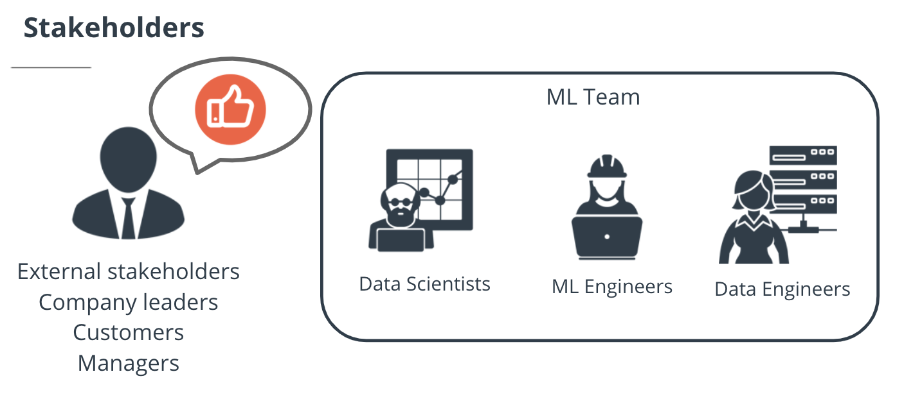

We need to define a **continuous monitoring system** in which 

- The model is continuously scored and its predictions evaluated wrt. expected accuracy; i.e., we run **diagnostics** on the model 
- **Ingestion** of new data is enabled in the system
- The model is re-trained and re-deployed if its performance has decreased
- The complete process is tested/checked for operation success automatically
- We report (e.g., with APIs) the results

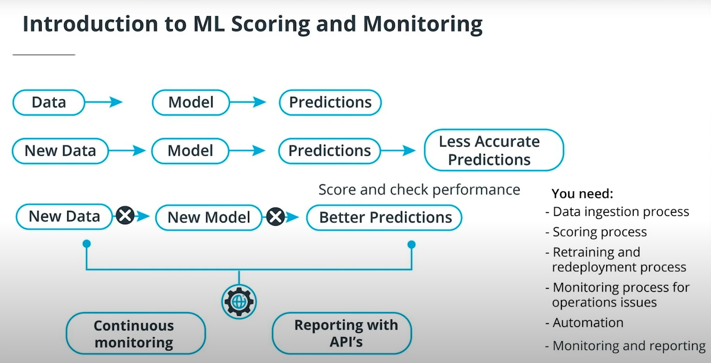

Interesting links:

- [How To Know if Your Machine Learning Model Has Good Performance](https://machinelearningmastery.com/how-to-know-if-your-machine-learning-model-has-good-performance/)
- [Production Machine Learning Monitoring: Outliers, Drift, Explainers & Statistical Performance](https://towardsdatascience.com/production-machine-learning-monitoring-outliers-drift-explainers-statistical-performance-d9b1d02ac158)
- [Evaluating a machine learning model](https://www.jeremyjordan.me/evaluating-a-machine-learning-model/)
- [How to Structure a Data Science Team: Key Models and Roles to Consider](https://www.altexsoft.com/blog/datascience/how-to-structure-data-science-team-key-models-and-roles/)
- [The Ultimate Guide to Model Retraining](https://mlinproduction.com/model-retraining/#:~:text=Rather%20retraining%20simply%20refers%20to,t%20involve%20any%20code%20changes.)

### 1.2 History of ML Scoring

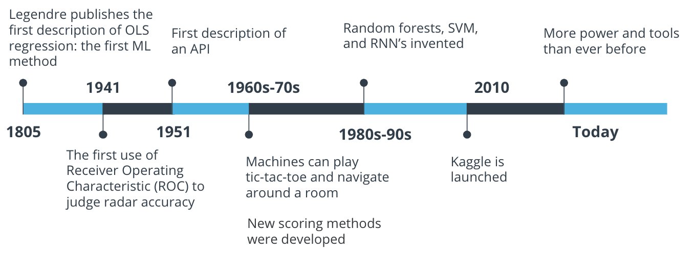

### 1.3 Overview of the Final Project: A Dynamic Risk Assessment System

The project builds a model which predicts who are the customers that have high probability of leaving the services of a company, i.e., customer churn or attrition risk. This is a common business problem faced by all companies; the idea behind it is that it's easier to keep a customer than getting a new one, thus, it's very important to detect customers that might want to leave to prevent them to.

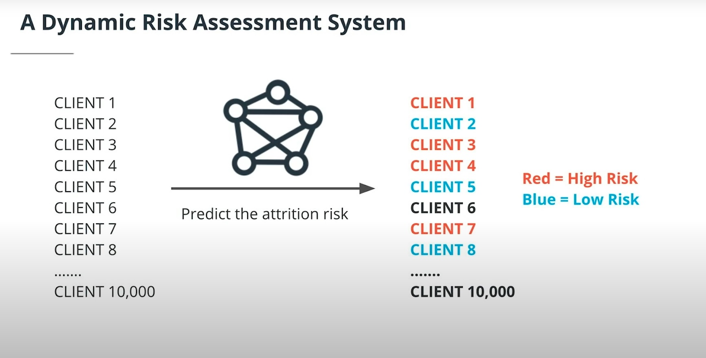

However, it's not enough with the model: if the nature of the business varies a little bit (e.g., new services) or we have new customers in our pool, the efficiency of the model will change, so we need to re-train and re-deploy it.

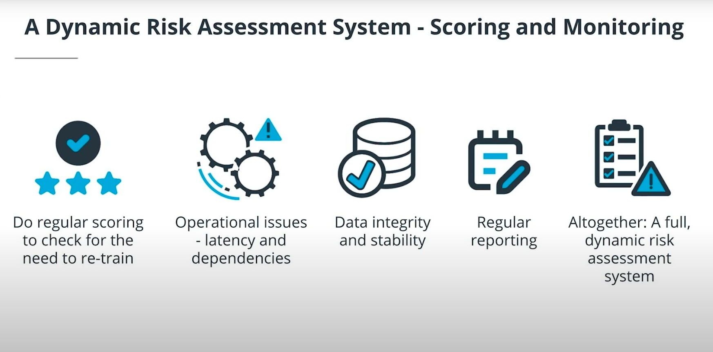

Altogether, the project builds a system with the following features:

- automated data ingestion
- checking for model drift
- retraining and re-deployment
- diagnosis of operational issues
- continuous monitoring with API's

## 2. Automating the Model Re-Training and Re-Deployment

Example: Stock-trading bot which works with a deployed model that predicts whether to buy or sell.

The markets are very dynamic and the model efficiency might change with time; therefore, it's important to

- Store historic data
- Monitor model performance
- Be able to ingest the stored historic data to re-train the model if its performance has decreased
- Be able to re-deploy the new model
- And repeat


**Note**: The exercises and demos of this lesson 2 are located in [`./lab/L2_Retraining_Redeployment`](./lab/L2_Retraining_Redeployment).

### 2.1 Automated Data Ingestion

Data ingestion will compile, clean, process, and output the new data we need to re-train the model.

Note that the data:

- can be in different locations (e.g., S3, local, etc.)
- can be in different formats (e.g., CSV, JSON, XLSX, etc.)
- can have different sizes or update frequencies (e.g., weekly, daily, etc.)

Obviously, before aggregating all the data, we need to know all those details.

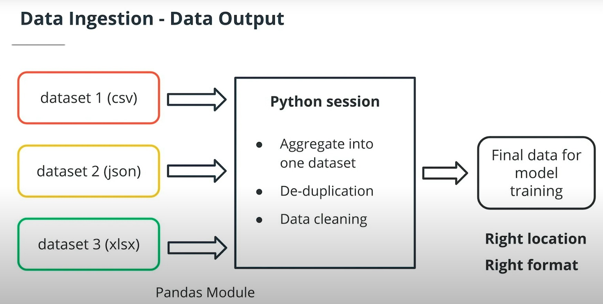

The processing done for aggregating all the data involves, among others:

- Changing columns names
- Removing duplicates
- Imputing NAs
- Removing outliers
- Reconciling different frequencies, if needed
- Creating a single, final dataset
- Keeping process records: information of the ingestion process related to origin, date, etc.

Useful python modules for manipulating files:

- `os.getcwd()`: get current directory string
- `os.listdir()`: list all files in a directory

#### Data Ingestion Example

Example code: aggregate all files in the local directories `udacity1` and `udacity2`:

[`demo1/demo1_aggregate.py`](./lab/L2_Retraining_Redeployment/demo1/demo1_aggregate.py`)

```python
import os
import pandas as pd

# Define local directories to look in 
directories=['/udacity1/','/udacity2/']
# Instantiate empty dataframe: PE ratio, Stock price
final_df = pd.DataFrame(columns=['peratio','price'])

for directory in directories:
    # Files in directory
    filenames = os.listdir(os.getcwd()+directory)
    for each_filename in filenames:
        current_df = pd.read_csv(os.getcwd()+directory+each_filename)
        # Append dataframe + reset index!
        final_df = final_df.append(current_df).reset_index(drop=True)

# Now, we could do some cleaning...
final_df.drop_duplicates().reset_index(drop=True)

# Persist aggregated dataframe
final_df.to_csv('result.csv', sep=',', header=True, index=False)
```

#### Dataset Merges

When we are merging different datasets, sometimes a row is duplicated in different files. We can remove it with `drop_duplicates()` or we could also track it by using `merge()` instead of `append()`.

In the following example, a `merge(how='outer', indicator=True)` is performed, which:

- Carries out an **outer join** of the datasets; see [SQL Joins](https://www.w3schools.com/sql/sql_join.asp) and [merge types](https://guides.nyu.edu/quant/merge).
- Tracks which rows appear on both datasets or in only a specific one, thanks to the flab `indicator=True`.

```python
# Merging datasets: OUTER JOINS
# More on JOINS:
# https://www.w3schools.com/sql/sql_join.asp
# https://guides.nyu.edu/quant/merge
#
# Example: 
# df1 and df2 have same columns: col1, col2
# Some rows appear only in df1, some only in df2, some in both
# We want to merge both: we need an OUTER JOIN
# AND we can informatively mark where each row came from
# with indicator=True
df_all = df1.merge(df2.drop_duplicates(),
                   on=['col1','col2'],
                   how='outer', 
                   indicator=True)
# df_all
#       col1    col2    _merge
#   0   7       90      both
#   1   6       81      left_only
#   2   2       72      right_only
#   3   9       63      both
#   ...
```

#### Process Record Keeping

Along with the aggregated dataset, we should create a file where meta-data of the ingestion process is collected so that our future selves and colleagues can track the origins; in that file, we should write, at least:

- Name and location of every file we read.
- Date when we performed data ingestion.
- All datasets we worked with
- Other details:
  - How many duplicates.
  - How many formatting changes made.
- Name and location of the final output file.

Example with useful snippets:

[`demo1/demo1_records.py`](./lab/L2_Retraining_Redeployment/demo1/demo1_records.py`)

```python
import pandas as pd
from datetime import datetime

source_location = './recorddatasource/'
filename = 'recordkeepingdemo.csv'
output_location = 'records.txt'

data = pd.read_csv(source_location+filename)

dateTimeObj = datetime.now()
time_now = str(dateTimeObj.year) + '/' + str(dateTimeObj.month) + '/'+str(dateTimeObj.day)

one_record = [source_location, filename, len(data.index), time_now]
all_records = []
all_records.append(one_record) # dummy record 1
all_records.append(one_record) # dummy record 2 = record 1

# Create TXT/CSV with record info
with open(output_location, 'w') as f:
    f.write("source_location,filename,num_entries,timestamp\n")
    for record in all_records:
        for i, element in enumerate(record):
            f.write(str(element))
            if i < len(record)-1:
                f.write(",")
            else:
                f.write("\n")

# Output: records.txt
# source_location,filename,num_entries,timestamp
# ./recorddatasource/,recordkeepingdemo.csv,4,2023/2/16
# ./recorddatasource/,recordkeepingdemo.csv,4,2023/2/16
```

#### Automation Using Cron Jobs

Cron jobs from Unix systems can automate any task which is run with a script, e.g., a python script. Cron jobs are stored in a `crontab` file which can be accessed and edited as follows

```bash
# If not started yet, start the cron service on the Unix machine
service cron start
# On Mac
cron start

# Open the crontab file to add cron jobs
crontab -e
# vim opens with crontab file
# Edit
# When finished: ESC, :wq
# Then, it is loaded automatically

# To show the contents of the crontab
crontab -l
```

With cron jobs we can run scripts any time we specify, with the regularity/frequency we specify. Thus, we can automate any task. The syntax of a cron job in the `crontab` file is the following:

```bash
# Structure: replace each field by a number in the range
# If a field has *, it means to run for every interval,
# e.g., * for day means run every day
min[0-59] hour[0-24] day[1-31] month[1-12] weekday[0-6] command

# Example:
# Every day, every month, any weekday,
# run at 12:59 the script do_something.py
59 12 * * *  python3 /home/mikel/scripts/do_something.py

# Example:
# Run every minute
* * * * * python3 /home/mikel/scripts/do_something.py

# Example:
# Run at 12:59 on January 5
59 12 5 1 * python3 /home/mikel/scripts/do_something.py

# Example:
# Run on Fridays once per hour at 59 minutes past every hour
59 12 5 1 * python3 /home/mikel/scripts/do_something.py

# Example:
# Run on reboot
# There are other special strings: @hourly, @daily, etc.
@reboot python3 /home/mikel/scripts/do_something.py
```

The cron output will be automatically sent to your *local email* account, which is accessed via CLI with `mail`. If you want to stop receiving emails, you can add `>/dev/null 2>&1` to a command and if you want to receive the output in a specific email, you need to specify `MAILTO` before the job description:

```bash
# DO NOT send output to local email account
0 5 * * * /home/mikel/scripts/backup.sh >/dev/null 2>&1

# DO SEND email to specific email account
MAILTO="inbox@domain.tld"
0 3 * * * /home/mikel/scripts/backup.sh >/dev/null 2>&1
```

The local mail can be checked in the CLI:

```bash
mail
```

Interesting links:

- [Crontab Guru](https://crontab.guru/)
- [Cron Jobs: Comprehensive Guide](https://www.hostinger.com/tutorials/cron-job)
- [The Complete Guide to Cron and Launchd on macOS/Linux](https://towardsdatascience.com/a-step-by-step-guide-to-scheduling-tasks-for-your-data-science-project-d7df4531fc41)

#### Distributed Systems

Sometimes datasets are so big that they cannot be stored on one file/database or even on one server. In those cases the data is partitioned and each part is saved in a database, distributed. To that end, typically a **client-server** architecture is adopted and technologies such as **MapReduce** are used to access the data.

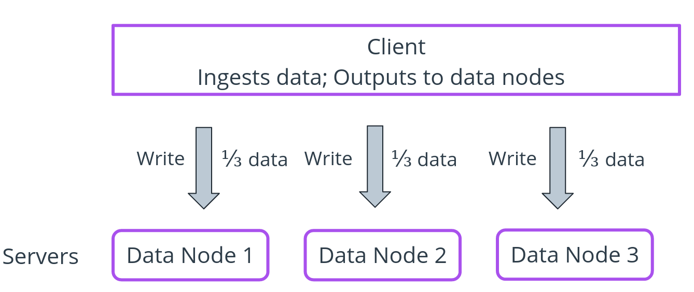

In such situations, performing aggregate operations on the complete dataset is more complicated; imagine how we would perform these operations:

- `count` a value: count in each database separately and the sum
- `mean`: mean in each database and the mean of the means
- `meadian`: we need to sort each database...

Interesting links:

- [A Very Brief Introduction to MapReduce](https://hci.stanford.edu/courses/cs448g/a2/files/map_reduce_tutorial.pdf)
- [What is DFS (Distributed File System)?](https://www.geeksforgeeks.org/what-is-dfsdistributed-file-system/)

### 2.2 Automated Model Re-Training and Re-Deployment

The process of re-deploying an optimized/updated ML model has these steps:

- Ingest new data from various sources (done before)
- Train model with new dataset
- Deploy new trained model: persist serialized model to a production environment

All these steps can be executed with cron jobs! We can either have one cron job that does all steps or separate cron jobs for each of them.

A very simple retraining script:

[`demo2/retraining.py`](./lab/L2_Retraining_Redeployment/demo2/retraining.py)

```python
import pickle
import pandas as pd
from sklearn.linear_model import LogisticRegression
import os

# Get model name from file
# Having the name in a TXT makes possible to parametrize it
# BUT: I would use a config.yaml or sorts...
with open('deployed_model_name.txt', 'r') as f:
    deployed_name = f.read()
print(deployed_name)

# Get data location + filename
with open('data_location.txt', 'r') as f:
    data_location = f.read()
print(data_location)

# Load dataset
df = pd.read_csv(os.getcwd() + data_location)
# Transform
X = df.loc[:,['bed','bath']].values.reshape(-1, 2)
y = df['highprice'].values.reshape(-1, 1).ravel()

# Instantiate model
logit = LogisticRegression(C=1.0, 
                           class_weight=None, 
                           dual=False, 
                           fit_intercept=True, 
                           intercept_scaling=1, 
                           l1_ratio=None, 
                           max_iter=100,
                           multi_class='auto', 
                           n_jobs=None, 
                           penalty='l2',
                           random_state=0, 
                           solver='liblinear', 
                           tol=0.0001, 
                           verbose=0,
                           warm_start=False)
# Re-Train
model = logit.fit(X, y)

# Persist file with extracted name
pickle.dump(model, open('./production/' + deployed_name, 'wb'))
```

### 2.3 Lesson Exercise

The exercise is in [`exercise/`](./lab/L2_Retraining_Redeployment/exercise/).

```python
import pickle
import pandas as pd
from sklearn.linear_model import LinearRegression

# Load dataset
data_location = "./sales.csv"
df = pd.read_csv(data_location)

# Transform
X = df.loc[:,['timeperiod']].values.reshape(-1, 1)
y = df['sales'].values.reshape(-1, 1).ravel()

# Instantiate model
lr = LinearRegression()
# Re-Train
model = lr.fit(X, y)

# Persist file with extracted name
deployed_name = "model.pkl"
pickle.dump(model, open('./production/' + deployed_name, 'wb'))

```

## 3. Model Scoring and Model Drift

Model drift is the decrease of the model performance (predicted values vs. expected) over time. We can measure it by scoring the model in production and storing the predictions in pair with the expected values. In order to avoid loosing money, we need to check model drift regularly.

Model drift occurs when the context or the properties of the business change; for example, consider House Prices: due to inflation, price prediction will be lower than the actual. In general, model drift can occur due to

- Changes in the target variable (e.g., price increase due to inflation)
- Changes in the predictor variable (e.g., new houses being built have less bedrooms, model wasn't trained on so many instances similar to them)
- Changes in relationship between predictor and target (e.g., utility prices go up, so people prefer smaller houses, so the price of the big ones decreases due to lack of demand)

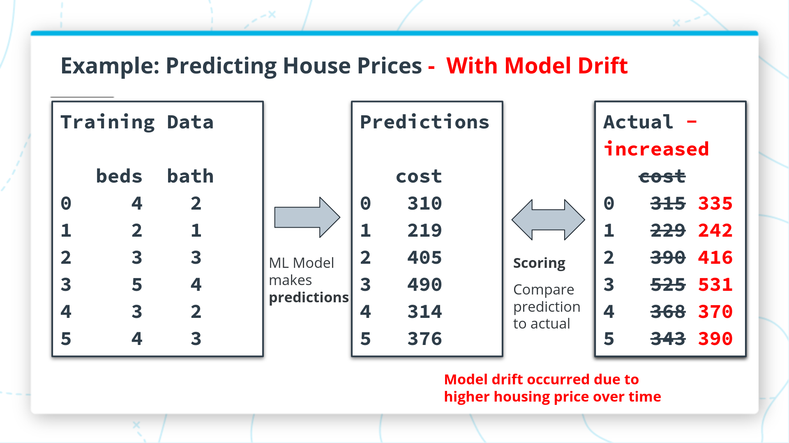

**Note**: The exercises and demos of this lesson 2 are located in [`./lab/L3_Scoring_Drift`](./lab/L3_Scoring_Drift).

Interesting links:

- [AI/ML Model Scoring – What Good Looks Like in Production](https://h2o.ai/blog/ai-ml-model-scoring-what-good-looks-like-in-production/)
- [Compare which Machine Learning Model performs Better](https://towardsdatascience.com/compare-which-machine-learning-model-performs-better-4912b2ed597d)
- [Statistical Significance Tests for Comparing Machine Learning Algorithms](https://machinelearningmastery.com/statistical-significance-tests-for-comparing-machine-learning-algorithms/)
- [Hypothesis testing and p-values](https://www.khanacademy.org/math/statistics-probability/significance-tests-one-sample/more-significance-testing-videos/v/hypothesis-testing-and-p-values)

### 3.1 Automatic Model Scoring

Model scoring can be automated with cron jobs so that we run a scoring on the deployed model every week. Every week, the dataset is fresh from the past week and we have the target values. Thus, we compute the difference/error with an appropriate metric: SSE, MSE, Precision, Recall, F1, etc.

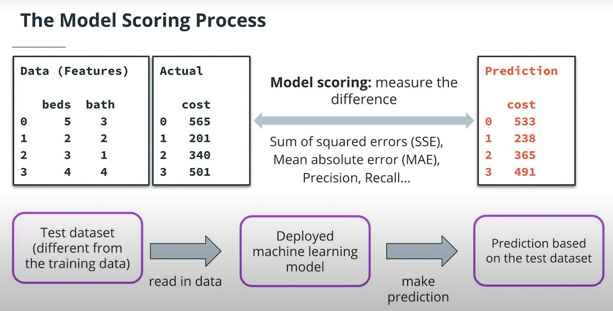

The frequency doesn't need to be weekly, it will vary depending on the business.

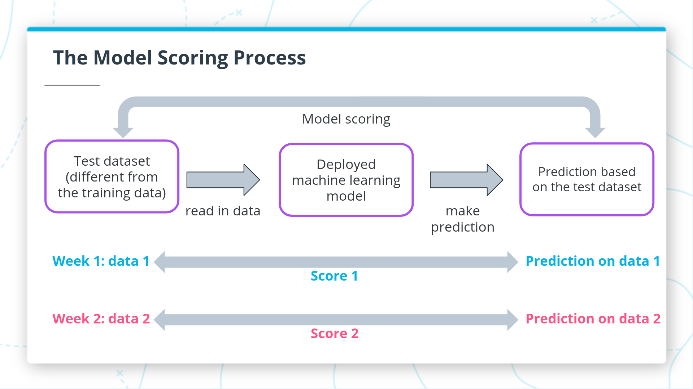

The idea is that we track the evolution of the metric: if it becomes worse, we 

#### Demo and Exercise

- [`demos/demo.py`](./lab/L3_Scoring_Drift/demos/demo.py)
- [`exercises/automatic_scoring.py`](./lab/L3_Scoring_Drift/exercises/automatic_scoring.py)

```python
import pandas as pd
import pickle
from sklearn import metrics
from sklearn.metrics import f1_score

with open('samplemodel.pkl', 'rb') as file:
    model = pickle.load(file)
    
testdata = pd.read_csv('testdata_l3demo.csv')
X = testdata[['bed','bath']].values.reshape(-1,2)
y = testdata['highprice'].values.reshape(-1,1)

predicted = model.predict(X)

f1score = metrics.f1_score(predicted,y)
print(f1score) # 0.5806451612903226
```

### 3.2 Recording Model Scores

We need to record our model scores and we need to be able to load & extend previous records. For instance, we can do it on a CSV (MVP) and persist these value in each row: `metric`, `model_version`, `score`.

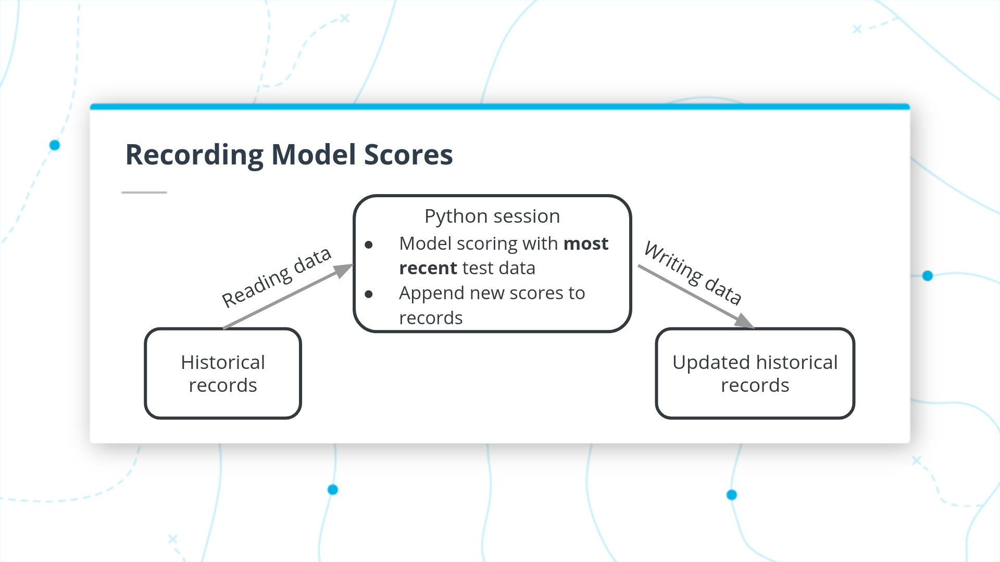

Usually, we load the previous scores and compute the current score; if the score improves, the new model is deployed. Scores can be unique aggregate values (R2, F1, etc.) or we can also perform hypothesis tests; more on that later.

Very simple snippet which performs those steps; present in the following files:

- [`demos/record_scores.py`](./lab/L3_Scoring_Drift/demos/record_scores.py)
- [`exercises/recordingscores.py`](./lab/L3_Scoring_Drift/exercises/recordingscores.py)


```python
#import ast
import pandas as pd
#import numpy as np

# New fictional scores
recent_r2 = 0.55
recent_sse = 49999

# Load previous model scores
previous_scores = pd.read_csv('previousscores_l3demo.csv')

# Increase version: Imagine we have a new model
max_version = previous_scores['version'].max()
this_version = max_version + 1

# Define new score rows
new_row_r2 = {'metric': 'r2', 
              'version': this_version, 
              'score': recent_r2}

new_row_sse = {'metric': 'sse', 
               'version': this_version, 
               'score': recent_sse}

# Append new model score rows
# Optional: Append them ONLY if the model improves the previous ones
# In that case, we would deploy the better model
# HOWEVER, it is much better to perform parametric significance tests
# instead of looking at only one aggregated value!
if recent_r2 > previous_scores.loc[previous_scores['metric'] == 'r2','score'].max():
    previous_scores = previous_scores.append(new_row_r2, ignore_index=True)
    previous_scores = previous_scores.append(new_row_sse, ignore_index=True)
    
# Persist updated scores
previous_scores.to_csv('newscores.csv')

```

### 3.3 Checking Model Drift: Tests

Instead of computing a single score (e.g., F1, R2, SSE) and checking against the maximum/minimum so far (aka. *raw test*), we can perform significance tests:

- Parametric tests: they assume that the scores are distributed in a bell curve; in that case, we use a Z or a T-Test. However, note the assumption; also we are sensitive to outliers.
- Non-parametric tests: they don't make any assumption. One very simple approach is based on the Inter-Quantile-Range (IQR); they are not sensitive to outliers.

The parametric test (e.g, T-Test) is done as follows, in practice:

- Compute mean standard deviations from previous scores.
- If the current score outside in the 2-sigma band/range, there is drift (`alpha = 0.05`, approximately).

Recall that some scores are better if they are smaller (e.g., SSE), and others if they are larger (e.g., R2).

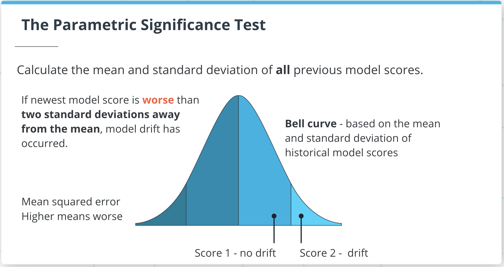

The Non-Parametric outlier test is done as follows:

- Compute the quantiles of the scores: `min, q25, q50, q75, max`
- Compute the **Inter-Quantile-Range (IQR)**: `IQR = q75-q25`
- If the new score is an outlier, there is model drift:
  - `upper_outlier > q75 + 1.5*IQR`
  - `lower_outlier < q25 - 1.5*IQR`

#### Demo

File: [`demos/model_drift_test.py`](./lab/L3_Scoring_Drift/demos/model_drift_test.py).

```python
import ast
import numpy as np

new_f1 = 0.38

with open('previousscores_l3demo.txt', 'r') as f:
    f1_list = ast.literal_eval(f.read())

# Test 1: Raw Test: Is the score better than the best so far?
first_test = new_f1 < np.min(f1_list)
print(first_test) # True

# Test 2: Parametric Test: Is the score significantly better than what we've seen so far?
second_test = new_f1 < np.mean(f1_list)-2*np.std(f1_list)
print(second_test) # False

# Test 3: Non-Parametric Test: Is the score significantly better than what we've seen so far?
iqr = np.quantile(f1_list, 0.75)-np.quantile(f1_list, 0.25)
third_test = new_f1 < np.quantile(f1_list, 0.25)-iqr*1.5
print(third_test) # False

```

#### Hypothesis Tests with Two Samples

The parametric T-Test introduced so far is a test of a value against a sample; however, we can also perform a T-Test with two samples, i.e., we compare two different models that both have their own sets of historic model scores.

In that case, the typical T-Test setting is followed:

- Define hypothesis: H0, Ha
- Define `alpha = 0.05`
- Compute T statistic
- Compute `p-value`
- If `p < alpha`, H0 is rejected.

### 3.4 Final Exercise

File: [`exercises/final_exercise.py`](./lab/L3_Scoring_Drift/exercises/final_exercise.py).

```python
import pandas as pd
import pickle
import ast
import numpy as np
from sklearn.metrics import mean_squared_error

## Score model

with open('l3final.pkl', 'rb') as file:
    model = pickle.load(file)
    
testdata = pd.read_csv('testdatafinal.csv')
X = testdata[['timeperiod']].values.reshape(-1,1)
y = testdata['sales'].values.reshape(-1,1)

predicted = model.predict(X)

new_mse = mean_squared_error(predicted,y)
print(new_mse) # 18938.960000000043

## Check drift

with open('l3finalscores.txt', 'r') as f:
    mse_list = ast.literal_eval(f.read())

# Non-Parametric Test: Is the score significantly WORSE
# than what we've seen so far?
iqr = np.quantile(mse_list, 0.75)-np.quantile(mse_list, 0.25)
print(iqr) # 2055.0
drift_test = new_mse > np.quantile(mse_list, 0.75)+iqr*1.5
print(drift_test) # True
```

### 3.5 Evidently Tutorial: Model Performance Monitoring and Data Drift

[Evidently](https://github.com/evidentlyai/evidently) is an open-source Python library which can be used to evaluate, test, and monitor the performance of ML models from validation to production. It works with tabular and text data.

I forked the [demo repository from Udacity](https://github.com/udacity/cd0583-model-scoring-and-drift-using-evidently) to:

[model_scoring_evidently_demo](https://github.com/mxagar/model_scoring_evidently_demo)

All notes and code are in that repository of mine. The final app is deployed on:

[https://model-scoring-evidently-demo.herokuapp.com/](https://model-scoring-evidently-demo.herokuapp.com/)

*That main link shows the model performance for February; check other links/dashboards mentioned below.*

The complete monitoring is implemented in the `main.py` of the repository: We create HTML dashboards with Evidently and save them to `./static`. Then, a FastAPI web app is instantiated to which we pass all the content in that `./static` folder.

More documentation on Evidently: [Getting Started with Evidently](https://docs.evidentlyai.com/get-started/tutorial)

### 3.6 MLflow Tutorial: Historical Data Drift

See [historical_data_drift_mlflow_demo](https://github.com/mxagar/historical_data_drift_mlflow_demo).

I forked that repository from [cd0583-historical-data-drift](https://github.com/udacity/cd0583-historical-data-drift) and followed the instructions below. However, it didn't work due to version collisions. I will come back to this when I have time.

## 4. Diagnosing and Fixing Operational Problems

We are going to have many types of operational problems, which often result in worse and delayed results:

- Missing data
- Unstable data: values/means change
- Timing problems: modules deliver too late
- Dependency issues

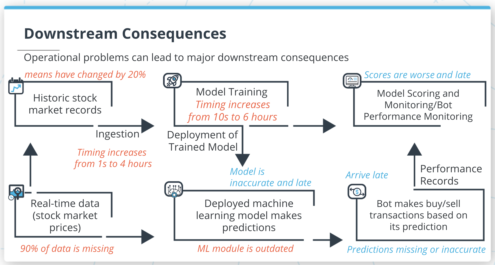

### 4.1 Process Timing

Timing all our processes is very helpful, because with time records we can detect when one step has taken too long, i.e., there might be something wrong with it.

```python
import timeit

# Stopwatch
start_time = timeit.default_timer() # store current time
# Code for any process you want to time
timing = timeit.default_timer() - start_time # Time elapsed
```

Also, note that we can start other processes within a python session with `os.system()`:

```python
import os

# Exit python session and run a shell command
os.system('python3 addnumbers.py')
```

#### Exercise: Process Timing

A script is created which measures 20x the time of 2 scripts launched via `os`. Then, statistics (i.e., mean, min, max, std) are generated for each script.

[`exercises/timings.py`](./lab/L4_Diagnosing/exercises/timings.py)

```python

import os
import timeit
import numpy as np

def ingestion_timing():
    starttime = timeit.default_timer()
    os.system('python3 ingestion.py')
    timing=timeit.default_timer() - starttime
    return timing

def training_timing():
    starttime = timeit.default_timer()
    os.system('python3 training.py')
    timing=timeit.default_timer() - starttime
    return timing

def measure_and_save_timings():
    ingestion_timings=[]
    training_timings=[]
    
    for idx in range(20):
        ingestion_timings.append(ingestion_timing())
        training_timings.append(training_timing())
    
    final_output=[]
    final_output.append(np.mean(ingestion_timings))
    final_output.append(np.std(ingestion_timings))
    final_output.append(np.min(ingestion_timings))
    final_output.append(np.max(ingestion_timings))
    final_output.append(np.mean(training_timings))
    final_output.append(np.std(training_timings))
    final_output.append(np.min(training_timings))
    final_output.append(np.max(training_timings))
    
    return final_output
    
print(measure_and_save_timings())
# [0.7203975, 0.21127245305744852, 0.6460763329999999, 1.6362521250000002, 1.415318122849999, 0.27338612631866893, 1.2490636669999944, 2.543399083]

```

### 4.2 Integrity and Stability Issues

New datasets we use to re-train might have issues:

- Integrity issues: missing data; **solutions**: remove NA or apply imputation
- Stability issues (aka. data drift): column means vary from previous dataset; **solution**: we need to re-train and re-deploy with recent data.

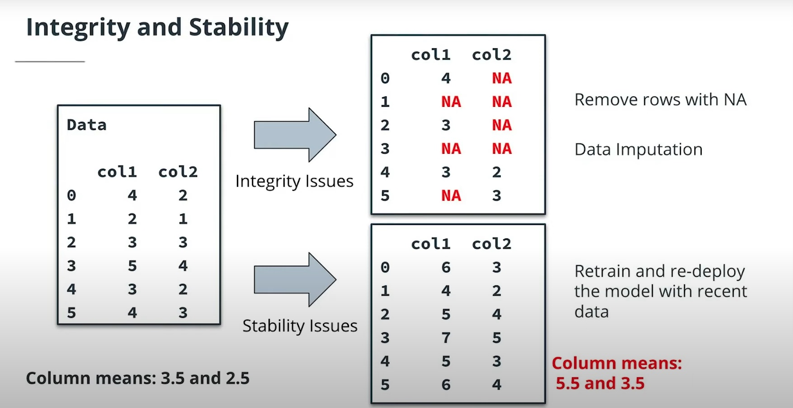

We should find the root cause of integrity and stability issues.

Useful tools:

- `mean()`
- `isna()`
- `sum()`
- `.index`
- `len()`

Interesting links:

- [Missing-data imputation](http://www.stat.columbia.edu/~gelman/arm/missing.pdf)
- [What is Data Integrity and How Can You Maintain it?](https://www.varonis.com/blog/data-integrity)
- [Detect data drift (preview) on datasets](https://learn.microsoft.com/en-us/azure/machine-learning/v1/how-to-monitor-datasets?tabs=python)

#### Demo: Data Integrity and Stability

Two exercises are shown, both with almost identical code:

- [`demos/timings.py`](./lab/L4_Diagnosing/demos/demo.py)
- [`exercises/stability_integrity.py`](./lab/L4_Diagnosing/exercises/stability_integrity.py)

```python
import ast
import pandas as pd

with open('healthdata.txt', 'r') as f:
    means_list = ast.literal_eval(f.read())
    
the_data=pd.read_csv('bloodpressure.csv')
the_means=list(the_data.mean())

mean_comparison=[(the_means[i]-means_list[i])/means_list[i] for i in range(len(means_list))]
print(mean_comparison)
# [-0.08285714285714281, -0.26710526315789473, -0.06451612903225806]

nas=list(the_data.isna().sum())
print(nas)
# [0, 1, 2]

```

### 4.3 Module Dependencies


## 5. Model Reporting and Monitoring with APIs


## 6. Project: A Dynamic Risk Assessment System

Starter file: [starter-file.zip](https://video.udacity-data.com/topher/2021/March/60412fe6_starter-file/starter-file.zip).