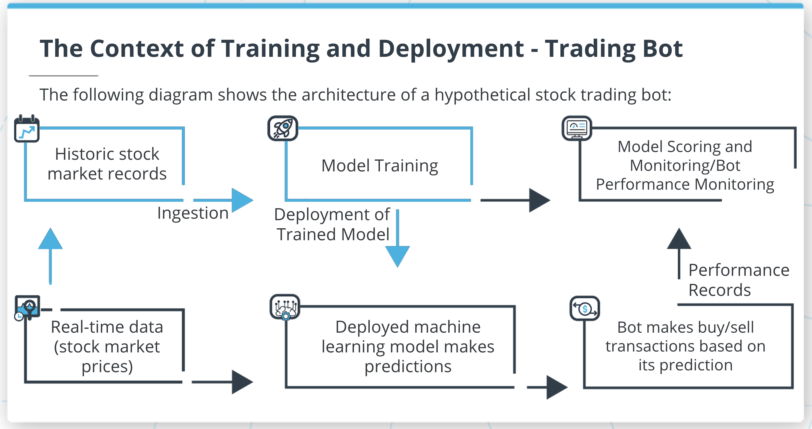

# Machine Learning DevOps Engineer: Personal Notes on the Udacity Nanodegree

These are my notes of the [Udacity Nanodegree Machine Learning DevOps Engineer](https://www.udacity.com/course/machine-learning-dev-ops-engineer-nanodegree--nd0821).

The nanodegree is composed of four modules:

1. Clean Code Principles
2. Building a Reproducible Model Workflow
3. Deploying a Scalable ML Pipeline in Production
4. ML Model Scoring and Monitoring

Each module has a folder with its respective notes. This folder and file refer to the **fourth** module: **ML Model Scoring and Monitoring**.

This module has 5 lessons and a project. The first lesson is an introduction; the exercises for lessons 2-5 are located in [`./lab/`](./lab/).

Personal useful guides:

- [linux_bash_howto.txt](`../linux_bash_howto.txt`)
- [linux_bash_howto_examples.sh](`../linux_bash_howto_examples.sh`)

Mikel Sagardia, 2022.  
No guarantees.

## Overview of Contents

- [Machine Learning DevOps Engineer: Personal Notes on the Udacity Nanodegree](#machine-learning-devops-engineer-personal-notes-on-the-udacity-nanodegree)
  - [Overview of Contents](#overview-of-contents)
  - [1. Introduction to Model Scoring and Monitoring](#1-introduction-to-model-scoring-and-monitoring)
    - [1.1 Requirements for a ML Monitoring System](#11-requirements-for-a-ml-monitoring-system)
    - [1.2 History of ML Scoring](#12-history-of-ml-scoring)
    - [1.3 Overview of the Final Project: A Dynamic Risk Assessment System](#13-overview-of-the-final-project-a-dynamic-risk-assessment-system)
  - [2. Automating the Model Re-Training and Re-Deployment](#2-automating-the-model-re-training-and-re-deployment)
    - [2.1 Automated Data Ingestion](#21-automated-data-ingestion)
      - [Data Ingestion Example](#data-ingestion-example)
      - [Dataset Merges](#dataset-merges)
      - [Process Record Keeping](#process-record-keeping)
      - [Automation Using Cron Jobs](#automation-using-cron-jobs)
      - [Distributed Systems](#distributed-systems)
    - [2.2 Automated Model Re-Training and Re-Deployment](#22-automated-model-re-training-and-re-deployment)
    - [2.3 Lesson Exercise](#23-lesson-exercise)
  - [3. Model Scoring and Model Drift](#3-model-scoring-and-model-drift)
  - [6. Project: A Dynamic Risk Assessment System](#6-project-a-dynamic-risk-assessment-system)

## 1. Introduction to Model Scoring and Monitoring

Why is it important to monitor ML models?

- Check model behaves correctly
- Check accuracy is enough
- Check any dependency/compatibility issues
- Check data is correctly pushed to the model
- etc.

When the model is sold to the customer, an MLOps team deploy it. However, when there are problems with the model, the ML/DS Engineer is responsible for the 2nd level support, because they know the model the best. Therefore, even though the model has been shipped, we are still its *"responsible owners"*.

With model monitoring

- We enable predictive ML Operations: we can identify and predict model drift
- We detect problems fast and solve them efficiently
- We achieve transparency for the stakeholders
- We increase productivity and result quality
- We capture insights and ideas

Module instructor: [Bradford Tuckfield](https://bradfordtuckfield.com/); he has a company: [https://kmbara.com/](https://kmbara.com/)

### 1.1 Requirements for a ML Monitoring System

Model scoring and monitoring is necessary every time **we deploy a model and use it continuously**.

Even though the external stakeholders are not aware of the need of monitoring, they want a system that works reliably &mdash; and that's possible only if we monitor our system. Additionally, even there exist clear roles of who does what in the industry, the responsibilities are often shared between different roles in the team (e.g., a data scientist is responsible for the monitoring infrastructure).


We need to define a **continuous monitoring system** in which 

- The model is continuously scored and its predictions evaluated wrt. expected accuracy; i.e., we run **diagnostics** on the model 
- **Ingestion** of new data is enabled in the system
- The model is re-trained and re-deployed if its performance has decreased
- The complete process is tested/checked for operation success automatically
- We report (e.g., with APIs) the results


Interesting links:

- [How To Know if Your Machine Learning Model Has Good Performance](https://machinelearningmastery.com/how-to-know-if-your-machine-learning-model-has-good-performance/)
- [Production Machine Learning Monitoring: Outliers, Drift, Explainers & Statistical Performance](https://towardsdatascience.com/production-machine-learning-monitoring-outliers-drift-explainers-statistical-performance-d9b1d02ac158)
- [Evaluating a machine learning model](https://www.jeremyjordan.me/evaluating-a-machine-learning-model/)
- [How to Structure a Data Science Team: Key Models and Roles to Consider](https://www.altexsoft.com/blog/datascience/how-to-structure-data-science-team-key-models-and-roles/)
- [The Ultimate Guide to Model Retraining](https://mlinproduction.com/model-retraining/#:~:text=Rather%20retraining%20simply%20refers%20to,t%20involve%20any%20code%20changes.)

### 1.2 History of ML Scoring


### 1.3 Overview of the Final Project: A Dynamic Risk Assessment System

The project builds a model which predicts who are the customers that have high probability of leaving the services of a company, i.e., customer churn or attrition risk. This is a common business problem faced by all companies; the idea behind it is that it's easier to keep a customer than getting a new one, thus, it's very important to detect customers that might want to leave to prevent them to.


However, it's not enough with the model: if the nature of the business varies a little bit (e.g., new services) or we have new customers in our pool, the efficiency of the model will change, so we need to re-train and re-deploy it.


Altogether, the project builds a system with the following features:

- automated data ingestion
- checking for model drift
- retraining and re-deployment
- diagnosis of operational issues
- continuous monitoring with API's

## 2. Automating the Model Re-Training and Re-Deployment

Example: Stock-trading bot which works with a deployed model that predicts whether to buy or sell.

The markets are very dynamic and the model efficiency might change with time; therefore, it's important to

- Store historic data
- Monitor model performance
- Be able to ingest the stored historic data to re-train the model if its performance has decreased
- Be able to re-deploy the new model
- And repeat



**Note**: The exercises and demos of this lesson 2 are located in [`./lab/L2_Retraining_Redeployment`](./lab/L2_Retraining_Redeployment).

### 2.1 Automated Data Ingestion

Data ingestion will compile, clean, process, and output the new data we need to re-train the model.

Note that the data:

- can be in different locations (e.g., S3, local, etc.)
- can be in different formats (e.g., CSV, JSON, XLSX, etc.)
- can have different sizes or update frequencies (e.g., weekly, daily, etc.)

Obviously, before aggregating all the data, we need to know all those details.


The processing done for aggregating all the data involves, among others:

- Changing columns names
- Removing duplicates
- Imputing NAs
- Removing outliers
- Reconciling different frequencies, if needed
- Creating a single, final dataset
- Keeping process records: information of the ingestion process related to origin, date, etc.

Useful python modules for manipulating files:

- `os.getcwd()`: get current directory string
- `os.listdir()`: list all files in a directory

#### Data Ingestion Example

Example code: aggregate all files in the local directories `udacity1` and `udacity2`:

[`demo1/demo1_aggregate.py`](./lab/L2_Retraining_Redeployment/demo1/demo1_aggregate.py`)

```python
import os
import pandas as pd

# Define local directories to look in 
directories=['/udacity1/','/udacity2/']
# Instantiate empty dataframe: PE ratio, Stock price
final_df = pd.DataFrame(columns=['peratio','price'])

for directory in directories:
    # Files in directory
    filenames = os.listdir(os.getcwd()+directory)
    for each_filename in filenames:
        current_df = pd.read_csv(os.getcwd()+directory+each_filename)
        # Append dataframe + reset index!
        final_df = final_df.append(current_df).reset_index(drop=True)

# Now, we could do some cleaning...
final_df.drop_duplicates().reset_index(drop=True)

# Persist aggregated dataframe
final_df.to_csv('result.csv', sep=',', header=True, index=False)
```

#### Dataset Merges

When we are merging different datasets, sometimes a row is duplicated in different files. We can remove it with `drop_duplicates()` or we could also track it by using `merge()` instead of `append()`.

In the following example, a `merge(how='outer', indicator=True)` is performed, which:

- Carries out an **outer join** of the datasets; see [SQL Joins](https://www.w3schools.com/sql/sql_join.asp) and [merge types](https://guides.nyu.edu/quant/merge).
- Tracks which rows appear on both datasets or in only a specific one, thanks to the flab `indicator=True`.

```python
# Merging datasets: OUTER JOINS
# More on JOINS:
# https://www.w3schools.com/sql/sql_join.asp
# https://guides.nyu.edu/quant/merge
#
# Example: 
# df1 and df2 have same columns: col1, col2
# Some rows appear only in df1, some only in df2, some in both
# We want to merge both: we need an OUTER JOIN
# AND we can informatively mark where each row came from
# with indicator=True
df_all = df1.merge(df2.drop_duplicates(),
                   on=['col1','col2'],
                   how='outer', 
                   indicator=True)
# df_all
#       col1    col2    _merge
#   0   7       90      both
#   1   6       81      left_only
#   2   2       72      right_only
#   3   9       63      both
#   ...
```

#### Process Record Keeping

Along with the aggregated dataset, we should create a file where meta-data of the ingestion process is collected so that our future selves and colleagues can track the origins; in that file, we should write, at least:

- Name and location of every file we read.
- Date when we performed data ingestion.
- All datasets we worked with
- Other details:
  - How many duplicates.
  - How many formatting changes made.
- Name and location of the final output file.

Example with useful snippets:

[`demo1/demo1_records.py`](./lab/L2_Retraining_Redeployment/demo1/demo1_records.py`)

```python
import pandas as pd
from datetime import datetime

source_location = './recorddatasource/'
filename = 'recordkeepingdemo.csv'
output_location = 'records.txt'

data = pd.read_csv(source_location+filename)

dateTimeObj = datetime.now()
time_now = str(dateTimeObj.year) + '/' + str(dateTimeObj.month) + '/'+str(dateTimeObj.day)

one_record = [source_location, filename, len(data.index), time_now]
all_records = []
all_records.append(one_record) # dummy record 1
all_records.append(one_record) # dummy record 2 = record 1

# Create TXT/CSV with record info
with open(output_location, 'w') as f:
    f.write("source_location,filename,num_entries,timestamp\n")
    for record in all_records:
        for i, element in enumerate(record):
            f.write(str(element))
            if i < len(record)-1:
                f.write(",")
            else:
                f.write("\n")

# Output: records.txt
# source_location,filename,num_entries,timestamp
# ./recorddatasource/,recordkeepingdemo.csv,4,2023/2/16
# ./recorddatasource/,recordkeepingdemo.csv,4,2023/2/16
```

#### Automation Using Cron Jobs

Cron jobs from Unix systems can automate any task which is run with a script, e.g., a python script. Cron jobs are stored in a `crontab` file which can be accessed and edited as follows

```bash
# If not started yet, start the cron service on the Unix machine
service cron start
# On Mac
cron start

# Open the crontab file to add cron jobs
crontab -e
# vim opens with crontab file
# Edit
# When finished: ESC, :wq
# Then, it is loaded automatically

# To show the contents of the crontab
crontab -l
```

With cron jobs we can run scripts any time we specify, with the regularity/frequency we specify. Thus, we can automate any task. The syntax of a cron job in the `crontab` file is the following:

```bash
# Structure: replace each field by a number in the range
# If a field has *, it means to run for every interval,
# e.g., * for day means run every day
min[0-59] hour[0-24] day[1-31] month[1-12] weekday[0-6] command

# Example:
# Every day, every month, any weekday,
# run at 12:59 the script do_something.py
59 12 * * *  python3 /home/mikel/scripts/do_something.py

# Example:
# Run every minute
* * * * * python3 /home/mikel/scripts/do_something.py

# Example:
# Run at 12:59 on January 5
59 12 5 1 * python3 /home/mikel/scripts/do_something.py

# Example:
# Run on Fridays once per hour at 59 minutes past every hour
59 12 5 1 * python3 /home/mikel/scripts/do_something.py

# Example:
# Run on reboot
# There are other special strings: @hourly, @daily, etc.
@reboot python3 /home/mikel/scripts/do_something.py
```

The cron output will be automatically sent to your *local email* account, which is accessed via CLI with `mail`. If you want to stop receiving emails, you can add `>/dev/null 2>&1` to a command and if you want to receive the output in a specific email, you need to specify `MAILTO` before the job description:

```bash
# DO NOT send output to local email account
0 5 * * * /home/mikel/scripts/backup.sh >/dev/null 2>&1

# DO SEND email to specific email account
MAILTO="inbox@domain.tld"
0 3 * * * /home/mikel/scripts/backup.sh >/dev/null 2>&1
```

The local mail can be checked in the CLI:

```bash
mail
```

Interesting links:

- [Crontab Guru](https://crontab.guru/)
- [Cron Jobs: Comprehensive Guide](https://www.hostinger.com/tutorials/cron-job)
- [The Complete Guide to Cron and Launchd on macOS/Linux](https://towardsdatascience.com/a-step-by-step-guide-to-scheduling-tasks-for-your-data-science-project-d7df4531fc41)

#### Distributed Systems

Sometimes datasets are so big that they cannot be stored on one file/database or even on one server. In those cases the data is partitioned and each part is saved in a database, distributed. To that end, typically a **client-server** architecture is adopted and technologies such as **MapReduce** are used to access the data.


In such situations, performing aggregate operations on the complete dataset is more complicated; imagine how we would perform these operations:

- `count` a value: count in each database separately and the sum
- `mean`: mean in each database and the mean of the means
- `meadian`: we need to sort each database...

Interesting links:

- [A Very Brief Introduction to MapReduce](https://hci.stanford.edu/courses/cs448g/a2/files/map_reduce_tutorial.pdf)
- [What is DFS (Distributed File System)?](https://www.geeksforgeeks.org/what-is-dfsdistributed-file-system/)

### 2.2 Automated Model Re-Training and Re-Deployment

The process of re-deploying an optimized/updated ML model has these steps:

- Ingest new data from various sources (done before)
- Train model with new dataset
- Deploy new trained model: persist serialized model to a production environment

All these steps can be executed with cron jobs! We can either have one cron job that does all steps or separate cron jobs for each of them.

A very simple retraining script:

[`demo2/retraining.py`](./lab/L2_Retraining_Redeployment/demo2/retraining.py)

```python
import pickle
import pandas as pd
from sklearn.linear_model import LogisticRegression
import os

# Get model name from file
# Having the name in a TXT makes possible to parametrize it
# BUT: I would use a config.yaml or sorts...
with open('deployed_model_name.txt', 'r') as f:
    deployed_name = f.read()
print(deployed_name)

# Get data location + filename
with open('data_location.txt', 'r') as f:
    data_location = f.read()
print(data_location)

# Load dataset
df = pd.read_csv(os.getcwd() + data_location)
# Transform
X = df.loc[:,['bed','bath']].values.reshape(-1, 2)
y = df['highprice'].values.reshape(-1, 1).ravel()

# Instantiate model
logit = LogisticRegression(C=1.0, 
                           class_weight=None, 
                           dual=False, 
                           fit_intercept=True, 
                           intercept_scaling=1, 
                           l1_ratio=None, 
                           max_iter=100,
                           multi_class='auto', 
                           n_jobs=None, 
                           penalty='l2',
                           random_state=0, 
                           solver='liblinear', 
                           tol=0.0001, 
                           verbose=0,
                           warm_start=False)
# Re-Train
model = logit.fit(X, y)

# Persist file with extracted name
pickle.dump(model, open('./production/' + deployed_name, 'wb'))
```

### 2.3 Lesson Exercise

The exercise is in [`exercise/`](./lab/L2_Retraining_Redeployment/exercise/).

```python
import pickle
import pandas as pd
from sklearn.linear_model import LinearRegression

# Load dataset
data_location = "./sales.csv"
df = pd.read_csv(data_location)

# Transform
X = df.loc[:,['timeperiod']].values.reshape(-1, 1)
y = df['sales'].values.reshape(-1, 1).ravel()

# Instantiate model
lr = LinearRegression()
# Re-Train
model = lr.fit(X, y)

# Persist file with extracted name
deployed_name = "model.pkl"
pickle.dump(model, open('./production/' + deployed_name, 'wb'))

```

## 3. Model Scoring and Model Drift


## 6. Project: A Dynamic Risk Assessment System

Starter file: [starter-file.zip](https://video.udacity-data.com/topher/2021/March/60412fe6_starter-file/starter-file.zip).